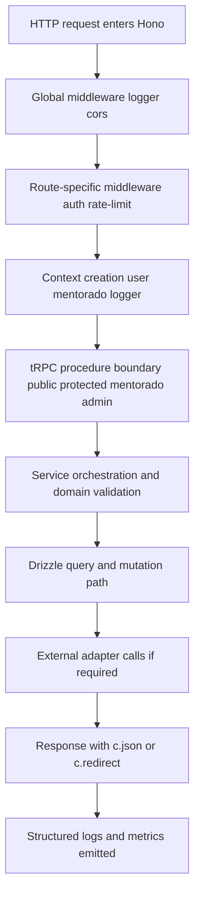
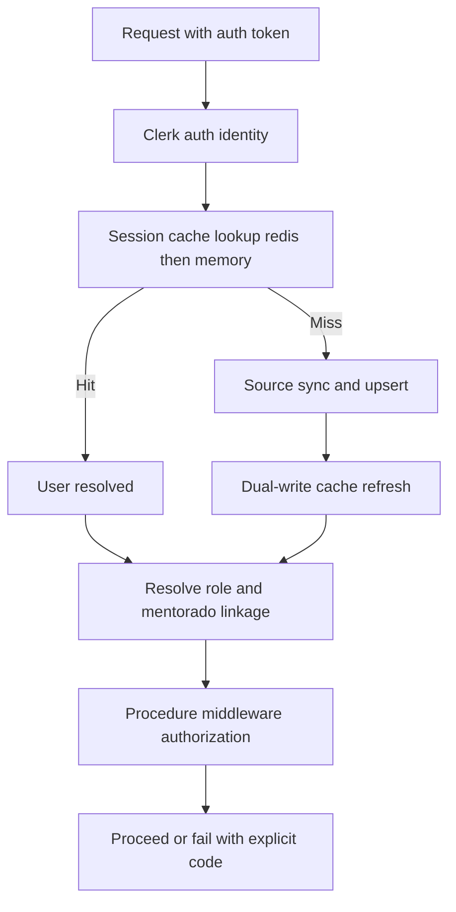
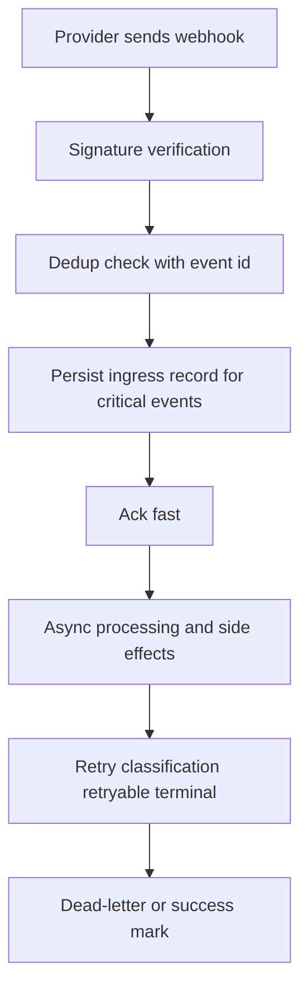
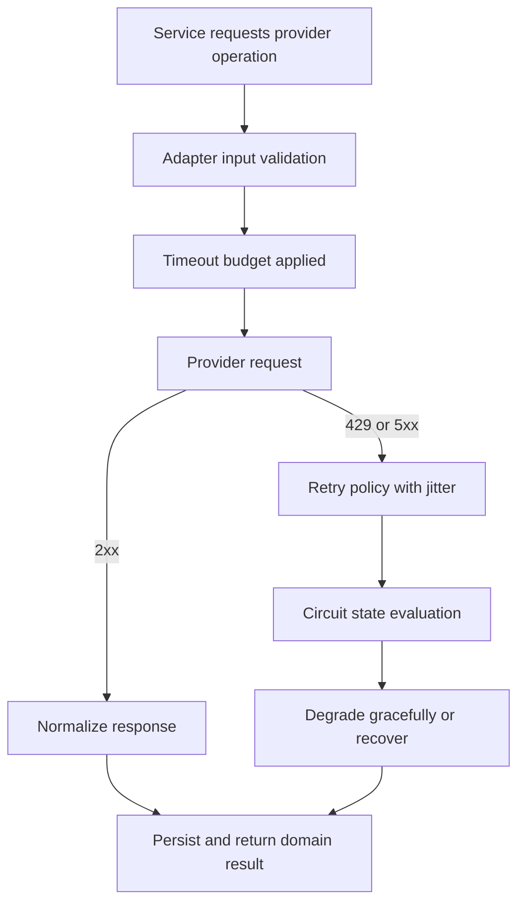

# Request Lifecycle Maps — API to Auth to Context to Data to Response

Use these maps as canonical execution flow for backend changes and incident triage.

## Core API Lifecycle (Hono + tRPC)

## Auth and Context Lifecycle

## Webhook Lifecycle

## External API Lifecycle

## Validation Points by Stage

| Stage | Must Validate |
|---|---|
| Edge | request size, rate limit, route-level trust |
| Auth | token validity, actor identity stability |
| Context | role linkage, mentorado linkage, logger correlation |
| Service | domain invariants, idempotency key presence |
| DB | index-aware query, conflict-safe writes |
| External | timeout, retry class, rate-limit behavior |
| Response | stable error contract and correlation id |

## Hono Request Patterns

| Operation | Pattern |
|---|---|
| Parse JSON body | `await c.req.json()` |
| Query params | `c.req.query('key')` |
| URL params | `c.req.param('id')` |
| Headers | `c.req.header('x-token')` |
| JSON response | `c.json({ data })` |
| Status + JSON | `c.json({ error }, 404)` |
| Middleware | `async (c, next) => { ... await next() }` |
| Context vars | `c.set('key', value)` / `c.get('key')` |
| Error handler | `app.onError((err, c) => c.json(..., 500))` |
