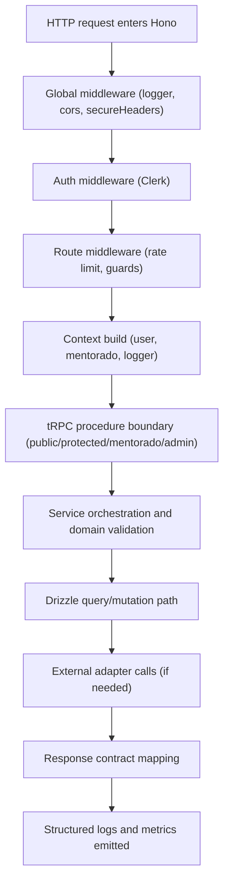
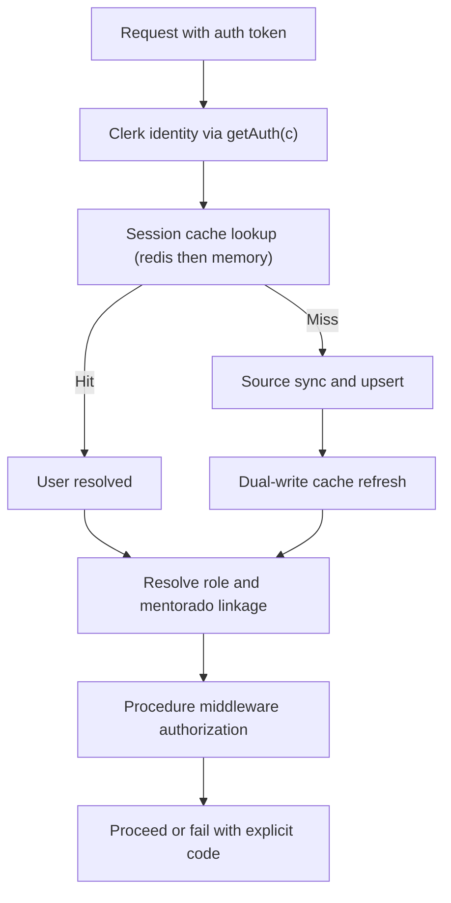
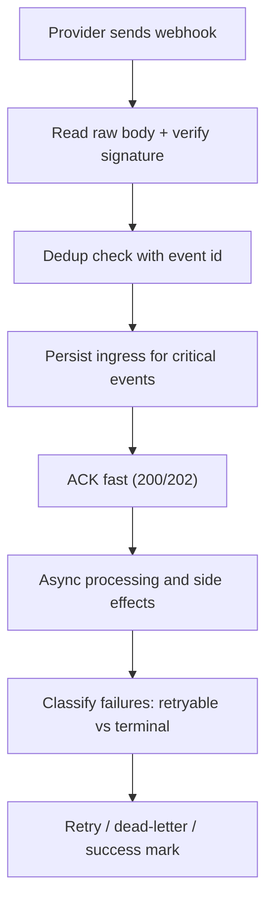
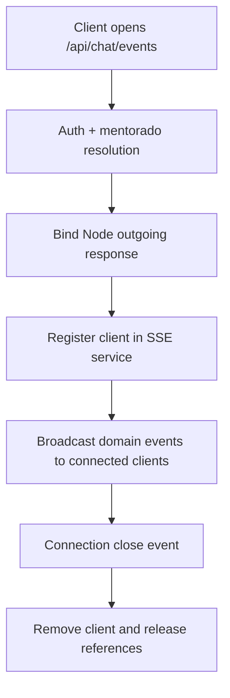

# Request Lifecycle Maps — Hono Primary, Express Legacy

Use these maps as canonical execution flow for backend implementation and incident triage.

## Core API Lifecycle (Hono)

## Auth and Context Lifecycle

## Webhook Lifecycle

## SSE Lifecycle (Broadcast Service Model)

## External API Lifecycle

## Validation Points by Stage

| Stage | Must Validate |
|---|---|
| Edge | request size, rate limit, route trust |
| Auth | token validity, identity stability |
| Context | role linkage, mentorado linkage, correlation logger |
| Service | domain invariants, idempotency presence |
| DB | index-aware query, conflict-safe writes |
| External | timeout, retry class, rate-limit behavior |
| Response | stable error contract + correlation id |

## Hono vs Express Lifecycle Comparison

| Stage | Express (legacy) | Hono (target) |
|---|---|---|
| Request parsing | `req.body`, `req.query` | `await c.req.json()`, `c.req.query()` |
| Middleware | `(req, res, next)` | `async (c, next)` |
| Context transport | request object mutation | `Context` + typed helpers |
| Response API | `res.json()`, `res.status()` | `c.json()`, status as 2nd arg |
| Error handling | error middleware | `app.onError((err, c) => ...)` |
