# Factory Orchestration System v2.0

Dynamic agent routing and MCP tool coordination for AegisWallet via Docker MCP Gateway.

**Context**: Brazilian fintech (PIX, LGPD, WCAG 2.1 AA+) with Portuguese-first interfaces.

## 🎯 Quick Decision Tree

```mermaid
graph TD
    A[📋 New Task] --> B{Keywords?}
    B -->|"spec/research/plan"| R[🔬 apex-researcher]
    B -->|"database/schema/RLS"| D[🗄️ database-specialist]
    B -->|"UI/component/design"| U[🎨 apex-ui-ux-designer]
    B -->|"security/review/audit"| S[🔒 code-reviewer]
    B -->|"docs/PRD/rules"| P[📝 product-architect]
    B -->|"implement/code/fix"| C{Complexity ≥7?}
    C -->|Yes| M[⚡ apex-dev + parallel specialists]
    C -->|No| A1[🔧 apex-dev solo]
    
    R --> V{Needs impl?}
    V -->|Yes| A1
    V -->|No| END[✅ Done]
```



## 🔧 Droids & MCP Tools

| Droid | MCPs | Primary Tools |
|-------|------|---------------|
| **apex-dev** | serena, context7, playwright | `find_symbol`, `replace_symbol_body`, `browser_snapshot` |
| **database-specialist** | serena, neon | `search_for_pattern`, `find_symbol` (schemas) |
| **code-reviewer** | context7, tavily | `tavily-search`, `get-library-docs` |
| **apex-ui-ux-designer** | context7, serena, playwright | `browser_take_screenshot`, `get-library-docs` |
| **apex-researcher** | context7, tavily, serena | `tavily-search`, `tavily-crawl`, `resolve-library-id` |
| **product-architect** | serena | `list_dir`, `find_file`, `get_symbols_overview` |

## ⚡ MCP Tool Chains

### 📚 Research Chain
```yaml
flow: tavily-search → tavily-extract → resolve-library-id → get-library-docs
usage: Documentation research, pattern discovery, compliance validation
example:
  - mcp_MCP_DOCKER_tavily-search: { query: "LGPD compliance React patterns 2024" }
  - mcp_MCP_DOCKER_resolve-library-id: { libraryName: "react" }
  - mcp_MCP_DOCKER_get-library-docs: { context7CompatibleLibraryID: "/facebook/react", topic: "hooks" }
```

### 🔍 Code Analysis Chain
```yaml
flow: serena find_symbol → get_symbols_overview → find_referencing_symbols → search_for_pattern
usage: Understand codebase before implementation
example:
  - mcp_serena_find_symbol: { name_path_pattern: "useAuth", include_body: true }
  - mcp_serena_find_referencing_symbols: { name_path: "useAuth", relative_path: "src/hooks" }
```

### 🛠️ Implementation Chain
```yaml
flow: serena find_symbol → replace_symbol_body OR insert_after_symbol → validate
usage: Code modifications with semantic understanding
example:
  - mcp_serena_find_symbol: { name_path_pattern: "MyComponent", include_body: true }
  - mcp_serena_replace_symbol_body: { name_path: "MyComponent", relative_path: "src/components/MyComponent.tsx", body: "..." }
```

### 🧪 Validation Chain
```yaml
flow: browser_navigate → browser_snapshot → browser_take_screenshot
usage: UI testing, visual validation
example:
  - mcp_MCP_DOCKER_browser_navigate: { url: "http://localhost:5173" }
  - mcp_MCP_DOCKER_browser_snapshot: {}
  - mcp_MCP_DOCKER_browser_take_screenshot: { filename: "validation.png" }
```

## 📋 Task Execution Patterns

### Pattern: New Feature (Complexity ≥7)
```yaml
phases:
  1_research:
    droid: apex-researcher
    tools: [tavily-search, context7, serena]
    output: Research Intelligence Report
    
  2_database: # if schema needed
    droid: database-specialist
    tools: [serena, neon]
    output: Schema + Migrations
    
  3_ui: # if UI component
    droid: apex-ui-ux-designer
    parallel: true
    tools: [context7, playwright]
    output: Component specs + Accessibility audit
    
  4_implement:
    droid: apex-dev
    tools: [serena, playwright]
    output: Implementation
    
  5_validate:
    droid: code-reviewer
    parallel: true
    tools: [tavily, context7]
    output: Security + Compliance report
```

### Pattern: Bug Fix
```yaml
phases:
  1_investigate:
    tools: [mcp_serena_find_symbol, mcp_serena_find_referencing_symbols]
    
  2_fix:
    droid: apex-dev
    tools: [mcp_serena_replace_symbol_body]
    
  3_validate:
    droid: code-reviewer # optional for critical bugs
```

### Pattern: Research Only
```yaml
trigger: "spec - research", "research and plan", "analyze and plan"
droid: apex-researcher
priority: HIGHEST
tools: [tavily-search, tavily-crawl, context7, serena]
output: Research Report + Implementation Plan
```

## 🌐 Skill Integration

### Auto-Activated Skills
| Context | Skill | Location |
|---------|-------|----------|
| Brazilian compliance | `brazilian-fintech-compliance` | `.factory/skills/brazilian-fintech-compliance/` |
| Frontend design | `frontend-design` | `.factory/skills/frontend-design/` |
| Web testing | `webapp-testing` | `.factory/skills/webapp-testing/` |

### Skill Activation Triggers
```yaml
brazilian_compliance:
  keywords: [LGPD, PIX, BCB, CPF, CNPJ, boleto, "R$"]
  skill: brazilian-fintech-compliance
  droids: [code-reviewer, apex-researcher, database-specialist]

accessibility:
  keywords: [WCAG, a11y, acessibilidade, screen reader, contrast]
  skill: frontend-design
  droids: [apex-ui-ux-designer]
```

## 🚀 Parallel Execution Matrix

| Complexity | Pre-Implementation | Post-Implementation |
|------------|-------------------|---------------------|
| **1-3** | apex-dev only | — |
| **4-6** | apex-dev + 1 specialist | code-reviewer |
| **7-8** | [parallel] 2-3 specialists | [parallel] validation |
| **9-10** | [parallel] all specialists | [parallel] full validation |

### Mandatory Parallel Triggers
- **UI Component** → `apex-ui-ux-designer` (ALWAYS)
- **Database Changes** → `database-specialist` (ALWAYS)
- **Brazilian Compliance** → `apex-researcher` + skill activation
- **Security Sensitive** → `code-reviewer` + `apex-researcher`

## 📊 Quality Gates

```yaml
confidence_thresholds:
  research: ≥95%     # Cross-source validation
  architecture: ≥90% # Design decisions
  implementation: ≥85% # Code changes
  
performance_targets:
  mcp_latency: <3ms
  query_response: <100ms
  pix_transactions: <150ms

compliance_priority:
  order: [Security, Compliance, Architecture, Performance, Features]
  mandatory: [LGPD, PIX, WCAG 2.1 AA]
```

## 🔄 Escalation Protocol

1. **Level 1**: Droid self-resolution (assigned MCPs)
2. **Level 2**: Request context from apex-dev
3. **Level 3**: Escalate to apex-researcher (tavily + context7)
4. **Level 4**: Escalate to code-reviewer (security research)
5. **Level 5**: Escalate to product-architect (strategic decisions)

---

> **Reference**: See `.factory/droids/` for complete droid definitions and `.factory/skills/` for skill implementations.
