# Factory Orchestration System v2.1

Dynamic agent routing and MCP tool coordination with intelligent context engineering for automated agent/skill loading.

**Context**: Brazilian fintech (PIX, LGPD, WCAG 2.1 AA+) with Portuguese-first interfaces for education/health sectors.

## 🎯 Enhanced Decision Tree with Context Engineering

```mermaid
graph TD
    A[📋 New Task] --> B{Research Trigger?}
    B -->|"/research|spec-research"| R1[🔬 IMMEDIATE apex-researcher]
    B -->|Standard Task| C1[🧠 apex-dev ANALYSIS]
    
    R1 --> R2{Implementation Needed?}
    R2 -->|Yes| C1
    R2 -->|No| END[✅ Research Complete]
    
    C1 --> D{Context Analysis}
    D -->|Complexity ≥7| E1[⚡ PARALLEL Specialists]
    D -->|Database/Schema| F1[🗄️ database-specialist ALWAYS]
    D -->|UI/Component| G1[🎨 apex-ui-ux-designer ALWAYS]
    D -->|Security/LGPD| H1[🔒 code-reviewer + brazilian-compliance]
    D -->|Simple| I1[🔧 apex-dev SOLO]
    
    E1 --> J[🔄 apex-dev SYNTHESIS]
    F1 --> J
    G1 --> J
    H1 --> J
    I1 --> K[🔧 apex-dev IMPLEMENTATION]
    
    J --> K
    K --> L[✅ PARALLEL Validation]
    L --> M[🔧 apex-dev FINALIZATION]
    M --> END[✅ Complete]
```



## 🧠 Apex-Dev Central Orchestration (MANDATORY)

**TODOS os prompts DEVEM passar pelo apex-dev primeiro** - Este é o hub central obrigatório para orquestração inteligente.

### Execution Flow (6 Phases)

```yaml
phase_1_analysis:
  executor: "apex-dev (solo)"
  activities:
    - Complexity assessment (1-10)
    - Domain identification (database/UI/security/research)
    - Requirements analysis
    - Brazilian compliance needs detection
    - Subagent requirement mapping
  deliverable: "Context Analysis Report"

phase_2_parallel_consultation:
  executor: "apex-dev coordination"
  trigger_conditions:
    - complexity ≥ 7
    - security_sensitive operations
    - UI components (ALWAYS apex-ui-ux-designer)
    - database changes (ALWAYS database-specialist)
    - compliance questions (apex-researcher PRIMARY)
  execution: "Specialist subagents in parallel"
  deliverable: "Specialist Insights Package"

phase_3_synthesis:
  executor: "apex-dev (solo)"
  activities:
    - Receive all specialist insights
    - Resolve conflicts using priority hierarchy
    - Consolidate into implementation plan
    - Define detailed strategy
  deliverable: "Consolidated Implementation Plan"

phase_4_implementation:
  executor: "apex-dev (solo)"
  activities:
    - Implement following consolidated specs
    - Apply security validations
    - Use database schemas as specified
    - Follow UI patterns defined
    - Document key decisions
  deliverable: "Implementation Package"

phase_5_validation:
  executor: "parallel specialists"
  activities:
    - code-reviewer: Security validation
    - database-specialist: Performance/RLS validation (if applicable)
    - apex-ui-ux-designer: Accessibility validation (if applicable)
    - apex-researcher: Brazilian compliance validation (if applicable)
  deliverable: "Validation Reports Package"

phase_6_finalization:
  executor: "apex-dev (solo)"
  activities:
    - Apply corrections from validations
    - Document final decisions with rationale
    - Prepare final delivery package
    - Verify all quality gates passed
  deliverable: "Final Implementation Package"
```

### Context Engineering Intelligence

**Atomic Task Decomposition System:**
```yaml
task_complexity:
  simple_1_3: "Single file, known pattern, 15-30min, apex-dev alone"
  moderate_4_6: "Multi-file, testing required, 1-3h, apex-dev + 1-2 specialists"
  complex_7_8: "Multi-domain, security-sensitive, 4-8h, apex-dev + 3-4 specialists parallel"
  mission_9_10: "System-wide impact, regulatory compliance, 12-24h, all specialists + apex-researcher"

research_depth:
  basic_l1_l3: "1-2 sources, Context7 only, 15-30min"
  moderate_l4_l6: "3-5 sources, Context7 + Tavily, 45-90min"
  complex_l7_l8: "5-10 sources, Context7 + Tavily + Serena, 2-4h"
  mission_l9_l10: "10+ sources, all MCPs + skills, 4-8h"

dependencies:
  hard_sequential: "DB schema → API implementation, Auth → Authorization"
  soft_parallel: "Frontend can mock backend endpoints"
  none_parallel: "Research across domains, independent validations"

time_estimation:
  base_times: "1-3 (30min-2h), 4-6 (2h-4h), 7-8 (4h-8h), 9-10 (12h-24h)"
  brazilian_compliance: "+60min (LGPD + PIX + Accessibility)"
  parallel_efficiency: "2 agents (~45%), 3-4 agents (~55%), 5+ agents (~60%)"
```

### Communication Contracts & Handoff Protocol

**apex-dev → Specialist:**
```yaml
input_structure:
  - "Complete task description with goals/constraints"
  - "Clear expectations and acceptance criteria"
  - "Available tools and timeframes"
  - "Success metrics and required output format"
  - "Context package with existing patterns"

output_expectations:
  - "Comprehensive work summary"
  - "Complete deliverables list"
  - "Key decisions with reasoning and alternatives"
  - "Recommended next actions and handoffs"
  - "Quality self-assessment with confidence levels"
```

**Specialist → apex-dev:**
```yaml
required_deliverables:
  - "Domain-specific analysis results"
  - "Implementation recommendations"
  - "Risk assessment and mitigation strategies"
  - "Quality gates validation status"
  - "Confidence score (≥85% required)"
```

**Escalation Protocol (5 Levels):**
```yaml
level_1: "Droid self-resolution with assigned MCPs"
level_2: "Request additional context from apex-dev"
level_3: "Escalate to apex-researcher for research-based resolution"
level_4: "Escalate to code-reviewer for security/compliance resolution"
level_5: "Escalate to product-architect for documentation/governance resolution"
```

## 🔧 Droids & MCP Tools

| Droid | MCPs | Primary Tools |
|-------|------|---------------|
| **apex-dev** | serena, context7, playwright | `find_symbol`, `replace_symbol_body`, `browser_snapshot` |
| **database-specialist** | serena, neon | `search_for_pattern`, `find_symbol` (schemas) |
| **code-reviewer** | context7, tavily | `tavily-search`, `get-library-docs` |
| **apex-ui-ux-designer** | context7, serena, playwright | `browser_take_screenshot`, `get-library-docs` |
| **apex-researcher** | context7, tavily, serena | `tavily-search`, `tavily-crawl`, `resolve-library-id` |
| **product-architect** | serena | `list_dir`, `find_file`, `get_symbols_overview` |

## 🎯 Intelligent Agent Routing & Skill Auto-Activation

### Automated Agent Selection Algorithm

```yaml
keyword_routing:
  database_triggers:
    keywords: ["database", "schema", "migration", "RLS", "query", "sql"]
    routing: "database-specialist (ALWAYS)"
    priority: "MANDATORY"
    
  ui_component_triggers:
    keywords: ["component", "ui", "ux", "design", "form", "page"]
    routing: "apex-ui-ux-designer (ALWAYS)"
    priority: "MANDATORY"
    
  security_triggers:
    keywords: ["security", "auth", "permission", "LGPD", "PIX", "encryption"]
    routing: "code-reviewer + apex-researcher (if regulatory)"
    priority: "HIGH"
    
  research_triggers:
    keywords: ["research", "spec", "analyze", "investigate", "/research", "/pesquisar"]
    routing: "IMMEDIATE apex-researcher (bypass apex-dev analysis)"
    priority: "HIGHEST"
    
  documentation_triggers:
    keywords: ["docs", "PRD", "rules", "strategy", "roadmap"]
    routing: "product-architect"
    priority: "MEDIUM"

brazilian_compliance_auto_activation:
  lgpd_triggers:
    keywords: ["LGPD", "aluno", "matrícula", "cpf", "consentimento", "proteção de dados"]
    skill: "education-lgpd-compliance"
    agents: ["apex-researcher", "code-reviewer", "database-specialist"]
    validation_level: "Expert (≥95% accuracy)"
    
  financial_triggers:
    keywords: ["PIX", "BCB", "boleto", "R$", "transação", "pagamento"]
    skill: "brazilian-fintech-compliance"
    agents: ["apex-researcher", "code-reviewer", "database-specialist"]
    validation_level: "Expert (≥95% accuracy)"
    
  accessibility_triggers:
    keywords: ["WCAG", "a11y", "acessibilidade", "screen reader", "contrast"]
    skill: "frontend-design"
    agents: ["apex-ui-ux-designer", "code-reviewer"]
    validation_level: "WCAG 2.1 AA+ + Brazilian standards"
    
  education_triggers:
    keywords: ["CRM", "pipeline", "lead", "aluno", "gestão", "SDR", "chat integrado"]
    skill: "crm-student-management"
    agents: ["apex-researcher", "database-specialist", "apex-dev"]
    validation_level: "Expert (≥95% accuracy)"
```

### Context-Based Skill Integration Matrix

```yaml
education_health_context:
  triggers: ["saúde estética", "estética", "ANVISA", "certificação profissional", "empreendedor estética"]
  primary_skills: ["health-aesthetics-research", "education-lgpd-compliance"]
  agent_combination: ["apex-researcher", "apex-ui-ux-designer"]
  compliance_focus: "ANVISA + LGPD + WCAG 2.1 AA+"
  
testing_validation_context:
  triggers: ["testing", "validation", "accessibility", "performance", "qa"]
  primary_skills: ["webapp-testing"]
  agent_combination: ["apex-ui-ux-designer", "code-reviewer", "apex-dev"]
  compliance_focus: "WCAG 2.1 AA+ + Brazilian testing standards"
  
market_analysis_context:
  triggers: ["market", "competitive", "roadmap", "strategy", "analysis"]
  primary_skills: ["product-management"]
  agent_combination: ["apex-researcher", "product-architect"]
  compliance_focus: "Brazilian market research standards"
  
data_analytics_context:
  triggers: ["statistics", "metrics", "performance", "analytics", "data"]
  primary_skills: ["ai-data-analyst"]
  agent_combination: ["apex-dev", "database-specialist"]
  compliance_focus: "LGPD data governance + analytics"
```

### Integration with /research Command

```yaml
research_command_integration:
  trigger_keywords: ["/research", "/pesquisar", "spec - research", "analyze and plan"]
  
  immediate_routing:
    condition: "Any trigger keyword detected"
    action: "IMMEDIATE apex-researcher (bypass apex-dev analysis)"
    priority: "HIGHEST (Level 1)"
    
  docker_mcp_stack:
    enabled_mcps: ["context7", "tavily", "sequential-thinking", "neon", "playwright", "fetch"]
    target_latency: "<3ms via Docker Gateway"
    cross_validation: "≥95% accuracy required"
    
  workflow_handoff:
    research_completion: "Research Intelligence Report → apex-dev"
    implementation_start: "apex-dev resumes Phase 3 (Synthesis)"
    context_preservation: "Serena memories + research artifacts"
    
  output_integration:
    location: ".factory/docs/YYYY-MM-DD-research-topic.md"
    format: "Executive summary + Implementation roadmap"
    compliance: "Brazilian LGPD/education/health validation"
```

## ⚡ MCP Tool Chains

### 📚 Research Chain
```yaml
flow: tavily-search → tavily-extract → resolve-library-id → get-library-docs
usage: Documentation research, pattern discovery, compliance validation
example:
  - mcp_MCP_DOCKER_tavily-search: { query: "LGPD compliance React patterns 2024" }
  - mcp_MCP_DOCKER_resolve-library-id: { libraryName: "react" }
  - mcp_MCP_DOCKER_get-library-docs: { context7CompatibleLibraryID: "/facebook/react", topic: "hooks" }
```

### 🔍 Code Analysis Chain
```yaml
flow: serena find_symbol → get_symbols_overview → find_referencing_symbols → search_for_pattern
usage: Understand codebase before implementation
example:
  - mcp_serena_find_symbol: { name_path_pattern: "useAuth", include_body: true }
  - mcp_serena_find_referencing_symbols: { name_path: "useAuth", relative_path: "src/hooks" }
```

### 🛠️ Implementation Chain
```yaml
flow: serena find_symbol → replace_symbol_body OR insert_after_symbol → validate
usage: Code modifications with semantic understanding
example:
  - mcp_serena_find_symbol: { name_path_pattern: "MyComponent", include_body: true }
  - mcp_serena_replace_symbol_body: { name_path: "MyComponent", relative_path: "src/components/MyComponent.tsx", body: "..." }
```

### 🧪 Validation Chain
```yaml
flow: browser_navigate → browser_snapshot → browser_take_screenshot
usage: UI testing, visual validation
example:
  - mcp_MCP_DOCKER_browser_navigate: { url: "http://localhost:5173" }
  - mcp_MCP_DOCKER_browser_snapshot: {}
  - mcp_MCP_DOCKER_browser_take_screenshot: { filename: "validation.png" }
```

## 📋 Task Execution Patterns

### Pattern: New Feature (Complexity ≥7)
```yaml
phases:
  1_research:
    droid: apex-researcher
    tools: [tavily-search, context7, serena]
    output: Research Intelligence Report
    
  2_database: # if schema needed
    droid: database-specialist
    tools: [serena, neon]
    output: Schema + Migrations
    
  3_ui: # if UI component
    droid: apex-ui-ux-designer
    parallel: true
    tools: [context7, playwright]
    output: Component specs + Accessibility audit
    
  4_implement:
    droid: apex-dev
    tools: [serena, playwright]
    output: Implementation
    
  5_validate:
    droid: code-reviewer
    parallel: true
    tools: [tavily, context7]
    output: Security + Compliance report
```

### Pattern: Bug Fix
```yaml
phases:
  1_investigate:
    tools: [mcp_serena_find_symbol, mcp_serena_find_referencing_symbols]
    
  2_fix:
    droid: apex-dev
    tools: [mcp_serena_replace_symbol_body]
    
  3_validate:
    droid: code-reviewer # optional for critical bugs
```

### Pattern: Research Only
```yaml
trigger: "spec - research", "research and plan", "analyze and plan"
droid: apex-researcher
priority: HIGHEST
tools: [tavily-search, tavily-crawl, context7, serena]
output: Research Report + Implementation Plan
```

## 🌐 Skill Integration

### Auto-Activated Skills
| Context | Skill | Location |
|---------|-------|----------|
| Brazilian compliance | `brazilian-fintech-compliance` | `.factory/skills/brazilian-fintech-compliance/` |
| Frontend design | `frontend-design` | `.factory/skills/frontend-design/` |
| Web testing | `webapp-testing` | `.factory/skills/webapp-testing/` |

### Skill Activation Triggers
```yaml
brazilian_compliance:
  keywords: [LGPD, PIX, BCB, CPF, CNPJ, boleto, "R$"]
  skill: brazilian-fintech-compliance
  droids: [code-reviewer, apex-researcher, database-specialist]

accessibility:
  keywords: [WCAG, a11y, acessibilidade, screen reader, contrast]
  skill: frontend-design
  droids: [apex-ui-ux-designer]
```

## 🚀 Parallel Execution Matrix

| Complexity | Pre-Implementation | Post-Implementation |
|------------|-------------------|---------------------|
| **1-3** | apex-dev only | — |
| **4-6** | apex-dev + 1 specialist | code-reviewer |
| **7-8** | [parallel] 2-3 specialists | [parallel] validation |
| **9-10** | [parallel] all specialists | [parallel] full validation |

### Mandatory Parallel Triggers
- **UI Component** → `apex-ui-ux-designer` (ALWAYS)
- **Database Changes** → `database-specialist` (ALWAYS)
- **Brazilian Compliance** → `apex-researcher` + skill activation
- **Security Sensitive** → `code-reviewer` + `apex-researcher`

## 📊 Enhanced Quality Gates & Performance Targets

### Confidence Thresholds Matrix

```yaml
confidence_requirements:
  research_validation: "≥95% cross-source validation (mandatory for regulatory)"
  architecture_decisions: "≥90% validation for system design"
  implementation_quality: "≥85% for code changes"
  brazilian_compliance: "100% mandatory for LGPD/PIX/education"
  accessibility_wcag: "≥95% for WCAG 2.1 AA+ compliance"
  security_validation: "≥95% for OWASP Top 10 compliance"
```

### Performance Targets (Docker MCP Gateway Optimized)

```yaml
mcp_performance:
  docker_latency: "<3ms target via Docker Gateway"
  context_deduplication: "Automatic via Docker containers"
  parallel_execution: "Optimized concurrent MCP calls"
  resource_isolation: "Built-in Docker container security"

system_performance:
  query_response: "<100ms for database operations"
  pix_transactions: "<150ms for Brazilian financial operations"
  ui_rendering: "<16ms for 60fps animations"
  api_endpoints: "<200ms for standard operations"

brazilian_compliance_performance:
  lgpd_encryption: "AES-256-GCM with hardware acceleration"
  data_anonymization: "<50ms for PII processing"
  audit_logging: "<10ms for compliance tracking"
```

### Priority Hierarchy & Conflict Resolution

```yaml
decision_hierarchy:
  level_1_security: "code-reviewer overrides all decisions"
  level_2_compliance: "LGPD and regulatory requirements mandatory"
  level_3_architecture: "System architecture decisions"
  level_4_performance: "Within security constraints"
  level_5_features: "Following established patterns"

conflict_resolution:
  subagent_disagreement: "apex-researcher (regulatory research)"
  compliance_conflict: "apex-researcher (regulatory clarification)"
  performance_vs_security: "security takes precedence"
  implementation_deadlocks: "apex-dev (coordination authority)"
```

### Enhanced Validation Framework

```yaml
cross_validation_strategy:
  source_1_official: "Context7 (BCB, WCAG, OWASP, LGPD docs)"
  source_2_community: "Tavily (community implementations, expert insights)"
  source_3_codebase: "Serena (existing patterns, consistency validation)"
  source_4_synthesis: "Sequential-thinking (gap identification, synthesis)"

brazilian_compliance_gates:
  lgpd_validation: "Mandatory for student data, financial transactions"
  pix_validation: "Required for Brazilian payment integration"
  accessibility_validation: "WCAG 2.1 AA+ + NBR 17225 for Brazilian standards"
  education_validation: "Specific requirements for health aesthetics sector"

quality_checkpoints:
  phase_1_analysis: "Complexity assessment validated"
  phase_2_consultation: "All specialist insights received"
  phase_3_synthesis: "Implementation plan consolidated"
  phase_4_implementation: "Code following consolidated specs"
  phase_5_validation: "All quality gates passed"
  phase_6_finalization: "Delivery package ready"
```

## 🔄 Multi-Level Escalation Protocol

### Enhanced Escalation Matrix

```yaml
level_1_self_resolution:
  executor: "Individual droid"
  resources: "Assigned MCPs only"
  timeout: "5 minutes"
  success_criteria: "Resolution with available resources"

level_2_context_request:
  executor: "Droid requests from apex-dev"
  resources: "Additional context + pattern database"
  timeout: "10 minutes"
  success_criteria: "Sufficient context for resolution"

level_3_research_escalation:
  executor: "apex-researcher activation"
  resources: "Full MCP stack (Context7 + Tavily + Serena)"
  timeout: "30 minutes"
  success_criteria: "Research-based resolution with ≥95% confidence"

level_4_security_escalation:
  executor: "code-reviewer + apex-researcher"
  resources: "Security research + compliance validation"
  timeout: "45 minutes"
  success_criteria: "Security resolution with compliance verification"

level_5_governance_escalation:
  executor: "product-architect + all specialists"
  resources: "Strategic analysis + documentation framework"
  timeout: "60 minutes"
  success_criteria: "Strategic decision with governance compliance"
```

### Context Preservation During Escalation

```yaml
context_management:
  memory_system: "Serena persistent memories"
  state_preservation: "Full workflow state between escalations"
  knowledge_transfer: "Research insights → implementation decisions"
  audit_trail: "Complete escalation history with rationale"

escalation_triggers:
  automatic: "Confidence score <85% or quality gate failure"
  manual: "Specialist determination of complexity"
  timeout: "Exceeded resolution time for current level"
  conflict: "Unresolved conflicts between recommendations"
```

## 📋 Quick Reference Templates

### Auto-Activation Protocol

```yaml
triggers: ["/research", "/pesquisar", "spec - research"]
routing: "Docker MCP Gateway orchestration"
mcp_stack: ["context7", "tavily", "sequential-thinking", "neon", "playwright", "fetch"]
quality_gate: "≥95% cross-validation"
target_latency: "<3ms"
brazilian_compliance: "Mandatory"
```

### Task Templates

**Simple Task (Complexity 1-3):**
```
apex-dev solo → implementation → code-reviewer validation
Duration: 30min-2h
MCPs: serena + context7
Brazilian compliance: basic check
```

**Moderate Task (Complexity 4-6):**
```
apex-dev analysis → [parallel] 1-2 specialists → apex-dev synthesis → implementation → validation
Duration: 2h-4h
MCPs: serena + context7 + tavily + specialist MCPs
Brazilian compliance: full validation
```

**Complex Task (Complexity 7-8):**
```
apex-dev analysis → [parallel] 3-4 specialists → apex-dev synthesis → implementation → [parallel] validation
Duration: 4h-8h
MCPs: Full Docker MCP Gateway stack
Brazilian compliance: expert validation
```

**Mission-Critical (Complexity 9-10):**
```
apex-researcher (immediate) → apex-dev analysis → [parallel] all specialists → apex-dev synthesis → implementation → [parallel] full validation
Duration: 12h-24h
MCPs: Full Docker MCP Gateway + all skills
Brazilian compliance: mission-critical validation
```

### Example Workflows

**CRM Pipeline Implementation:**
```yaml
trigger: "CRM pipeline para cursos de estética"
complexity: 7
routing: "apex-dev analysis → [parallel] database-specialist + apex-ui-ux-designer + apex-researcher"
skills: ["crm-student-management", "education-lgpd-compliance"]
brazilian_compliance: "Mandatory (LGPD + student data)"
output: "Complete CRM system with LGPD compliance"
```

**PIX Integration:**
```yaml
trigger: "PIX payment integration"
complexity: 9
routing: "IMMEDIATE apex-researcher → apex-dev analysis → [parallel] database-specialist + code-reviewer"
skills: ["brazilian-fintech-compliance"]
brazilian_compliance: "Mission-critical (BCB standards + LGPD)"
output: "PIX payment system with full regulatory compliance"
```

**Research Command:**
```yaml
trigger: "/research LGPD compliance para gestão de alunos"
routing: "IMMEDIATE apex-researcher (bypass apex-dev)"
mcp_stack: "Full Docker MCP Gateway"
skills: ["education-lgpd-compliance"]
brazilian_compliance: "Expert validation"
output: ".factory/docs/YYYY-MM-DD-lgpd-aluno-compliance.md"
```

---

> **Reference**: See `.factory/droids/` for complete droid definitions and `.factory/skills/` for skill implementations.
