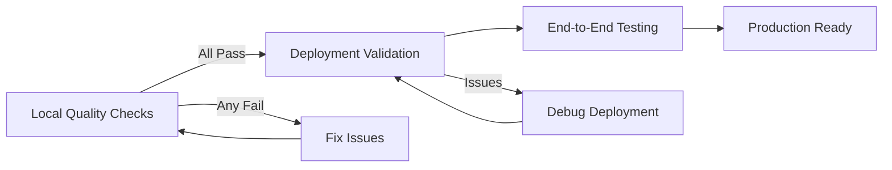

# 🔍 Quality Control - Modern Web Stack

**Complete quality control pipeline for Bun + Vite + Convex + TanStack Router applications with Railway deployment verification.**

---

## 🏗️ ARCHITECTURAL OVERVIEW

### System Components
```
┌─────────────────────────────────────────────────────────────────────────────┐
│                        DEPLOYMENT ARCHITECTURE                           │
├─────────────────────────────────────────────────────────────────────────────┤
│                                                                             │
│  ┌─────────────────┐          ┌─────────────────┐                        │
│  │   FRONTEND      │          │    BACKEND      │                        │
│  │                 │          │                 │                        │
│  │ Railway (Docker)│◄────────►│    Convex       │                        │
│  │ Vite Build      │  Auth    │ Real-time DB    │                        │
│  │ Static Hosting  │◄────────►│ + Functions     │                        │
│  │                 │  Clerk   │                 │                        │
│  └─────────────────┘          └─────────────────┘                        │
│                                                                             │
└─────────────────────────────────────────────────────────────────────────────┘
```

### Tech Stack Integration
- **Runtime**: Bun (package manager + execution)
- **Frontend**: React 19 + Vite + TanStack Router
- **Styling**: Tailwind CSS v4 + shadcn/ui
- **Backend**: Convex (database + real-time functions)
- **Auth**: Clerk (authentication)
- **Deploy**: Railway (frontend) + Convex (backend)

---

## 🎯 Quality Control Philosophy

**Execution Order**: Local Checks → Deployment Validation → End-to-End Testing

**Gate Principle**: Deployments MUST NOT proceed if any local check fails

**Validation Standard**: Zero tolerance for lint errors, type errors, and configuration mismatches

---

## 📋 EXECUTION PHASES

### 🔄 High-Level Sequence



---

## 📍 PHASE 1: LOCAL QUALITY CHECKS

> **⚠️ CRITICAL GATE**: Do NOT proceed to deployment if ANY check fails

### 1.1 Code Quality & Linting
```bash
# Check code formatting and lint rules
bun run lint:check

# Expected: 0 errors, 0 warnings
# If issues found: bun run lint to auto-fix
```

### 1.2 Type Safety & Build Verification
```bash
# Type checking (included in build)
bun run build

# Expected: Clean build with no TypeScript errors
# This command runs both Vite build and tsc --noEmit
```

### 1.3 Test Coverage
```bash
# Run tests with coverage
bun run test:coverage

# Expected: All tests pass, coverage metrics maintained
# Coverage report generated in coverage/ directory
```

### 1.4 Local Development Validation
```bash
# Verify local development setup
bun run dev

# Expected: Application starts successfully on http://localhost:5173
# No runtime errors in browser console
```

---

## 📍 PHASE 2: DEPLOYMENT VALIDATION

> **✅ PREREQUISITE**: Phase 1 must pass completely

### 2.1 Frontend Deployment (Railway)

#### Prerequisites
```bash
# Install Railway CLI (if not installed)
npm install -g @railway/cli

# Login to Railway
railway login

# Target correct project
railway use <your-project-id>
# OR set RAILWAY_TOKEN environment variable
```

#### Deployment Status Verification
```bash
# Check current deployment status
railway status

# Expected: Service running, healthy status
# Note the public URL for validation
```

#### Trigger Deployment (if needed)
```bash
# Push changes to trigger deployment
git add .
git commit -m "chore: update deployment"
git push origin main

# Railway will automatically deploy on push
```

#### Frontend Health Checks
```bash
# Retrieve public URL from Railway dashboard or status command
PUBLIC_URL=$(railway status | grep -o 'https://[^[:space:]]*\.railway\.app')

# Verify root path loads without errors
curl -f "$PUBLIC_URL" || echo "❌ Frontend health check failed"

# Open in browser for visual verification
open "$PUBLIC_URL"
```

#### Log Analysis
```bash
# Check recent deployment logs
railway logs --lines 50

# Look for:
# - Build errors
# - Runtime errors
# - Missing environment variables
# - Convex connection issues
```

### 2.2 Backend Deployment (Convex)

#### Schema & Function Deployment
```bash
# Deploy Convex schema and functions to production
npm run deploy:convex

# Expected: Successful deployment confirmation
# Note the deployment URL/ID
```

#### Active Deployment Verification
```bash
# List all Convex deployments
npx convex deployments list

# Expected: Your deployment appears as 'Active'
# Verify CONVEX_DEPLOYMENT in .env.local matches active deployment
```

#### Environment Variable Alignment
```bash
# Verify local Convex URL matches deployment
echo "Local CONVEX_URL: $VITE_CONVEX_URL"
echo "Local DEPLOYMENT: $CONVEX_DEPLOYMENT"

# These should match the active Convex deployment
```

#### Backend Function Validation
```bash
# Test key Convex functions are accessible
npx convex run --prod api.leads.listLeads
npx convex run --prod api.users.current

# Expected: Functions execute without errors
# May need authentication for some functions
```

---

## 📍 PHASE 3: ENVIRONMENT VARIABLE CONSISTENCY

> **🔧 CRITICAL**: Environment variables must align between local, Railway, and Convex

### 3.1 Critical Variables Mapping

| Variable | Purpose | Location | Verification |
|----------|---------|-----------|--------------|
| `VITE_CONVEX_URL` | Convex backend URL | `.env.local` + Railway | Must match active Convex deployment |
| `CONVEX_DEPLOYMENT` | Convex deployment ID | `.env.local` | Must match active deployment from list |
| `VITE_CLERK_PUBLISHABLE_KEY` | Clerk auth key | `.env.local` + Railway | Required for app initialization |

### 3.2 Environment Verification Steps

```bash
# Step 1: Check local environment
cat .env.local
# Expected: All 3 variables present and non-empty

# Step 2: Verify Convex deployment alignment
npx convex deployments list
# Look for your deployment marked as "Active"
# Compare with CONVEX_DEPLOYMENT in .env.local

# Step 3: Get Convex URL from dashboard
# Convex Dashboard → Settings → Deployment URL
# Verify this matches VITE_CONVEX_URL in .env.local

# Step 4: Check Railway environment variables
railway variables list
# Verify VITE_CONVEX_URL and VITE_CLERK_PUBLISHABLE_KEY are set
```

### 3.3 Common Configuration Issues

#### Issue: Missing VITE_CLERK_PUBLISHABLE_KEY
```bash
# Error: Missing VITE_CLERK_PUBLISHABLE_KEY (from src/main.tsx)
# Solution: Add to .env.local AND Railway environment variables
```

#### Issue: Convex URL Mismatch
```bash
# Symptom: Frontend can't connect to backend
# Solution: Update VITE_CONVEX_URL to match active Convex deployment
# Remember: Railway needs redeploy after env var changes
```

#### Issue: Deployment ID Drift
```bash
# Symptom: Local deployment ID differs from production
# Solution: Run `npm run deploy:convex` and update .env.local
```

### 3.4 Environment Update Protocol

```bash
# 1. Update Convex deployment
npm run deploy:convex

# 2. Note new deployment URL/ID
# 3. Update .env.local
echo "VITE_CONVEX_URL=https://new-deployment.convex.cloud" >> .env.local
echo "CONVEX_DEPLOYMENT=dev:new-deployment-id" >> .env.local

# 4. Update Railway environment variables
railway variables set VITE_CONVEX_URL=https://new-deployment.convex.cloud
railway variables set VITE_CLERK_PUBLISHABLE_KEY=pk_test_your_key

# 5. Trigger Railway redeploy
git add .env.local
git commit -m "chore: update convex deployment"
git push origin main
```

---

## 📍 PHASE 4: END-TO-END VALIDATION

> **✅ PREREQUISITE**: Phases 1-3 must pass completely

### 4.1 Frontend-Backend Integration Test

```bash
# Open deployed Railway URL
open https://your-app.railway.app

# Test authentication flow
# 1. Click sign-in/sign-up
# 2. Complete authentication with Clerk
# 3. Verify user is logged in

# Test Convex integration
# 1. Navigate to CRM: /crm
# 2. Verify leads load without errors
# 3. Check browser console for connection issues
```

### 4.2 Functional Workflow Validation

```bash
# Test key user workflows:
# ✅ Authentication (Clerk)
# ✅ Data fetching (Convex functions)
# ✅ Navigation (TanStack Router)
# ✅ Component rendering (React 19 + shadcn/ui)
```

### 4.3 Error Boundary Testing

```bash
# Test error handling:
# 1. Navigate to non-existent route (should show 404)
# 2. Disconnect from network (should handle gracefully)
# 3. Clear browser storage (should re-authenticate properly)
```

### 4.4 Performance Verification

```bash
# Check load times with browser dev tools:
# 1. Initial page load: < 3 seconds
# 2. Route transitions: < 500ms
# 3. API responses: < 1 second
```

---

## 🚀 QUICK REFERENCE COMMANDS

### Local Quality Checks
```bash
# Full local quality check
bun run lint:check && bun run build && bun run test:coverage

# Individual checks
bun run lint:check          # Code quality and formatting
bun run build               # TypeScript + build verification
bun run test:coverage       # Test execution with coverage
bun run dev                 # Local development validation
```

### Deployment Commands
```bash
# Frontend (Railway)
railway status              # Check deployment status
railway logs --lines 50    # Check recent logs
git push origin main         # Trigger new deployment

# Backend (Convex)
npm run deploy:convex       # Deploy schema and functions
npx convex deployments list # List active deployments
npx convex run --prod api.leads.listLeads  # Test functions
```

### Environment Management
```bash
# Verify environment alignment
cat .env.local
railway variables list
npx convex deployments list

# Update environment after Convex deploy
echo "VITE_CONVEX_URL=new-url" >> .env.local
railway variables set VITE_CONVEX_URL=new-url
git push origin main  # Trigger Railway redeploy
```

---

## ⚠️ COMMON ISSUES & SOLUTIONS

### Build Issues
```bash
# Problem: TypeScript errors
# Solution: Check types in components and routes
bun run build  # Will show specific errors

# Problem: Vite build fails
# Solution: Check for missing imports or syntax errors
# Look at error output for file/line details
```

### Deployment Issues
```bash
# Problem: Railway deployment fails
# Check: railway logs --lines 100
# Common causes:
# - Missing environment variables
# - Build script failures
# - Invalid Dockerfile

# Problem: Convex deployment fails
# Check: convex schema validity
# Common causes:
# - Invalid schema definitions
# - Missing function exports
# - Type mismatches
```

### Runtime Issues
```bash
# Problem: Frontend can't connect to Convex
# Check 1: VITE_CONVEX_URL in .env.local
# Check 2: VITE_CONVEX_URL in Railway variables
# Check 3: Convex deployment is active

# Problem: Authentication not working
# Check 1: VITE_CLERK_PUBLISHABLE_KEY is set
# Check 2: Clerk configuration is correct
# Check 3: Auth component is properly integrated
```

---

## 📊 SUCCESS METRICS

### Quality Gates
- ✅ **0 lint errors** (`bun run lint:check`)
- ✅ **0 type errors** (`bun run build`)
- ✅ **100% tests pass** (`bun run test:coverage`)
- ✅ **Clean deployment** (Railway status: healthy)
- ✅ **Backend functions accessible** (Convex CLI tests)

### Performance Benchmarks
- 🚀 **Page load**: < 3 seconds
- 🚀 **Route transitions**: < 500ms
- 🚀 **API responses**: < 1 second
- 🚀 **Build time**: < 2 minutes

### Reliability Indicators
- 🟢 **All phases pass without intervention**
- 🟢 **No manual environment fixes needed**
- 🟢 **End-to-end workflows functional**
- 🟢 **No console errors in production**

---

## 🔧 TROUBLESHOOTING GUIDE

### Phase 1 Failures
```bash
# If lint fails:
bun run lint  # Auto-fix common issues
# Manual fixes needed for:
# - TypeScript types
# - Import organization
# - Code style violations

# If build fails:
# Check TypeScript errors in output
# Common issues:
# - Missing type definitions
# - Import path problems
# - Component prop type mismatches

# If tests fail:
bun run test:watch  # Run in watch mode
# Look for failing assertions
# Check test setup and mocks
```

### Phase 2 Failures
```bash
# If Railway deployment fails:
railway logs --lines 100
# Look for build errors or runtime issues
# Check Dockerfile and package.json scripts

# If Convex deployment fails:
# Validate schema syntax
# Check function exports
# Verify authentication configuration
```

### Phase 3 Environment Issues
```bash
# Environment variable mismatch:
# 1. Get current Convex deployment
npx convex deployments list

# 2. Update .env.local
# 3. Update Railway variables
# 4. Trigger redeploy

# URL format issues:
# Convex URLs: https://<deployment>.convex.cloud
# Railway URLs: https://<project>.railway.app
```

### Phase 4 Integration Issues
```bash
# Authentication flow broken:
# 1. Check Clerk keys
# 2. Verify auth provider setup
# 3. Test with different users

# Data loading fails:
# 1. Check Convex function availability
# 2. Verify network connectivity
# 3. Check browser console for errors

# Performance issues:
# 1. Check bundle size
# 2. Verify lazy loading
# 3. Optimize images and assets
```

---

*Quality Control v3.0 - Bun + Vite + Convex + TanStack Router Stack*
*Last Updated: 2025-12-13*
