# GEMINI ORCHESTRATION PROTOCOL v2.1

Advanced AI orchestration for **Grupo US** with intelligent agent routing, MCP coordination, and Brazilian compliance automation.

**Context**: Brazilian fintech (PIX, LGPD, WCAG 2.1 AA+) with Portuguese-first interfaces for education/health sectors.

---

## 🚨 PRIME DIRECTIVES (NON-NEGOTIABLE)

| Directive | Rule |
|-----------|------|
| **Master Rulebook** | Read `/Users/sacha/projetos/gpus/AGENTS.md` at session start. Recursively read local `AGENTS.md` in subdirectories. |
| **Package Manager** | **ALWAYS use `bun`**. Never `npm`, `yarn`, or `pnpm`. |
| **Framework** | React 19 + Vite + TanStack Router + Convex + Clerk |
| **MCP First** | Use `serena` before `grep`/`cat`. Use `sequential-thinking` for complexity ≥5. |

---

## 🎯 Decision Tree & Agent Routing

```mermaid
graph TD
    A[📋 New Task] --> B{Research Trigger?}
    B -->|"/research"| R1[🔬 apex-researcher IMMEDIATE]
    B -->|Standard| C1[🧠 apex-dev ANALYSIS]
    C1 --> D{Domain?}
    D -->|Database| F1[🗄️ database-specialist]
    D -->|UI/Component| G1[🎨 apex-ui-ux-designer]
    D -->|Security/LGPD| H1[🔒 code-reviewer]
    D -->|Simple| I1[🔧 apex-dev SOLO]
    F1 & G1 & H1 --> J[apex-dev SYNTHESIS]
    J --> K[IMPLEMENTATION] --> L[VALIDATION]
```



### Keyword Routing Matrix

| Trigger | Agent | Priority |
|---------|-------|----------|
| `/research`, `spec`, `analyze` | `apex-researcher` (bypass apex-dev) | **HIGHEST** |
| `database`, `schema`, `migration`, `RLS` | `database-specialist` | **MANDATORY** |
| `component`, `ui`, `ux`, `design`, `form` | `apex-ui-ux-designer` | **MANDATORY** |
| `security`, `auth`, `LGPD`, `PIX` | `code-reviewer` + `apex-researcher` | HIGH |
| `docs`, `PRD`, `roadmap` | `product-architect` | MEDIUM |
| Default implementation | `apex-dev` | STANDARD |

---

## 🤖 Droid Factory

### Location: `/Users/sacha/projetos/gpus/.factory/droids/`

| Task Type | Droid | Trigger Keywords |
|-----------|-------|------------------|
| Complex Implementation (≥7) | `apex-dev.md` | "implement", "refactor", "build feature" |
| Research & Planning | `apex-researcher.md` | "research", "analyze", "plan", "spec" |
| UI/UX & Accessibility | `apex-ui-ux-designer.md` | "design", "style", "css", "accessibility" |
| Database & LGPD | `database-specialist.md` | "schema", "convex", "database", "migration" |
| Security & Review | `code-reviewer.md` | "review", "security", "audit" |
| Product & Docs | `product-architect.md` | "prd", "documentation", "roadmap" |

**Activation**: Read droid file → Adopt Role/Mission → Follow Critical Rules

---

## 🔧 MCP Tools & Chains

### Tool Assignment by Droid

| Droid | MCPs | Primary Tools |
|-------|------|---------------|
| **apex-dev** | serena, context7, playwright | `find_symbol`, `replace_symbol_body`, `browser_snapshot` |
| **database-specialist** | serena, neon | `search_for_pattern`, `find_symbol` (schemas) |
| **code-reviewer** | context7, tavily | `tavily-search`, `get-library-docs` |
| **apex-ui-ux-designer** | context7, serena, playwright | `browser_take_screenshot`, `get-library-docs` |
| **apex-researcher** | context7, tavily, serena | `tavily-search`, `tavily-crawl`, `resolve-library-id` |

### Tool Chains

```yaml
# Research Chain
tavily-search → tavily-extract → resolve-library-id → get-library-docs

# Code Analysis Chain  
serena find_symbol → get_symbols_overview → find_referencing_symbols

# Implementation Chain
serena find_symbol → replace_symbol_body OR insert_after_symbol → validate

# Validation Chain
browser_navigate → browser_snapshot → browser_take_screenshot
```

---

## ⚡ Execution Flow (6 Phases)

```yaml
phase_1_analysis:     apex-dev solo → Complexity assessment, domain identification
phase_2_consultation: [parallel] Specialists based on domain triggers
phase_3_synthesis:    apex-dev → Consolidate insights into implementation plan
phase_4_implementation: apex-dev → Code following specs
phase_5_validation:   [parallel] code-reviewer + domain specialists
phase_6_finalization: apex-dev → Apply corrections, prepare delivery
```

### Complexity Matrix

| Level | Description | Duration | Team |
|-------|-------------|----------|------|
| **1-3** | Single file, known pattern | 30min-2h | apex-dev solo |
| **4-6** | Multi-file, testing required | 2h-4h | apex-dev + 1-2 specialists |
| **7-8** | Multi-domain, security-sensitive | 4h-8h | apex-dev + 3-4 specialists |
| **9-10** | System-wide, regulatory compliance | 12-24h | All specialists + apex-researcher |

---

## 🛑 Debugging Protocol

**When an error occurs:**

1. **PAUSE** – Don't immediately retry
2. **THINK** – Call `sequential-thinking`:
   - What exactly happened?
   - Why? (Root Cause Analysis)
   - What are 3 possible fixes?
3. **HYPOTHESIZE** – Formulate hypothesis + validation plan
4. **EXECUTE** – Apply fix after understanding cause

---

## 🇧🇷 Brazilian Compliance Auto-Activation

| Context | Keywords | Skill | Validation Level |
|---------|----------|-------|------------------|
| **LGPD** | `LGPD`, `aluno`, `CPF`, `consentimento` | `education-lgpd-compliance` | ≥95% |
| **Financial** | `PIX`, `BCB`, `boleto`, `R$`, `pagamento` | `brazilian-fintech-compliance` | ≥95% |
| **Accessibility** | `WCAG`, `a11y`, `acessibilidade` | `frontend-design` | WCAG 2.1 AA+ |
| **Education** | `CRM`, `pipeline`, `lead`, `SDR` | `crm-student-management` | ≥95% |

### Performance Targets

```yaml
mcp_latency: "<3ms via Docker Gateway"
query_response: "<100ms for database"
pix_transactions: "<150ms"
lgpd_encryption: "AES-256-GCM"
```

---

## 📊 Quality Gates

### Confidence Thresholds

| Domain | Required Confidence |
|--------|---------------------|
| Research validation | ≥95% (cross-source) |
| Architecture decisions | ≥90% |
| Implementation quality | ≥85% |
| Brazilian compliance | **100%** (mandatory) |
| WCAG accessibility | ≥95% |
| Security (OWASP Top 10) | ≥95% |

### Priority Hierarchy (Conflict Resolution)

1. **Security** → code-reviewer overrides all
2. **Compliance** → LGPD/regulatory mandatory
3. **Architecture** → System design decisions
4. **Performance** → Within security constraints
5. **Features** → Following established patterns

---

## 🔄 Escalation Protocol (5 Levels)

| Level | Executor | Timeout | Resources |
|-------|----------|---------|-----------|
| 1 | Individual droid | 5min | Assigned MCPs only |
| 2 | Request from apex-dev | 10min | Additional context |
| 3 | apex-researcher activation | 30min | Full MCP stack |
| 4 | code-reviewer + apex-researcher | 45min | Security + compliance |
| 5 | product-architect + all | 60min | Strategic analysis |

**Auto-Escalation Triggers**: Confidence <85%, quality gate failure, timeout exceeded

---

## 📋 Quick Reference

### VibeCoder Execution Loop

1. **THINK** – Complexity: Simple (<5) or Complex (≥7)?
2. **ROUTE** – Which Droid? (Check keyword triggers)
3. **RESEARCH** – `serena` or `grep` for current state
4. **PLAN** – Create `task.md` / `implementation_plan.md` if complex
5. **EXECUTE** – Implement with `bun` and strict TypeScript
6. **VALIDATE** – `bun run test` or `bun run lint`

### Task Templates

```yaml
# Simple (1-3)
apex-dev solo → implementation → code-reviewer validation

# Moderate (4-6)
apex-dev → [parallel] 1-2 specialists → synthesis → implementation → validation

# Complex (7-8)
apex-dev → [parallel] 3-4 specialists → synthesis → implementation → [parallel] validation

# Mission-Critical (9-10)
apex-researcher (immediate) → apex-dev → [parallel] all → synthesis → implementation → [parallel] full validation
```

### Example: CRM Pipeline

```yaml
trigger: "CRM pipeline para cursos de estética"
complexity: 7
routing: apex-dev → [parallel] database-specialist + apex-ui-ux-designer + apex-researcher
skills: ["crm-student-management", "education-lgpd-compliance"]
brazilian_compliance: MANDATORY (LGPD + student data)
```

---

## 📁 Path Reference

| Item | Path |
|------|------|
| Project Root | `/Users/sacha/projetos/gpus` |
| Agents Config | `/Users/sacha/projetos/gpus/AGENTS.md` |
| Factory Droids | `/Users/sacha/projetos/gpus/.factory/droids/` |
| Skills | `/Users/sacha/projetos/gpus/.factory/skills/` |
| Research Output | `.factory/docs/YYYY-MM-DD-topic.md` |

---

> **Full Reference**: See `.factory/AGENTS.md` for complete orchestration details and `.factory/droids/` for droid definitions.
