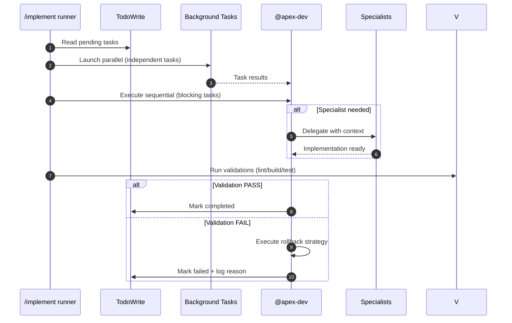

# /implement | /implementar

## Ultra-Think Protocol

```yaml
ultra_think_protocol:
  thinking_budget: "extended"
  pre_execution_thinking:
    - "Analyze TodoWrite DAG structure and critical path"
    - "Identify parallelization opportunities for independent tasks"
    - "Determine agent delegation requirements"
    - "Validate all preconditions are satisfiable"
  inter_atomic_thinking:
    - "Verify background task results"
    - "Adjust execution strategy based on actual results"
    - "Detect emergent dependencies or file conflicts"
  post_execution_thinking:
    - "Critically validate: did implementation achieve plan goals?"
    - "Assess quality metrics against acceptance criteria"
    - "Identify technical debt or gaps introduced"
```

Execute approved implementation plan from TodoWrite. Use `todoread` to read current task state.

## Trigger

- User approves research plan: "aprovar plano", "approve", "proceed"
- Direct command: `/implement`

---

## Input Contract

Required inputs for a correct `/implement` run:

```yaml
input_contract:
  source: "TodoWrite state created by /research command"
  expected_task_format:
    id: "AT-XXX or VT-XXX"
    content: "[ID] Title | Phase: N | Files: paths"
    status: "pending"
    priority: "high | medium | low"
  required_metadata_in_content:
    - phase: "Extracted from 'Phase: N'"
    - files_affected: "Extracted from 'Files: path1, path2'"
    - parallel_group: "Extracted from parallel group marker (optional)"
  dependencies:
    source: "Inferred from task order and research report"
    format: "Array of task IDs"
  validation:
    - "All AT-XXX tasks have phase 1-5"
    - "All VT-XXX tasks are at the end"
    - "Subtasks (AT-XXX-A) immediately follow parent"
  compatibility_note: |
    This format is generated by @apex-researcher via todowrite()
    as specified in .opencode/command/research.md Step 3.
```

If any required input is missing, `/implement` MUST stop and request remediation.

---

## Execution Strategy

### Background Task Parallelization

Launch parallel background tasks for independent work items:

```yaml
parallel_tasks:
  launch:
    action: "Use `background_task` tool for parallel execution"
    max_concurrent: 3  # Maximum parallel tasks
    timeout: 180000  # 3 minutes per task

  collection:
    action: "Use `background_output` when results are ready"
    wait_for: ["critical_path_tasks", "blocking_tasks"]

  cleanup:
    action: "Cancel all with `background_cancel(all=true)` before completion"

  constraints:
    - "Different files"
    - "No dependencies"
    - "Different agents"
    - "Auth/security/LGPD always sequential"
```

### Agent Coordination

Available agents from oh-my-opencode:

| Agent | Purpose | When to Use |
|--------|----------|--------------|
| **Oracle** | Architecture decisions, complex debugging | Multi-system tradeoffs, after 2+ failures |
| **Librarian** | Official docs, open source research | Unfamiliar libraries, GitHub code examples |
| **Explore** | Codebase patterns search | File structures, existing implementations |
| **Apex-Dev** | Core implementation | Default when no specialist needed |
| **Database-Specialist** | Convex tasks | Schema design, queries, mutations |
| **Code-Reviewer** | Security & compliance review | OWASP, LGPD validation |
| **Apex-UI-UX-Designer** | Frontend visual tasks | UI components, WCAG, design systems |

### Task Flow

```yaml
task_execution:
  1_read_tasks:
    action: "todoread → read current task state"

  2_evaluate_parallelization:
    action: "Identify independent tasks for background execution"
    criteria:
      - "Different files"
      - "No dependencies"
      - "Different agents"

  3_launch_background:
    action: "Use background_task for parallel work"
    collect_when: "tasks are independent"

  4_execute_sequential:
    action: "Execute remaining tasks one by one"
    update: "todowrite after each completion"

  5_collect_results:
    action: "background_output(task_id) when ready"

  6_cleanup:
    action: "background_cancel(all=true) before completion"
```

---

## Step 1: Load TodoWrite Tasks

Parse TodoWrite tasks created by `/research`:

### Execution Mode

Mode: `parallel_aware_proactive`

> This mode combines Ultra-Think Protocol with background task parallelization for maximum efficiency.

```yaml
todowrite_parsing:
  source: "TodoWrite state from /research"

  extract_fields:
    - id: "AT-XXX or VT-XXX"
    - content: "Task description with metadata"
    - status: "pending | in_progress | completed | failed"
    - priority: "high | medium | low"

  parse_metadata:
    # Expected format (created by /research via apex-researcher):
    # "[AT-001] Title | Phase: 3 | Files: src/x.ts" + optional fields
    # Subtasks are written as: "  ↳ [AT-001-A] Subtask description"
    from_content: "[ID] Title | Phase: N | Files: paths"
    extract:
      - phase: "[1-5] from Phase: N"
      - parallel_group: "[A|B|C|null] when present"
      - files_affected: "Array of file paths (from Files: ...)"
      - dependencies: "Array of task IDs this depends on (when present)"
      - test_strategy: "unit | integration | e2e | none (when present)"
      - rollback_strategy: "How to undo (when present)"
```

---

## Step 2: Order and Group Tasks

Apply **Ultra-Think Protocol (UTP)** to ensure safe ordering:

### Phase-Based Ordering

```yaml
phase_ordering:
  algorithm:
    1. "Group tasks by phase: [1, 2, 3, 4, 5]"
    2. "Topological sort by dependencies within phase"
    3. "Tasks with no dependencies can start immediately"

  phases:
    phase_1_setup:
      checkpoint: "bun install && bun run build"
      activities: ["directories", "dependencies", "config", "schema"]

    phase_2_test:
      checkpoint: "bun run test --run"
      activities: ["unit tests", "fixtures", "mocks"]

    phase_3_core:
      checkpoint: "bun run build && bun run lint:check && bun run test"
      activities: ["queries", "mutations", "hooks", "components"]

    phase_4_integration:
      checkpoint: "bun run build && bun run lint:check && bun run test"
      activities: ["routes", "auth guards", "middleware"]

    phase_5_polish:
      checkpoint: "bun run build && bun run lint:check && bun run test:coverage"
      activities: ["optimization", "cleanup", "docs", "accessibility"]
```

### Parallelization Rules

**Strategy**: Launch background tasks for provably independent work

| Condition | Can run in parallel? |
|-----------|---------------------|
| Same `parallel_group` AND different files AND no unmet dependencies | Yes |
| Same `parallel_group` BUT shared files | No |
| Different `parallel_group` | Only if phases/deps allow |
| Any unmet dependency | No |
| Auth/security/LGPD changes | No (always sequential) |

---

## Step 3: Task Execution Flow

```yaml
task_execution:
  1_mark_in_progress:
    action: "todowrite → status = 'in_progress'"

  2_check_dependencies:
    action: "Verify all dependency tasks are 'completed'"
    on_blocked: "Wait for dependencies"

  3_delegate_or_execute:
    action: "Route to appropriate agent"
    delegate_table:
      convex: "@database-specialist"
      components: "@apex-ui-ux-designer"
      security: "@code-reviewer"
      docs: "@librarian"
      exploration: "@explore"
    pass_context:
      - "constitution.md"
      - "spec.md (if available)"
      - "Task details and acceptance criteria"

  4_implement:
    action: "Execute task implementation"
    guidelines:
      - "Follow constitution principles"
      - "Match spec contracts"
      - "Meet acceptance criteria"

  5_validate:
    action: "Run acceptance criteria checks"
    commands:
      - "bun run lint:check"
      - "bun run build"
      - "bun run test --run"
    on_pass: "todowrite → status = 'completed'"
    on_fail: "Execute rollback, todowrite → status = 'failed'"
```

### Sequence Diagram



---

## Step 4: Postconditions & Validation

Each task MUST end in a validated postcondition:

```yaml
validation:
  verify:
    - "Files created/modified match spec"
    - "All tests pass"
    - "Lint clean"
    - "Build successful"
    - "No regressions"

  failure_handling:
    action: "Execute rollback_strategy immediately"
    report:
      - "Task ID that failed"
      - "Postcondition that failed"
      - "Rollback executed"
      - "Current state"
```

### Cleanup

```yaml
cleanup:
  action: "background_cancel(all=true) before completion report"
  reason: "Conserve resources and ensure clean state"
```
