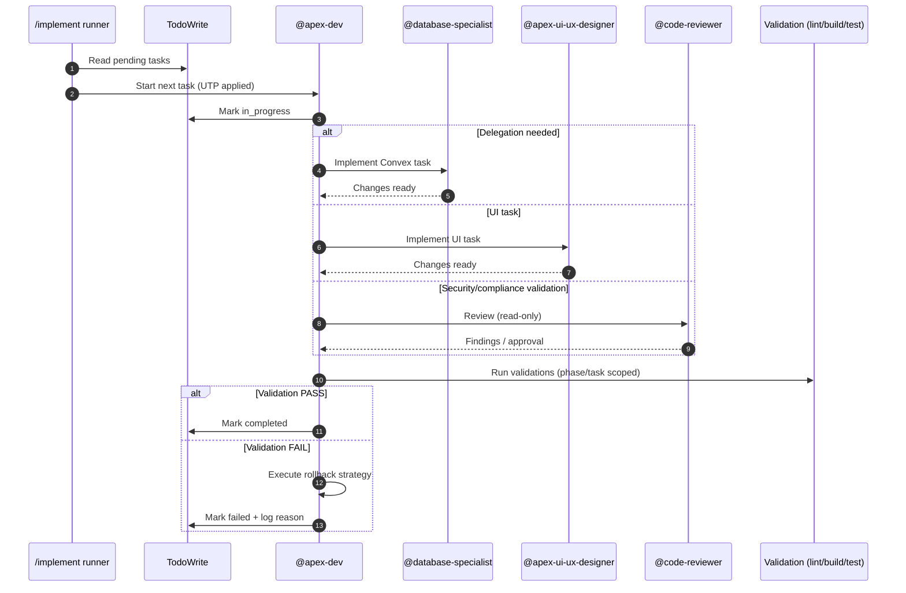

# /implement | /implementar

## Ultra-Think Protocol

```yaml
ultra_think_protocol:
  thinking_budget: "extended"
  pre_execution_thinking:
    - "Analyze TodoWrite DAG structure and critical path"
    - "Identify parallelization opportunities by parallel_group"
    - "Anticipate edge cases in constitution compliance"
    - "Validate all preconditions are satisfiable"
  inter_atomic_thinking:
    - "Verify previous atom outputs meet postconditions"
    - "Adjust execution strategy based on actual results"
    - "Detect emergent dependencies or file conflicts"
  post_execution_thinking:
    - "Critically validate: did implementation achieve plan goals?"
    - "Assess quality metrics against acceptance criteria"
    - "Identify technical debt or gaps introduced"
```

**Requirement**: apply this protocol at:
- **Step 3** (ordering/grouping decisions)
- **Step 4** (per-task execution decisions)

---

Execute the approved implementation plan from TodoWrite.

## Trigger

- User approves research plan: "aprovar plano", "approve", "proceed"
- Direct command: `/implement`

---

## Input Contract

Required inputs for a correct `/implement` run:

```yaml
input_contract:
  source: "TodoWrite state created by /research command"
  expected_task_format:
    id: "AT-XXX or VT-XXX"
    content: "[ID] Title | Phase: N | Files: paths"
    status: "pending"
    priority: "high | medium | low"
  required_metadata_in_content:
    - phase: "Extracted from 'Phase: N'"
    - files_affected: "Extracted from 'Files: path1, path2'"
    - parallel_group: "Extracted from parallel group marker (optional)"
  dependencies:
    source: "Inferred from task order and research report"
    format: "Array of task IDs"
  validation:
    - "All AT-XXX tasks have phase 1-5"
    - "All VT-XXX tasks are at the end"
    - "Subtasks (AT-XXX-A) immediately follow parent"
  compatibility_note: |
    This format is generated by @apex-researcher via todowrite()
    as specified in .opencode/command/research.md Step 3.
```

If any required input is missing, `/implement` MUST stop and request remediation.

---

## Optimized Architecture

```mermaid
flowchart LR
  A[Plan Mode: /research] --> B[TodoWrite: AT-* + VT-*]
  B --> C[Act Mode: /implement]

  C --> D[@apex-dev: task runner]
  D --> E{Delegation?}
  E -->|convex/*| F[@database-specialist]
  E -->|src/components/*| G[@apex-ui-ux-designer]
  E -->|security/compliance| H[@code-reviewer]
  E -->|default| D

  D --> I[Phase checkpoints\n(lint/build/test)]
  I --> J[Completion report]
```

---

## Step 1: Load TodoWrite Tasks

Parse TodoWrite tasks created by `/research`:

### 1.2 Execution Mode

Mode: `one_shot_proactive`

> This mode is optimized for approved, deterministic execution. If required inputs or constitution checks fail, stop early and request remediation.

```yaml
todowrite_parsing:
  source: "TodoWrite state from /research"

  extract_fields:
    - id: "AT-XXX or VT-XXX"
    - content: "Task description with metadata"
    - status: "pending | in_progress | completed | failed"
    - priority: "high | medium | low"

  parse_metadata:
    # Expected format (created by /research via apex-researcher):
    # "[AT-001] Title | Phase: 3 | Files: src/x.ts" + optional fields
    # Subtasks are written as: "  ↳ [AT-001-A] Subtask description"
    from_content: "[ID] Title | Phase: N | Files: paths"
    extract:
      - phase: "[1-5] from Phase: N"
      - parallel_group: "[A|B|C|null] when present"
      - files_affected: "Array of file paths (from Files: ...)"
      - dependencies: "Array of task IDs this depends on (when present)"
      - test_strategy: "unit | integration | e2e | none (when present)"
      - rollback_strategy: "How to undo (when present)"
```

### 1.3 Validate Preconditions

Before doing ANY work (including task ordering), validate preconditions.

```yaml
1.3_validate_preconditions:
  for_each_task:
    check:
      - dependencies_exist: "All dependency task IDs exist in TodoWrite"
      - files_accessible: "All files_affected are readable/writable"
      - constitution_compliant: "Task passes constitution validation"
      - rollback_defined: "rollback_strategy is not empty"
    on_failure:
      action: "STOP execution and report unsatisfied preconditions"
      report:
        - task_id: "[AT-XXX]"
        - failed_precondition: "[description]"
        - remediation: "[how to fix before proceeding]"
```

**Preconditions**:
- Bun is available and is the package manager used for this run.
- Repo is present and readable.
- TodoWrite contains at least one `pending` task.
- `.opencode/memory/constitution.md` exists.
- If the plan references spec artifacts, they exist under `.opencode/specs/[feature-id]/`.


---

## Execution Mode

```yaml
execution_mode:
  paradigm: "one_shot_proactive"
  behavior:
    - "Execute ALL pending tasks from TodoWrite in ONE response"
    - "Use parallel tool calling for independent tasks"
    - "Only stop on critical failure (halt_phase: true)"
    - "Generate complete report at end"
  critical_failure_definition:
    - "Phase checkpoint fails (build/lint/test)"
    - "Task postcondition fails and rollback fails"
    - "Constitution violation detected"
  non_critical_handling:
    - "Log warning and continue"
    - "Mark task as partial"
    - "Include in final report"
  user_interaction:
    when: "Only on critical failure"
    message: |
      ❌ Critical failure in Phase [N]: [reason]

      Rollback executed: [command]
      Current state: [description]

      Please fix the issue and re-run `/implement`.
```

---

## Step 2: Load Context

### 2.1 Load Constitution (Active Validation)

Load and validate the execution against `.opencode/memory/constitution.md`.

Rules are not informational — they are **active gates**:

- If a task violates the constitution, `/implement` MUST block that task.
- If a violation is fixable, add or request a remediation task.
- If compliance is triggered (LGPD/security/auth), ensure `@code-reviewer` review is executed before completion.

**Active validation timing**:
- Validate **after each task implementation** and **before** postcondition checks.
- On any violation: **fail the task postcondition**, execute rollback, and halt the current phase.

```yaml
constitution_context:
  path: ".opencode/memory/constitution.md"

  validate_tasks_against:
    - principle_1_bun_first: "No npm/yarn/pnpm commands"
    - principle_2_typescript_strict: "No 'any' types"
    - principle_3_lgpd_compliance: "Encryption/audit for PII"
    - principle_4_biome_standards: "Pass lint:check"
    - principle_5_convex_patterns: "Auth checks, indexes"
    - principle_6_test_coverage: "Include tests"
    - principle_7_accessibility: "WCAG 2.1 AA"
    - principle_8_portuguese_ui: "PT-BR user text"
    - principle_9_performance: "Bundle/lazy loading"
    - principle_10_functional: "No class components"
```

On violation, collect: task_id, principle violated, issue, remediation/rollback executed.

### 2.2 Load Spec (If Available)

```yaml
spec_context:
  path: ".opencode/specs/[feature-id]/spec.md"

  optional_artifacts:
    - data_model: ".opencode/specs/[feature-id]/data-model.md"
    - contracts: ".opencode/specs/[feature-id]/contracts.md"
    - quickstart: ".opencode/specs/[feature-id]/quickstart.md"

  use_for:
    - "Implementation guidance"
    - "Data model reference"
    - "API contract validation"
```

---

## Step 3: Order and Group Tasks

Apply **Ultra-Think Protocol (UTP)** here to avoid unnecessary work and to ensure safe ordering.

### 3.1 Phase-Based Ordering

Group tasks by phase (1→5) and resolve dependencies:

```yaml
phase_ordering:
  algorithm:
    1. Group tasks by phase: [1, 2, 3, 4, 5]
    2. Within phase, topological sort by dependencies
    3. Tasks with no dependencies can start immediately
    4. Tasks with dependencies wait for dependency completion

  phases:
    phase_1_setup:
      checkpoint: "bun install && bun run build"
      activities: ["directories", "dependencies", "config", "schema"]

    phase_2_test:
      checkpoint: "bun run test --run"
      activities: ["unit tests", "fixtures", "mocks"]

    phase_3_core:
      checkpoint: "bun run build && bun run lint:check && bun run test"
      activities: ["queries", "mutations", "hooks", "components"]

    phase_4_integration:
      checkpoint: "bun run build && bun run lint:check && bun run test"
      activities: ["routes", "auth guards", "middleware"]

    phase_5_polish:
      checkpoint: "bun run build && bun run lint:check && bun run test:coverage"
      activities: ["optimization", "cleanup", "docs", "accessibility"]
```

### 3.2 Parallel Group Batching (`parallel_tool_calling`) + Decision Table

Safe parallelization is optional and MUST follow UTP + constitution constraints.

**Strategy**: `parallel_tool_calling`
- Only parallelize tasks that are *provably independent*.
- Default to sequential if there is any uncertainty.

**Hard limits** (to reduce risk):
- Max parallel tasks per batch: **3**
- Never parallelize if *any* task in the batch touches:
  - auth/security/LGPD surfaces
  - schema/config files (e.g., `convex/schema.ts`, `vite.config.ts`)
  - generated files

**Rules**:
- Tasks with the same `parallel_group` MAY run concurrently.
- Tasks in the same parallel group MUST NOT modify the same files.
- `parallel_group = null` is always sequential.
- Dependencies always override parallelization.
- If compliance/security is triggered, force sequential + require `@code-reviewer` before completion.

**Decision table**:

| Condition | Example | Can run in parallel? | Notes |
|---|---|---:|---|
| Same `parallel_group` AND no shared files AND no unmet dependencies | AT-003 + AT-004 both group A, distinct files | Yes | Preferred case |
| Same `parallel_group` BUT shared files | both touch `convex/schema.ts` | No | Force sequential |
| Different `parallel_group` | group A vs B | Only if phases/deps allow | Default: keep sequential |
| Any unmet dependency | AT-005 depends on AT-004 | No | Wait for dependency |
| Any constitution gate uncertain (security/auth/LGPD) | auth changes | No | Run sequential + require review |

```yaml
parallel_batching:
  strategy: "parallel_tool_calling"
  max_parallel: 3

  constraints:
    - "Same parallel_group only"
    - "No shared files_affected"
    - "All dependencies completed"

  on_conflict:
    action: "Fallback to sequential"
    log: "Warn: file conflict detected in parallel batch"

  on_dependency_block:
    action: "Wait until dependencies complete"

  example:
    batch_A:  # Concurrent execution
      - AT-002: "Write notification mutation tests"
      - AT-003: "Write notification UI tests"

    sequential:  # One at a time
      - AT-004: "Implement sendNotification mutation"
```

---

## Step 4: Invoke @apex-dev with Delegation

Apply **Ultra-Think Protocol (UTP)** before delegating and before implementing each task.

### 4.1 Delegation Rules

```yaml
delegation:
  by_file_pattern:
    "convex/*":
      agent: "@database-specialist"
      skills: ["convex_schema", "convex_queries", "convex_mutations"]

    "src/components/*":
      agent: "@apex-ui-ux-designer"
      skills: ["react_components", "tailwind", "accessibility"]

    "**/security/**":
      agent: "@code-reviewer"
      skills: ["owasp", "lgpd", "auth"]

    "default":
      agent: "@apex-dev"
      skills: ["typescript", "testing", "integration"]
```

### 4.2 Dynamic Skills Loading

```yaml
skills_by_task_type:
  setup:
    - "package_management"
    - "environment_config"
    - "directory_structure"

  test:
    - "vitest"
    - "testing_library"
    - "mock_patterns"

  core:
    - "typescript_strict"
    - "convex_patterns"
    - "react_hooks"

  integration:
    - "tanstack_router"
    - "clerk_auth"
    - "api_wiring"

  polish:
    - "code_splitting"
    - "bundle_optimization"
    - "documentation"
```

### 4.3 Task Execution Flow

For each task:

```yaml
task_execution:
  1_mark_in_progress:
    action: "Update TodoWrite status to 'in_progress'"

  2_check_dependencies:
    action: "Verify all dependency tasks are 'completed'"
    on_blocked: "Wait for dependencies"

  3_delegate_or_execute:
    action: "Route to appropriate agent based on files_affected"
    pass_context:
      - "constitution.md"
      - "spec.md (if available)"
      - "Task details and acceptance criteria"

  4_implement:
    action: "Execute task implementation"
    guidelines:
      - "Follow constitution principles"
      - "Match spec contracts (if available)"
      - "Meet acceptance criteria"

  5_validate:
    action: "Run acceptance criteria checks"
    on_pass: "Mark 'completed'"
    on_fail: "Execute rollback, mark 'failed'"
```

### 4.4 Postconditions (Validation + Commands + Sequence Diagram)

Each task MUST end in a validated postcondition.

```yaml
4_validate_postconditions:
  after_each_task:
    verify:
      - acceptance_criteria_met: "All criteria from task definition pass"
      - files_created_modified: "Expected files exist with correct content"
      - no_regressions: "Existing tests still pass"
      - constitution_compliant: "Implementation follows all 10 principles"
    validation_commands:
      - "bun run build"
      - "bun run lint:check"
      - "bun run test --run"
    on_failure:
      action: "Execute rollback_strategy immediately"
      mark_status: "failed"
      halt_phase: true
      report:
        - task_id: "[AT-XXX]"
        - failed_postcondition: "[description]"
        - rollback_executed: "[command]"
        - current_state: "[after rollback]"
```

**Validation commands (task-level)**:
- `bun run lint:check` (Biome)
- `bun run build` (TypeScript + build)
- `bun run test --run` (Vitest)

> Note: you may scope validations during development for speed, but **a phase checkpoint MUST run the full required commands**.



---

## Step 5: Per-Phase Validation Checkpoints

Execute validation at each phase boundary:

```yaml
phase_checkpoints:
  after_phase_1:
    commands:
      - "bun install"
      - "bun run build"
    on_failure:
      - "Rollback all phase 1 tasks"
      - "Report setup errors"
      - "Halt execution"

  after_phase_2:
    commands:
      - "bun run test --run"
    on_failure:
      - "Rollback phase 2 tasks"
      - "Report test setup errors"
      - "Halt execution"

  after_phase_3:
    commands:
      - "bun run build"
      - "bun run lint:check"
      - "bun run test"
    on_failure:
      - "Rollback phase 3 tasks"
      - "Report core implementation errors"
      - "Halt execution"

  after_phase_4:
    commands:
      - "bun run build"
      - "bun run lint:check"
      - "bun run test"
    on_failure:
      - "Rollback phase 4 tasks"
      - "Report integration errors"
      - "Halt execution"

  after_phase_5:
    commands:
      - "bun run build"
      - "bun run lint:check"
      - "bun run test:coverage"
    on_failure:
      - "Rollback phase 5 tasks"
      - "Report polish errors"
      - "Continue with warnings"
```

---

## Step 6: Rollback on Failure

When a task fails, execute its rollback strategy:

```yaml
rollback_execution:
  strategies:
    file_created:
      action: "rm [path/to/file]"
      example: "rm src/components/notifications/NotificationBell.tsx"

    file_modified:
      action: "git checkout [path/to/file]"
      example: "git checkout convex/schema.ts"

    dependency_added:
      action: "bun remove [package]"
      example: "bun remove @tanstack/react-query"

    schema_migration:
      action: "git checkout convex/schema.ts && bunx convex deploy"
      example: "Revert schema changes and redeploy"

    multiple_files:
      action: "git checkout [files] && rm [new_files]"
      example: "git checkout src/lib/utils.ts && rm src/hooks/useNotifications.ts"

  on_rollback:
    - "Mark task as 'failed'"
    - "Log failure reason"
    - "Halt current phase"
    - "Report to user with details"
```

---

## Step 7: Completion Report (Simplified)

After all phases complete (or on halt), output a concise summary:

```md
---
## /implement concluído: [Feature Name]

### Resultado
- Build: PASS/FAIL
- Lint: PASS/FAIL
- Tests: PASS/FAIL (coverage: opcional)

### Execução
- Tasks: total X | completed Y | failed Z | skipped W

### Mudanças
- Arquivos alterados: [lista]
- Rollbacks executados: [lista ou "nenhum"]

### Próximos passos
- [1-3 bullets]
---
```

---

## Quick Reference

| Phase | Type | Checkpoint | Rollback Scope |
|-------|------|------------|----------------|
| 1 | setup | `bun install && bun run build` | Config only |
| 2 | test | `bun run test --run` | Test files only |
| 3 | core | `bun run build && lint && test` | Core files |
| 4 | integration | `bun run build && lint && test` | Integration files |
| 5 | polish | `bun run build && lint && test:coverage` | Polish files |

---

## Example Execution

```
/implement

Loading TodoWrite [10 tasks]...
Loading context [constitution.md, spec.md]...

Phase 1 (Setup): 2 tasks
  - AT-001: Create directory structure
  - AT-002: Add dependencies
  - Checkpoint: bun install && bun run build → PASS

Phase 2 (Tests): 3 tasks
  - AT-003: Write mutation tests (parallel A)
  - AT-004: Write UI tests (parallel A)
  - AT-005: Create test fixtures
  - Checkpoint: bun run test --run → PASS

Phase 3 (Core): 3 tasks
  - AT-006: Implement mutation [@database-specialist]
  - AT-007: Create component [@apex-ui-ux-designer]
  - AT-008: Add hook [@apex-dev]
  - Checkpoint: bun run build && bun run lint:check && bun run test → PASS

Phase 4 (Integration): 1 task
  - AT-009: Wire to route [@apex-dev]
  - Checkpoint: bun run build && bun run lint:check && bun run test → PASS

Phase 5 (Polish): 1 task
  - AT-010: Add documentation [@apex-dev]
  - Checkpoint: bun run build && bun run lint:check && bun run test:coverage → PASS

Validation Tasks:
  - VT-001: Build validation
  - VT-002: Lint check
  - VT-003: Test suite

Implementation Complete: 10/10 tasks successful
```
