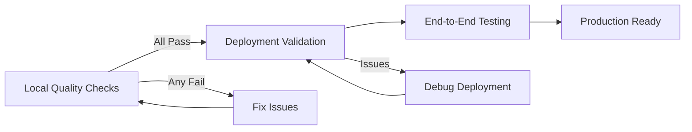

# 🔍 Quality Control - Modern Web Stack

**Complete quality control pipeline for Bun + Vite + Convex + TanStack Router applications with Railway deployment verification.**

---

## 🏗️ ARCHITECTURAL OVERVIEW

### System Components
```
┌─────────────────────────────────────────────────────────────────────────────┐
│                        DEPLOYMENT ARCHITECTURE                           │
├─────────────────────────────────────────────────────────────────────────────┤
│                                                                             │
│  ┌─────────────────┐          ┌─────────────────┐                        │
│  │   FRONTEND      │          │    BACKEND      │                        │
│  │                 │          │                 │                        │
│  │ Railway (Docker)│◄────────►│    Convex       │                        │
│  │ Vite Build      │  Auth    │ Real-time DB    │                        │
│  │ Static Hosting  │◄────────►│ + Functions     │                        │
│  │                 │  Clerk   │                 │                        │
│  └─────────────────┘          └─────────────────┘                        │
│                                                                             │
└─────────────────────────────────────────────────────────────────────────────┘
```

### Tech Stack Integration
- **Runtime**: Bun (package manager + execution)
- **Frontend**: React 19 + Vite + TanStack Router
- **Styling**: Tailwind CSS v4 + shadcn/ui
- **Backend**: Convex (database + real-time functions)
- **Auth**: Clerk (authentication)
- **Deploy**: Railway (frontend) + Convex (backend)

---

## 🤖 MCP INTEGRATION OVERVIEW

**Model Context Protocol (MCP) tools enable intelligent error detection, research, and automated correction workflows.**

### Available MCP Servers

| MCP Server | Purpose | Primary Tools | Use Cases |
|------------|---------|--------------|-----------|
| **serena** | Codebase intelligence | `find_symbol`, `search_for_pattern`, `find_referencing_symbols`, `get_symbols_overview` | Semantic code search, pattern analysis, symbol resolution |
| **context7** | Documentation intelligence | `get-library-docs`, `resolve-library-id` | Official library documentation, API references, best practices |
| **tavily** | Web research | `tavily-search`, `tavily-extract`, `tavily-crawl` | Current solutions, community patterns, troubleshooting guides |
| **sequential-thinking** | Structured reasoning | `sequentialthinking` | Multi-step problem analysis, solution synthesis, decision trees |

### MCP Workflow Integration

```yaml
ERROR_RESOLUTION_WITH_MCP:
  detection:
    - bun run lint:check
    - bun run build
    - serena search_for_pattern (error patterns)
  
  research:
    - context7 get-library-docs (official solutions)
    - tavily-search (current community solutions)
    - sequential-thinking (analyze and synthesize)
  
  correction:
    - serena find_symbol (locate code to fix)
    - serena replace_symbol_body (apply fix)
    - bun run lint:check (validate)
```

### MCP Tool Chains

**Research Chain**: `tavily-search` → `context7 get-library-docs` → `sequential-thinking` → Solution

**Code Analysis Chain**: `serena search_for_pattern` → `serena find_symbol` → `serena find_referencing_symbols` → Fix

**Validation Chain**: `bun run build` → `serena search_for_pattern` (error patterns) → Research → Fix → Validate

---

## 🎯 Quality Control Philosophy

**Execution Order**: Local Checks → Deployment Validation → End-to-End Testing

**Gate Principle**: Deployments MUST NOT proceed if any local check fails

**Validation Standard**: Zero tolerance for lint errors, type errors, and configuration mismatches

---

## 📋 EXECUTION PHASES

### 🔄 High-Level Sequence



---

## 📍 PHASE 1: LOCAL QUALITY CHECKS

> **⚠️ CRITICAL GATE**: Do NOT proceed to deployment if ANY check fails

### 1.1 Code Quality & Linting
```bash
# Check code formatting and lint rules
bun run lint:check

# Expected: 0 errors, 0 warnings
# If issues found: bun run lint to auto-fix
```

### 1.2 Type Safety & Build Verification
```bash
# Type checking (included in build)
bun run build

# Expected: Clean build with no TypeScript errors
# This command runs both Vite build and tsc --noEmit
```

### 1.3 Test Coverage
```bash
# Run tests with coverage
bun run test:coverage

# Expected: All tests pass, coverage metrics maintained
# Coverage report generated in coverage/ directory
```

### 1.4 Local Development Validation
```bash
# Verify local development setup
bun run dev

# Expected: Application starts successfully on http://localhost:5173
# No runtime errors in browser console
```

### 1.5 MCP-Powered Error Detection & Analysis

When errors are detected, use MCP tools for intelligent analysis and research:

#### Error Detection Workflow

```yaml
MCP_ERROR_DETECTION_WORKFLOW:
  step_1_detect:
    command: "bun run lint:check"
    command: "bun run build"
    on_failure: "Proceed to MCP analysis"
  
  step_2_analyze:
    tool: "serena search_for_pattern"
    pattern: "Error pattern from build output"
    context_lines: 5
    output: "All occurrences of error pattern in codebase"
  
  step_3_research:
    tool: "context7 get-library-docs"
    library: "typescript | vite | react"
    topic: "Error type or pattern"
    output: "Official documentation solutions"
  
  step_4_validate:
    tool: "tavily-search"
    query: "Error message + stack + solution 2024"
    output: "Current community solutions and patterns"
  
  step_5_synthesize:
    tool: "sequential-thinking"
    input: "Research results from step 3 and 4"
    output: "Analyzed solution with confidence score"
```

#### Example: TypeScript Build Error

```bash
# 1. Detect error
bun run build
# Output: "Type error in src/components/LeadCard.tsx:42"

# 2. Analyze with serena
# MCP call: serena search_for_pattern("Type error|TypeError")
# Returns: All similar type errors in codebase

# 3. Research official solution
# MCP call: context7 get-library-docs("typescript", "type errors")
# Returns: TypeScript official type error resolution guide

# 4. Research current solutions
# MCP call: tavily-search("TypeScript type error React component props 2024")
# Returns: Current community solutions and patterns

# 5. Synthesize solution
# MCP call: sequential-thinking (analyze all research)
# Returns: Recommended fix with confidence ≥95%

# 6. Apply fix using serena
# MCP call: serena find_symbol("LeadCard")
# MCP call: serena replace_symbol_body (apply fix)

# 7. Validate
bun run build  # Should pass now
```

#### Example: Lint Error Pattern Analysis

```bash
# 1. Detect lint errors
bun run lint:check
# Output: Multiple lint errors across files

# 2. Analyze pattern with serena
# MCP call: serena search_for_pattern("unused import|unused variable")
# Returns: All files with similar issues

# 3. Research best practices
# MCP call: context7 get-library-docs("biome", "linting rules")
# Returns: Official Biome linting documentation

# 4. Batch fix using serena
# For each error pattern:
#   - serena find_symbol (locate code)
#   - serena replace_symbol_body (apply fix)

# 5. Validate
bun run lint:check  # Should pass
```

---

## 📍 PHASE 1.5: MCP RESEARCH WORKFLOW

> **🔬 INTELLIGENT RESEARCH**: When errors are detected, use MCPs to research authoritative solutions before manual fixes

### Research-Driven Error Resolution

This phase activates automatically when Phase 1 detects errors. MCP tools research solutions from multiple authoritative sources before applying fixes.

#### Research Workflow

```yaml
MCP_RESEARCH_WORKFLOW:
  trigger: "Any error detected in Phase 1"
  
  parallel_research:
    official_docs:
      tool: "context7 get-library-docs"
      libraries: ["typescript", "vite", "react", "convex", "railway"]
      topics: "Error type or component"
      confidence: "≥95% (official documentation)"
    
    current_solutions:
      tool: "tavily-search"
      query: "Error message + stack + solution 2024 2025"
      depth: "advanced"
      max_results: 10
      confidence: "≥90% (cross-validated)"
    
    codebase_analysis:
      tool: "serena search_for_pattern"
      pattern: "Error pattern or similar code"
      context_lines: 10
      output: "Existing patterns in codebase"
  
  synthesis:
    tool: "sequential-thinking"
    input: "All research results"
    process: ["Analyze solutions", "Compare approaches", "Select best fix", "Validate confidence"]
    output: "Recommended solution with ≥95% confidence"
  
  validation:
    apply_fix: "serena replace_symbol_body or manual fix"
    verify: "bun run lint:check && bun run build"
    gate: "All checks must pass"
```

#### Example: Build Error Research

```bash
# Scenario: Vite build fails with module resolution error

# Step 1: Research official Vite documentation
# MCP: context7 get-library-docs("vite", "module resolution")
# Result: Official Vite module resolution guide

# Step 2: Research current solutions
# MCP: tavily-search("Vite module resolution error React TypeScript 2024")
# Result: 10 current solutions from community

# Step 3: Analyze codebase patterns
# MCP: serena search_for_pattern("import.*from|resolve.*alias")
# Result: How imports are structured in this codebase

# Step 4: Synthesize solution
# MCP: sequential-thinking
# Input: All research results
# Output: "Update vite.config.ts with resolve.alias configuration (confidence: 97%)"

# Step 5: Apply fix
# Manual or serena: Update vite.config.ts

# Step 6: Validate
bun run build  # Should pass
```

#### Example: Deployment Error Research

```bash
# Scenario: Railway deployment fails during build

# Step 1: Research Railway deployment docs
# MCP: context7 get-library-docs("railway", "deployment dockerfile")
# Result: Official Railway Docker deployment guide

# Step 2: Research current deployment patterns
# MCP: tavily-search("Railway Vite bun deployment Dockerfile error 2024")
# Result: Current deployment solutions

# Step 3: Analyze Dockerfile patterns
# MCP: serena search_for_pattern("FROM|RUN|COPY|CMD")
# Result: Current Dockerfile structure

# Step 4: Research Vite + Bun deployment
# MCP: tavily-search("Vite bun Dockerfile multi-stage build 2024")
# Result: Best practices for Vite + Bun deployments

# Step 5: Synthesize solution
# MCP: sequential-thinking
# Output: "Update Dockerfile to use oven/bun:1-alpine and bun install (confidence: 98%)"

# Step 6: Apply fix
# Update Dockerfile

# Step 7: Validate
# Push to trigger Railway deployment
```

### Research Quality Gates

- ✅ **Official docs consulted**: context7 provides authoritative solutions
- ✅ **Current patterns validated**: tavily provides ≥3 cross-validated sources
- ✅ **Codebase consistency**: serena ensures fixes align with existing patterns
- ✅ **Confidence threshold**: sequential-thinking provides ≥95% confidence
- ✅ **Solution validated**: All Phase 1 checks pass after fix

---

## 📍 PHASE 2: DEPLOYMENT VALIDATION

> **✅ PREREQUISITE**: Phase 1 must pass completely (or Phase 1.5 completed if errors were fixed)

### 2.1 Frontend Deployment (Railway)

#### Prerequisites
```bash
# Install Railway CLI (if not installed)
# Option 1: Using bunx (recommended - no global install needed)
bunx @railway/cli --help

# Option 2: Global install with bun (if preferred)
bun install -g @railway/cli

# Login to Railway
railway login

# Target correct project
railway use <your-project-id>
# OR set RAILWAY_TOKEN environment variable
```

#### Deployment Status Verification
```bash
# Check current deployment status
railway status

# Expected: Service running, healthy status
# Note the public URL for validation
```

#### Trigger Deployment (if needed)
```bash
# Push changes to trigger deployment
git add .
git commit -m "chore: update deployment"
git push origin main

# Railway will automatically deploy on push
```

#### Frontend Health Checks
```bash
# Retrieve public URL from Railway dashboard or status command
PUBLIC_URL=$(railway status | grep -o 'https://[^[:space:]]*\.railway\.app')

# Verify root path loads without errors
curl -f "$PUBLIC_URL" || echo "❌ Frontend health check failed"

# Open in browser for visual verification
open "$PUBLIC_URL"
```

#### 📋 Railway Log Analysis
```bash
# Check recent deployment logs (last 50 lines)
railway logs --lines 50

# Check extended logs for more context
railway logs --lines 200

# Stream logs in real-time (for monitoring)
railway logs --follow

# Get logs from a specific service (if multiple)
railway logs --service <service-name>

# Look for common error patterns:
# - Build errors ("Error:", "BUILD FAILED")
# - Runtime errors ("Uncaught", "Exception")
# - Missing environment variables ("undefined", "VITE_")
# - Convex connection issues ("convex", "WebSocket")
# - Docker/container issues ("OOMKilled", "Crashloop")
```

#### 🔴 Railway Error Detection & Debugging
```bash
# Check deployment status with details
railway status

# Get deployment history
railway deployments

# Check environment variables are set correctly
railway variables list

# Filter logs for errors specifically
railway logs --lines 100 2>&1 | grep -iE "error|failed|exception|warning|undefined"

# Check for build failures
railway logs --lines 100 2>&1 | grep -iE "build failed|npm err|bun err|exit code"

# Check for container health issues
railway logs --lines 100 2>&1 | grep -iE "oom|killed|crash|restart"
```

#### Railway Health Check Script
```bash
# Create a comprehensive Railway health check
echo "🔍 Checking Railway deployment health..."

# 1. Check deployment status
STATUS=$(railway status 2>&1)
echo "$STATUS" | grep -qi "healthy\|running" && echo "✅ Deployment is healthy" || echo "❌ Deployment may have issues"

# 2. Get public URL
PUBLIC_URL=$(railway status 2>&1 | grep -o 'https://[^[:space:]]*\.railway\.app' | head -1)
if [ -n "$PUBLIC_URL" ]; then
  echo "📍 Public URL: $PUBLIC_URL"
  
  # 3. Health check the URL
  HTTP_STATUS=$(curl -s -o /dev/null -w "%{http_code}" "$PUBLIC_URL" 2>/dev/null)
  [ "$HTTP_STATUS" = "200" ] && echo "✅ Frontend responds with 200 OK" || echo "⚠️ Frontend responds with HTTP $HTTP_STATUS"
else
  echo "⚠️ Could not detect public URL"
fi

# 4. Check for recent errors in logs
ERROR_COUNT=$(railway logs --lines 50 2>&1 | grep -ci "error\|failed" || echo "0")
if [ "$ERROR_COUNT" -gt 0 ]; then
  echo "⚠️ Found $ERROR_COUNT potential errors in recent logs"
  railway logs --lines 50 2>&1 | grep -i "error\|failed" | head -10
else
  echo "✅ No errors in recent logs"
fi

# 5. Verify environment variables
echo "\n📋 Environment Variables:"
railway variables list 2>&1 | grep -E "VITE_|CONVEX_|CLERK_"
```

#### MCP-Assisted Deployment Validation

When deployment issues are detected, use MCPs for intelligent analysis:

```yaml
MCP_DEPLOYMENT_VALIDATION:
  step_1_detect_issue:
    command: "railway logs --lines 100"
    analyze: "Extract error patterns from logs"
  
  step_2_research_solution:
    parallel:
      railway_docs:
        tool: "context7 get-library-docs"
        library: "railway"
        topic: "Error type from logs"
      
      current_solutions:
        tool: "tavily-search"
        query: "Railway deployment error + stack trace 2024"
        depth: "advanced"
      
      codebase_config:
        tool: "serena find_symbol"
        pattern: "Dockerfile|Caddyfile|railway.json"
        output: "Current deployment configuration"
  
  step_3_analyze_root_cause:
    tool: "sequential-thinking"
    input: "Logs + research results + config"
    output: "Root cause with confidence ≥95%"
  
  step_4_apply_fix:
    method: "Update configuration files"
    validate: "railway status"
```

#### Example: Railway Build Failure

```bash
# 1. Check logs
railway logs --lines 100
# Output: "Error: Cannot find module 'vite'"

# 2. Research with MCPs
# MCP: context7 get-library-docs("railway", "dockerfile build")
# Result: Railway Dockerfile build requirements

# MCP: tavily-search("Railway Dockerfile bun vite build error 2024")
# Result: Current solutions for Vite + Bun on Railway

# MCP: serena find_symbol("Dockerfile")
# Result: Current Dockerfile content

# 3. Analyze
# MCP: sequential-thinking
# Output: "Dockerfile missing bun install step (confidence: 98%)"

# 4. Fix
# Update Dockerfile to include: RUN bun install

# 5. Validate
railway status  # Should show healthy deployment
```

#### Example: Environment Variable Issues

```bash
# 1. Detect from logs
railway logs --lines 50
# Output: "Missing VITE_CONVEX_URL"

# 2. Research
# MCP: context7 get-library-docs("railway", "environment variables")
# Result: Railway environment variable configuration

# MCP: tavily-search("Railway Vite environment variables build time 2024")
# Result: Current patterns for Vite env vars on Railway

# MCP: serena search_for_pattern("VITE_|ARG|ENV")
# Result: How env vars are used in Dockerfile

# 3. Analyze
# MCP: sequential-thinking
# Output: "VITE_* vars must be ARG in Dockerfile for build-time (confidence: 99%)"

# 4. Fix
# Update Dockerfile: ARG VITE_CONVEX_URL

# 5. Validate
railway variables list  # Verify vars are set
railway status  # Verify deployment
```

### 2.2 Backend Deployment (Convex)

> **🔧 CONVEX CLI INTEGRATION**: Use the Convex CLI for comprehensive deployment verification, log analysis, and error detection.

#### Convex CLI Prerequisites
```bash
# Verify Convex CLI is available
bunx convex --version

# Login to Convex (if not already logged in)
bunx convex login

# Set the deployment target
bunx convex dev --once  # Syncs local with deployment
```

#### Schema & Function Deployment
```bash
# Deploy Convex schema and functions to production
bun run deploy:convex

# Alternative: Direct Convex CLI deployment
bunx convex deploy --prod

# Expected: Successful deployment confirmation
# Note the deployment URL/ID
```

#### Active Deployment Verification
```bash
# List all Convex deployments with status
bunx convex deployments list

# Get detailed deployment information
bunx convex deployment info

# Verify current deployment URL
bunx convex env get CONVEX_URL

# Expected: Your deployment appears as 'Active'
# Verify CONVEX_DEPLOYMENT in .env.local matches active deployment
```

#### 📋 Convex Log Analysis
```bash
# View real-time Convex logs
bunx convex logs

# View logs from production deployment
bunx convex logs --prod

# View logs with more detail (last 100 entries)
bunx convex logs --prod --limit 100

# Stream logs in real-time (for monitoring)
bunx convex logs --prod --follow

# Filter logs by function name
bunx convex logs --prod --function "api.leads.list"

# Look for error patterns:
# - "Error:" prefixed lines
# - "Uncaught" exceptions
# - "Schema validation failed"
# - "Function execution failed"
```

#### 🔴 Convex Error Detection
```bash
# Check for deployment errors
bunx convex deploy --prod --dry-run 2>&1 | grep -i "error\|failed\|warning"

# Validate schema before deployment
bunx convex dev --typecheck-only

# Check function exports are valid
bunx convex codegen

# Common error patterns to look for:
# - "Invalid schema definition"
# - "Type mismatch in function"
# - "Missing required field"
# - "Function not exported"
# - "Validator error"
```

#### Convex Health Check Script
```bash
# Create a comprehensive Convex health check
echo "🔍 Checking Convex deployment health..."

# 1. Verify deployment is active
bunx convex deployments list | grep -q "Active" && echo "✅ Deployment is active" || echo "❌ Deployment not active"

# 2. Check for recent errors in logs
ERROR_COUNT=$(bunx convex logs --prod --limit 50 2>&1 | grep -ci "error\|failed" || echo "0")
if [ "$ERROR_COUNT" -gt 0 ]; then
  echo "⚠️ Found $ERROR_COUNT potential errors in recent logs"
  bunx convex logs --prod --limit 50 2>&1 | grep -i "error\|failed"
else
  echo "✅ No errors in recent logs"
fi

# 3. Test key functions
bunx convex run --prod api.leads.list --args '{}' && echo "✅ leads.list works" || echo "❌ leads.list failed"
bunx convex run --prod api.users.list --args '{}' && echo "✅ users.list works" || echo "❌ users.list failed"
```

#### Environment Variable Alignment
```bash
# Verify local Convex URL matches deployment
echo "Local CONVEX_URL: $VITE_CONVEX_URL"
echo "Local DEPLOYMENT: $CONVEX_DEPLOYMENT"

# Get the actual deployment URL from Convex
ACTUAL_URL=$(bunx convex deployment info 2>/dev/null | grep -o 'https://[^[:space:]]*\.convex\.cloud')
echo "Actual CONVEX_URL: $ACTUAL_URL"

# Compare and verify alignment
[ "$VITE_CONVEX_URL" = "$ACTUAL_URL" ] && echo "✅ URLs match" || echo "❌ URL mismatch detected"
```

#### Backend Function Validation
```bash
# Test key Convex functions are accessible
bunx convex run --prod api.leads.list
bunx convex run --prod api.users.list

# Test with specific arguments
bunx convex run --prod api.leads.get --args '{"id": "test-id"}'

# Expected: Functions execute without errors
# May need authentication for some functions
```

---

## 📍 PHASE 2.5: FULL-STACK DEPLOYMENT VERIFICATION

> **🔄 AUTOMATED VERIFICATION**: Comprehensive verification of both Railway (frontend) and Convex (backend) deployments using CLI tools

### 2.5.1 Complete Deployment Health Check Script

```bash
#!/bin/bash
# Full-Stack Deployment Verification Script
# Run this after any deployment to verify both frontend and backend are working

echo "🚀 FULL-STACK DEPLOYMENT VERIFICATION"
echo "======================================"
echo ""

# --- RAILWAY (FRONTEND) VERIFICATION ---
echo "📦 RAILWAY FRONTEND VERIFICATION"
echo "─────────────────────────────────"

# 1. Check Railway status
echo "Checking Railway deployment status..."
RAILWAY_STATUS=$(railway status 2>&1)
if echo "$RAILWAY_STATUS" | grep -qi "healthy\|running\|active"; then
  echo "✅ Railway deployment is active"
else
  echo "❌ Railway deployment may have issues"
  echo "$RAILWAY_STATUS"
fi

# 2. Get and test public URL
PUBLIC_URL=$(echo "$RAILWAY_STATUS" | grep -o 'https://[^[:space:]]*\.railway\.app' | head -1)
if [ -n "$PUBLIC_URL" ]; then
  echo "📍 Public URL: $PUBLIC_URL"
  HTTP_STATUS=$(curl -s -o /dev/null -w "%{http_code}" "$PUBLIC_URL" 2>/dev/null)
  if [ "$HTTP_STATUS" = "200" ]; then
    echo "✅ Frontend responds with 200 OK"
  else
    echo "⚠️ Frontend responds with HTTP $HTTP_STATUS"
  fi
else
  echo "⚠️ Could not detect public URL from Railway status"
fi

# 3. Check Railway logs for errors
echo "Checking Railway logs for errors..."
RAILWAY_ERRORS=$(railway logs --lines 50 2>&1 | grep -ci "error\|failed" || echo "0")
if [ "$RAILWAY_ERRORS" -gt 0 ]; then
  echo "⚠️ Found $RAILWAY_ERRORS potential errors in Railway logs"
  echo "Recent errors:"
  railway logs --lines 50 2>&1 | grep -i "error\|failed" | head -5
else
  echo "✅ No errors in Railway logs"
fi

echo ""

# --- CONVEX (BACKEND) VERIFICATION ---
echo "🔧 CONVEX BACKEND VERIFICATION"
echo "───────────────────────────────"

# 1. Check Convex deployment status
echo "Checking Convex deployment status..."
CONVEX_DEPLOYMENTS=$(bunx convex deployments list 2>&1)
if echo "$CONVEX_DEPLOYMENTS" | grep -qi "Active\|Production"; then
  echo "✅ Convex deployment is active"
else
  echo "❌ Convex deployment may have issues"
  echo "$CONVEX_DEPLOYMENTS"
fi

# 2. Check Convex logs for errors
echo "Checking Convex logs for errors..."
CONVEX_ERRORS=$(bunx convex logs --prod --limit 50 2>&1 | grep -ci "error\|failed" || echo "0")
if [ "$CONVEX_ERRORS" -gt 0 ]; then
  echo "⚠️ Found $CONVEX_ERRORS potential errors in Convex logs"
  echo "Recent errors:"
  bunx convex logs --prod --limit 50 2>&1 | grep -i "error\|failed" | head -5
else
  echo "✅ No errors in Convex logs"
fi

# 3. Test key Convex functions
echo "Testing key Convex functions..."
if bunx convex run --prod api.leads.list --args '{}' >/dev/null 2>&1; then
  echo "✅ api.leads.list works"
else
  echo "❌ api.leads.list failed"
fi

echo ""

# --- ENVIRONMENT ALIGNMENT CHECK ---
echo "🌍 ENVIRONMENT ALIGNMENT CHECK"
echo "───────────────────────────────"

# Check local env vars
LOCAL_CONVEX_URL=$(grep VITE_CONVEX_URL .env.local 2>/dev/null | cut -d'=' -f2)
RAILWAY_CONVEX_URL=$(railway variables list 2>&1 | grep VITE_CONVEX_URL | awk '{print $2}')

if [ "$LOCAL_CONVEX_URL" = "$RAILWAY_CONVEX_URL" ]; then
  echo "✅ VITE_CONVEX_URL matches between local and Railway"
else
  echo "⚠️ VITE_CONVEX_URL mismatch detected"
  echo "   Local: $LOCAL_CONVEX_URL"
  echo "   Railway: $RAILWAY_CONVEX_URL"
fi

echo ""
echo "======================================"
echo "🏁 VERIFICATION COMPLETE"
echo "======================================"
```

### 2.5.2 Quick Verification Commands

```bash
# Quick Railway check (one-liner)
railway status && railway logs --lines 20 | grep -iE "error|warn" || echo "✅ No issues"

# Quick Convex check (one-liner)
bunx convex deployments list && bunx convex logs --prod --limit 20 2>&1 | grep -iE "error|failed" || echo "✅ No issues"

# Combined quick check
echo "Railway:" && railway status | head -3 && echo "Convex:" && bunx convex deployments list | head -3
```

### 2.5.3 MCP-Assisted Deployment Verification Chain

```yaml
FULL_STACK_DEPLOYMENT_CHAIN:
  trigger: "Deploy verification needed"
  
  steps:
    1_railway_status:
      command: "railway status && railway logs --lines 100"
      extract: ["Deployment status", "Error patterns", "Public URL"]
    
    2_convex_status:
      command: "bunx convex deployments list && bunx convex logs --prod --limit 100"
      extract: ["Active deployment", "Error patterns", "Function status"]
    
    3_health_check:
      commands:
        - "curl -f $PUBLIC_URL || echo 'Frontend unreachable'"
        - "bunx convex run --prod api.leads.list || echo 'Backend function failed'"
      validate: "Both must succeed"
    
    4_error_analysis:
      if_errors_detected:
        tool: "sequential-thinking"
        input: "Railway logs + Convex logs + error patterns"
        output: "Root cause analysis and fix recommendation"
    
    5_research_fixes:
      if_confidence_below_95:
        parallel:
          railway_docs:
            tool: "context7 get-library-docs"
            library: "railway"
            topic: "Detected error type"
          convex_docs:
            tool: "context7 get-library-docs"
            library: "convex"
            topic: "Detected error type"
          community:
            tool: "tavily-search"
            query: "Error + Railway OR Convex + solution 2024"
    
    6_synthesize_fix:
      tool: "sequential-thinking"
      output: "Complete fix with ≥95% confidence"
    
    7_validate:
      run: "Full verification script"
      gate: "All checks must pass"
```

### 2.5.4 Troubleshooting Common Deployment Issues

#### Railway Deployment Fails to Start
```bash
# 1. Check build logs
railway logs --lines 200 | grep -A5 -B5 "error\|failed"

# 2. Verify Dockerfile is correct
cat Dockerfile | head -30

# 3. Check environment variables
railway variables list

# 4. Research with MCP if needed
# MCP: tavily-search("Railway Docker deployment error $ERROR_MESSAGE 2024")
```

#### Convex Functions Not Responding
```bash
# 1. Check deployment status
bunx convex deployments list

# 2. View function logs
bunx convex logs --prod --limit 100 --function "api.functionName"

# 3. Test function directly
bunx convex run --prod api.functionName --args '{}'

# 4. Validate schema
bunx convex dev --typecheck-only

# 5. Research with MCP if needed
# MCP: context7 get-library-docs("convex", "function errors debugging")
```

#### Frontend-Backend Connection Issues
```bash
# 1. Verify VITE_CONVEX_URL in Railway
railway variables list | grep CONVEX

# 2. Verify local env matches
cat .env.local | grep CONVEX

# 3. Check Convex deployment URL
bunx convex deployment info

# 4. Test from Railway container logs
railway logs --lines 100 | grep -i "convex\|websocket"

# 5. Fix: Update Railway variable if mismatched
railway variables set VITE_CONVEX_URL=$(bunx convex deployment info | grep -o 'https://[^[:space:]]*\.convex\.cloud')
```

---

## 📍 PHASE 3: ENVIRONMENT VARIABLE CONSISTENCY

> **🔧 CRITICAL**: Environment variables must align between local, Railway, and Convex

### 3.1 Critical Variables Mapping

| Variable | Purpose | Location | Verification |
|----------|---------|-----------|--------------|
| `VITE_CONVEX_URL` | Convex backend URL | `.env.local` + Railway | Must match active Convex deployment |
| `CONVEX_DEPLOYMENT` | Convex deployment ID | `.env.local` | Must match active deployment from list |
| `VITE_CLERK_PUBLISHABLE_KEY` | Clerk auth key | `.env.local` + Railway | Required for app initialization |

### 3.2 Environment Verification Steps

```bash
# Step 1: Check local environment
cat .env.local
# Expected: All 3 variables present and non-empty

# Step 2: Verify Convex deployment alignment
bunx convex deployments list
# Look for your deployment marked as "Active"
# Compare with CONVEX_DEPLOYMENT in .env.local

# Step 3: Get Convex URL from dashboard
# Convex Dashboard → Settings → Deployment URL
# Verify this matches VITE_CONVEX_URL in .env.local

# Step 4: Check Railway environment variables
railway variables list
# Verify VITE_CONVEX_URL and VITE_CLERK_PUBLISHABLE_KEY are set
```

### 3.3 Common Configuration Issues

#### Issue: Missing VITE_CLERK_PUBLISHABLE_KEY
```bash
# Error: Missing VITE_CLERK_PUBLISHABLE_KEY (from src/main.tsx)
# Solution: Add to .env.local AND Railway environment variables
```

#### Issue: Convex URL Mismatch
```bash
# Symptom: Frontend can't connect to backend
# Solution: Update VITE_CONVEX_URL to match active Convex deployment
# Remember: Railway needs redeploy after env var changes
```

#### Issue: Deployment ID Drift
```bash
# Symptom: Local deployment ID differs from production
# Solution: Run `bun run deploy:convex` and update .env.local
```

### 3.4 Environment Update Protocol

```bash
# 1. Update Convex deployment
bun run deploy:convex

# 2. Note new deployment URL/ID
# 3. Update .env.local
echo "VITE_CONVEX_URL=https://new-deployment.convex.cloud" >> .env.local
echo "CONVEX_DEPLOYMENT=dev:new-deployment-id" >> .env.local

# 4. Update Railway environment variables
railway variables set VITE_CONVEX_URL=https://new-deployment.convex.cloud
railway variables set VITE_CLERK_PUBLISHABLE_KEY=pk_test_your_key

# 5. Trigger Railway redeploy
git add .env.local
git commit -m "chore: update convex deployment"
git push origin main
```

---

## 📍 PHASE 4: END-TO-END VALIDATION

> **✅ PREREQUISITE**: Phases 1-3 must pass completely

### 4.1 Frontend-Backend Integration Test

```bash
# Open deployed Railway URL
open https://your-app.railway.app

# Test authentication flow
# 1. Click sign-in/sign-up
# 2. Complete authentication with Clerk
# 3. Verify user is logged in

# Test Convex integration
# 1. Navigate to CRM: /crm
# 2. Verify leads load without errors
# 3. Check browser console for connection issues
```

### 4.2 Functional Workflow Validation

```bash
# Test key user workflows:
# ✅ Authentication (Clerk)
# ✅ Data fetching (Convex functions)
# ✅ Navigation (TanStack Router)
# ✅ Component rendering (React 19 + shadcn/ui)
```

### 4.3 Error Boundary Testing

```bash
# Test error handling:
# 1. Navigate to non-existent route (should show 404)
# 2. Disconnect from network (should handle gracefully)
# 3. Clear browser storage (should re-authenticate properly)
```

### 4.4 Performance Verification

```bash
# Check load times with browser dev tools:
# 1. Initial page load: < 3 seconds
# 2. Route transitions: < 500ms
# 3. API responses: < 1 second
```

---

## 🔗 MCP TOOL CHAINS

**Pre-configured MCP tool chains for common quality control scenarios.**

### Chain 1: Build Error Resolution

```yaml
BUILD_ERROR_CHAIN:
  trigger: "bun run build fails"
  
  steps:
    1_analyze:
      tool: "serena search_for_pattern"
      pattern: "Error message pattern"
      output: "All error occurrences"
    
    2_research_official:
      tool: "context7 get-library-docs"
      library: "typescript | vite"
      topic: "Error type"
      output: "Official solution"
    
    3_research_community:
      tool: "tavily-search"
      query: "Error + stack + solution 2024"
      output: "Community solutions"
    
    4_synthesize:
      tool: "sequential-thinking"
      input: "All research"
      output: "Best fix (≥95% confidence)"
    
    5_apply:
      tool: "serena replace_symbol_body"
      validate: "bun run build"
```

### Chain 2: Deployment Failure Resolution

```yaml
DEPLOYMENT_ERROR_CHAIN:
  trigger: "railway status shows failure"
  
  steps:
    1_get_logs:
      command: "railway logs --lines 100"
      extract: "Error pattern"
    
    2_analyze_config:
      tool: "serena find_symbol"
      pattern: "Dockerfile|Caddyfile|railway.json"
      output: "Current configuration"
    
    3_research_railway:
      tool: "context7 get-library-docs"
      library: "railway"
      topic: "Deployment error type"
      output: "Railway official guide"
    
    4_research_solutions:
      tool: "tavily-search"
      query: "Railway deployment error + technology 2024"
      output: "Current solutions"
    
    5_synthesize:
      tool: "sequential-thinking"
      output: "Configuration fix (≥95% confidence)"
    
    6_apply:
      method: "Update configuration files"
      validate: "railway status"
```

### Chain 3: Type Error Resolution

```yaml
TYPE_ERROR_CHAIN:
  trigger: "TypeScript type error detected"
  
  steps:
    1_find_symbol:
      tool: "serena find_symbol"
      name: "Component or function with error"
      output: "Full code with types"
    
    2_find_references:
      tool: "serena find_referencing_symbols"
      output: "Where symbol is used"
    
    3_research_types:
      tool: "context7 get-library-docs"
      library: "typescript"
      topic: "Type system and compatibility"
      output: "TypeScript type documentation"
    
    4_research_patterns:
      tool: "tavily-search"
      query: "TypeScript type error React component 2024"
      output: "Current type patterns"
    
    5_synthesize:
      tool: "sequential-thinking"
      output: "Type fix (≥95% confidence)"
    
    6_apply:
      tool: "serena replace_symbol_body"
      validate: "bun run build"
```

### Chain 4: Lint Error Batch Fix

```yaml
LINT_ERROR_CHAIN:
  trigger: "bun run lint:check fails"
  
  steps:
    1_analyze_patterns:
      tool: "serena search_for_pattern"
      pattern: "Lint error patterns"
      output: "All lint errors grouped by type"
    
    2_research_rules:
      tool: "context7 get-library-docs"
      library: "biome"
      topic: "Linting rules"
      output: "Official linting rules"
    
    3_batch_fix:
      for_each_pattern:
        tool: "serena find_symbol"
        tool: "serena replace_symbol_body"
      output: "All fixes applied"
    
    4_validate:
      command: "bun run lint:check"
      gate: "Must pass"
```

### Chain 5: Environment Variable Validation

```yaml
ENV_VAR_CHAIN:
  trigger: "Missing or incorrect environment variables"
  
  steps:
    1_check_local:
      command: "cat .env.local"
      extract: "Variable names and values"
    
    2_check_railway:
      command: "railway variables list"
      extract: "Railway variables"
    
    3_check_convex:
      command: "bunx convex deployments list"
      extract: "Active deployment URL"
    
    4_analyze_mismatch:
      tool: "sequential-thinking"
      input: "All environment data"
      output: "Mismatches and required fixes"
    
    5_research_patterns:
      tool: "tavily-search"
      query: "Railway Vite environment variables build time 2024"
      output: "Current patterns"
    
    6_apply_fixes:
      method: "Update .env.local and Railway variables"
      validate: "railway status"
```

### Chain 6: Performance Issue Analysis

```yaml
PERFORMANCE_CHAIN:
  trigger: "Performance benchmarks not met"
  
  steps:
    1_analyze_bundle:
      command: "bun run build"
      extract: "Bundle size and composition"
    
    2_find_large_imports:
      tool: "serena search_for_pattern"
      pattern: "import.*from"
      output: "All imports in codebase"
    
    3_research_optimization:
      tool: "context7 get-library-docs"
      library: "vite"
      topic: "bundle optimization code splitting"
      output: "Vite optimization guide"
    
    4_research_patterns:
      tool: "tavily-search"
      query: "Vite React bundle size optimization 2024"
      output: "Current optimization patterns"
    
    5_synthesize:
      tool: "sequential-thinking"
      output: "Optimization strategy (≥95% confidence)"
    
    6_apply:
      method: "Implement code splitting, lazy loading"
      validate: "bun run build (check bundle size)"
```

### Using MCP Chains

**When to use**: Any time you encounter an error or need to research a solution

**How to use**: Follow the chain steps sequentially, using MCP tools as specified

**Quality gate**: All chains end with validation - the fix must pass all checks

**Confidence threshold**: All synthesized solutions must have ≥95% confidence

---

## 🚀 QUICK REFERENCE COMMANDS

### Local Quality Checks
```bash
# Full local quality check
bun run lint:check && bun run build && bun run test:coverage

# Individual checks
bun run lint:check          # Code quality and formatting
bun run build               # TypeScript + build verification
bun run test:coverage       # Test execution with coverage
bun run dev                 # Local development validation
```

### Deployment Commands
```bash
# ─────────────────────────────────────
# RAILWAY (FRONTEND) CLI COMMANDS
# ─────────────────────────────────────

# Status & Health
railway status                          # Check deployment status
railway deployments                     # View deployment history

# Logs & Debugging
railway logs --lines 50                 # Check recent logs
railway logs --lines 200                # Extended log view
railway logs --follow                   # Stream logs in real-time
railway logs | grep -i "error\|failed"  # Filter for errors

# Environment Variables
railway variables list                  # List all env vars
railway variables set KEY=value         # Set environment variable

# Deployment
git push origin main                    # Trigger new deployment

# ─────────────────────────────────────
# CONVEX (BACKEND) CLI COMMANDS
# ─────────────────────────────────────

# Deployment & Status
bun run deploy:convex                   # Deploy schema and functions
bunx convex deploy --prod               # Direct production deploy
bunx convex deployments list            # List active deployments
bunx convex deployment info             # Get deployment details

# Logs & Debugging
bunx convex logs                        # View real-time logs
bunx convex logs --prod                 # Production logs
bunx convex logs --prod --limit 100     # Extended log view
bunx convex logs --prod --follow        # Stream logs
bunx convex logs --prod --function "api.leads.list"  # Filter by function

# Function Testing
bunx convex run --prod api.leads.list   # Test a function
bunx convex run --prod api.leads.list --args '{}'  # Test with args

# Schema & Type Validation
bunx convex dev --typecheck-only        # Validate types
bunx convex codegen                     # Regenerate types

# ─────────────────────────────────────
# QUICK VERIFICATION ONE-LINERS
# ─────────────────────────────────────

# Quick Railway check
railway status && railway logs --lines 20 | grep -iE "error|warn" || echo "✅ OK"

# Quick Convex check
bunx convex deployments list && bunx convex logs --prod --limit 20 2>&1 | grep -iE "error|failed" || echo "✅ OK"

# Full-stack quick check
echo "Railway:" && railway status | head -3 && echo "Convex:" && bunx convex deployments list | head -3
```

### Environment Management
```bash
# Verify environment alignment
cat .env.local
railway variables list
bunx convex deployments list
bunx convex deployment info

# Update environment after Convex deploy
echo "VITE_CONVEX_URL=new-url" >> .env.local
railway variables set VITE_CONVEX_URL=new-url
git push origin main  # Trigger Railway redeploy

# Sync Convex URL automatically
railway variables set VITE_CONVEX_URL=$(bunx convex deployment info | grep -o 'https://[^[:space:]]*\.convex\.cloud')
```

---

## ⚠️ COMMON ISSUES & SOLUTIONS

### Build Issues
```bash
# Problem: TypeScript errors
# Solution: Check types in components and routes
bun run build  # Will show specific errors

# Problem: Vite build fails
# Solution: Check for missing imports or syntax errors
# Look at error output for file/line details
```

### Deployment Issues
```bash
# Problem: Railway deployment fails
# Check: railway logs --lines 100
# Common causes:
# - Missing environment variables
# - Build script failures
# - Invalid Dockerfile

# Problem: Convex deployment fails
# Check: convex schema validity
# Common causes:
# - Invalid schema definitions
# - Missing function exports
# - Type mismatches
```

### Runtime Issues
```bash
# Problem: Frontend can't connect to Convex
# Check 1: VITE_CONVEX_URL in .env.local
# Check 2: VITE_CONVEX_URL in Railway variables
# Check 3: Convex deployment is active

# Problem: Authentication not working
# Check 1: VITE_CLERK_PUBLISHABLE_KEY is set
# Check 2: Clerk configuration is correct
# Check 3: Auth component is properly integrated
```

---

## 📊 SUCCESS METRICS

### Quality Gates
- ✅ **0 lint errors** (`bun run lint:check`)
- ✅ **0 type errors** (`bun run build`)
- ✅ **100% tests pass** (`bun run test:coverage`)
- ✅ **Clean deployment** (Railway status: healthy)
- ✅ **Backend functions accessible** (Convex CLI tests)

### Performance Benchmarks
- 🚀 **Page load**: < 3 seconds
- 🚀 **Route transitions**: < 500ms
- 🚀 **API responses**: < 1 second
- 🚀 **Build time**: < 2 minutes

### Reliability Indicators
- 🟢 **All phases pass without intervention**
- 🟢 **No manual environment fixes needed**
- 🟢 **End-to-end workflows functional**
- 🟢 **No console errors in production**

---

## 🔧 TROUBLESHOOTING GUIDE

### Phase 1 Failures
```bash
# If lint fails:
bun run lint  # Auto-fix common issues
# Manual fixes needed for:
# - TypeScript types
# - Import organization
# - Code style violations

# If build fails:
# Check TypeScript errors in output
# Common issues:
# - Missing type definitions
# - Import path problems
# - Component prop type mismatches

# If tests fail:
bun run test:watch  # Run in watch mode
# Look for failing assertions
# Check test setup and mocks
```

### Phase 2 Failures
```bash
# If Railway deployment fails:
railway logs --lines 100
# Look for build errors or runtime issues
# Check Dockerfile and package.json scripts

# If Convex deployment fails:
# Validate schema syntax
# Check function exports
# Verify authentication configuration
```

### Phase 3 Environment Issues
```bash
# Environment variable mismatch:
# 1. Get current Convex deployment
bunx convex deployments list

# 2. Update .env.local
# 3. Update Railway variables
# 4. Trigger redeploy

# URL format issues:
# Convex URLs: https://<deployment>.convex.cloud
# Railway URLs: https://<project>.railway.app
```

### Phase 4 Integration Issues
```bash
# Authentication flow broken:
# 1. Check Clerk keys
# 2. Verify auth provider setup
# 3. Test with different users

# Data loading fails:
# 1. Check Convex function availability
# 2. Verify network connectivity
# 3. Check browser console for errors

# Performance issues:
# 1. Check bundle size
# 2. Verify lazy loading
# 3. Optimize images and assets
```

### MCP-Powered Troubleshooting Workflows

#### Complete Error Resolution Chain

```yaml
MCP_TROUBLESHOOTING_WORKFLOW:
  scenario: "Any error in any phase"
  
  step_1_detect:
    command: "Run phase-specific check"
    extract: "Error message, stack trace, file location"
  
  step_2_analyze_codebase:
    tool: "serena search_for_pattern"
    pattern: "Error pattern or similar code"
    context: "5-10 lines before/after"
    output: "All occurrences in codebase"
  
  step_3_research_official:
    tool: "context7 get-library-docs"
    libraries: ["typescript", "vite", "react", "convex", "railway"]
    topics: "Error type or component"
    output: "Official documentation solutions"
  
  step_4_research_community:
    tool: "tavily-search"
    query: "Error message + technology stack + solution 2024"
    depth: "advanced"
    max_results: 10
    output: "Current community solutions"
  
  step_5_synthesize:
    tool: "sequential-thinking"
    input: "All research + codebase analysis"
    process: ["Compare solutions", "Assess compatibility", "Select best approach"]
    output: "Recommended fix with confidence ≥95%"
  
  step_6_apply:
    method: "serena replace_symbol_body or manual fix"
    validate: "Re-run phase check"
    gate: "Must pass all checks"
```

#### Example: TypeScript Type Error Resolution

```bash
# Error: Type 'X' is not assignable to type 'Y' in Component.tsx:42

# Step 1: Analyze with serena
# MCP: serena search_for_pattern("type.*assignable|Type.*not")
# Result: Find all similar type errors

# MCP: serena find_symbol("Component")
# Result: Get full component code

# Step 2: Research official solution
# MCP: context7 get-library-docs("typescript", "type compatibility")
# Result: TypeScript type system documentation

# Step 3: Research current solutions
# MCP: tavily-search("TypeScript type not assignable React component props 2024")
# Result: Current patterns and solutions

# Step 4: Synthesize
# MCP: sequential-thinking
# Input: Error + research + codebase patterns
# Output: "Use type assertion or update prop types (confidence: 96%)"

# Step 5: Apply fix
# MCP: serena replace_symbol_body (apply fix)

# Step 6: Validate
bun run build  # Should pass
```

#### Example: Railway Deployment Failure Resolution

```bash
# Error: Railway deployment fails with "Build failed"

# Step 1: Get logs
railway logs --lines 100
# Extract: Build error message

# Step 2: Analyze configuration
# MCP: serena find_symbol("Dockerfile")
# Result: Current Dockerfile content

# MCP: serena search_for_pattern("FROM|RUN|COPY|CMD")
# Result: Dockerfile structure patterns

# Step 3: Research Railway deployment
# MCP: context7 get-library-docs("railway", "dockerfile deployment")
# Result: Official Railway Docker deployment guide

# MCP: tavily-search("Railway Vite bun Dockerfile deployment error 2024")
# Result: Current deployment solutions

# Step 4: Research Vite + Bun deployment
# MCP: tavily-search("Vite bun Dockerfile multi-stage build best practices 2024")
# Result: Best practices for Vite + Bun

# Step 5: Synthesize
# MCP: sequential-thinking
# Output: "Update Dockerfile to use oven/bun:1-alpine and bun install (confidence: 98%)"

# Step 6: Apply fix
# Update Dockerfile

# Step 7: Validate
git push origin main  # Trigger deployment
railway status  # Verify success
```

#### Example: Convex Function Error Resolution

```bash
# Error: Convex function fails with "Invalid argument"

# Step 1: Analyze function
# MCP: serena find_symbol("functionName")
# Result: Get function code

# MCP: serena find_referencing_symbols("functionName")
# Result: Where function is called

# Step 2: Research Convex
# MCP: context7 get-library-docs("convex", "function arguments validation")
# Result: Convex function argument validation

# MCP: tavily-search("Convex invalid argument error validation 2024")
# Result: Current Convex validation patterns

# Step 3: Synthesize
# MCP: sequential-thinking
# Output: "Add v.optional() or update argument schema (confidence: 97%)"

# Step 4: Apply fix
# Update convex function schema

# Step 5: Validate
bun run deploy:convex  # Deploy updated function
bunx convex run functionName  # Test function
```