# /research: $ARGUMENTS

Este comando roda em **Plan Mode** (pesquisa + planejamento). Ele **não** implementa.

## Fluxo de Orquestração de Alta Performance

```mermaid
flowchart TD
    A[Início /research] --> B[Paralelização de Pesquisa]
    B --> C1[Explore Agent: Codebase Patterns]
    B --> C2[Librarian Agent: External Docs/GitHub]
    B --> C3[Oracle Agent: Strategic Guidance]
    C1 & C2 & C3 --> D[Sintetizar Resultados]
    D --> E[Gerar YAML Output Contract]
    E --> F[Executar todowrite para Atomic Tasks]
    F --> G[Apresentar Plano para Aprovação]
```



## Task

Follow this systematic approach to create a new feature: $ARGUMENTS

1. **Feature Planning**
   - Define feature requirements and acceptance criteria
   - Break down feature into smaller, manageable tasks (AT-XXX)
   - Identify affected components and potential impact areas

2. **Research and Analysis (Background Tasks)**
   - **Explore Agent**: Contextual grep for codebase patterns and implementations
   - **Librarian Agent**: Reference grep for official documentation and OSS examples
   - **Sequential Thinking**: Structured problem-solving and decision trees

3. **Architecture Design**
   - Design feature architecture and data flow
   - Plan database schema changes if needed (Convex)
   - Define API endpoints and contracts

4. **Implementation Strategy**
   - Use multi-perspective analysis (user, developer, business, security)
   - Validate logic, cover edge cases and errors
   - Plan validation tasks (VT-XXX)

## 📄 ONE-SHOT PROMPT TEMPLATE (YAML-Structured)

```yaml
role: "[SPECIFIC EXPERTISE] Developer"
objective:
  task: "[DESCRIBE WHAT NEEDS TO BE DONE]"
  context: "[PROJECT TYPE, STACK, CONSTRAINTS]"
chain_of_thought_process:
  analyze:
    checklist:
      - "Core requirement: _________"
      - "Technical constraints: _________"
      - "Expected output: _________"
      - "Edge cases to consider: _________"
  research:
    checklist:
      - "Framework/library documentation needed: _________"
      - "Patterns to apply (and anti-patterns to avoid): _________"
      - "Security and compliance considerations: _________"
  think:
    step_by_step:
      - "First: _________  # initial setup/analysis"
      - "Then: _________   # core design/specification"
      - "Next: _________   # validation/testing strategy"
      - "Finally: _________ # optimization/cleanup"
```

## Background Task Orchestration

Use `background_task` to maximize throughput during research:

```yaml
orchestration:
  parallel_launch:
    - agent: "explore"
      prompt: "Find existing implementations of X in our codebase"
    - agent: "librarian"
      prompt: "Research best practices for library Y"
  
  collection:
    - action: "background_output(task_id) when ready"
    - action: "Synthesize findings into the final plan"
    
  cleanup:
    - action: "background_cancel(all=true) before completion"
```

## Instruções para @apex-researcher

1. **Detecte complexidade (L1-L10)** com justificativa.
2. **Priorize repo-first** (serena/mgrep) usando background tasks para exploração inicial.
3. **Use context7** via background tasks para documentação oficial.
4. **Coordenação**: Use `background_task`, `background_output` e `background_cancel` para maximizar o throughput.
5. **Retorne o YAML completo** no Output Contract.
6. **Execute todowrite()** para criar as atomic tasks (AT-XXX e VT-XXX).
   - Tasks ordenadas por fase (1-5)
   - Validation tasks no final

## Step 2: Gerar Spec e Aprovação

- **Spec**: Criar em `.opencode/specs/[feature-id]/spec.md`.
- **Aprovação**: Apresentar resumo compacto ao usuário com Tasks e Validação.

## Referências
- Constituição: `.opencode/memory/constitution.md`
- Implementação: `.opencode/command/implement.md`
- Coordenação: `.opencode/AGENTS.md`
