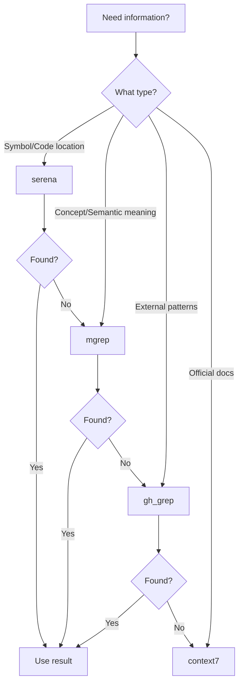

# Portal Grupo US - AI Agent Guide

## Project Snapshot

**Type:** Single-project React application  
**Stack:** React 19 + Vite + TanStack Router + shadcn/ui + Convex + Clerk  
**Purpose:** CRM and student management portal for health aesthetics education business  
**Note:** Sub-directories have their own AGENTS.md files with detailed patterns

---

## Package Manager

**⚠️ IMPORTANTE**: Este projeto **sempre usa `bun`** como package manager. Nunca use `npm`, `yarn` ou `pnpm`.

- ✅ **Sempre use**: `bun install`, `bun run`, `bunx`
- ❌ **Nunca use**: `npm install`, `npm run`, `npx`

## Root Setup Commands

```bash
# Install dependencies (sempre use bun)
bun install

# Development (runs Convex + Vite concurrently)
bun run dev

# Type checking
bun run build  # Includes tsc --noEmit

# Linting & formatting
bun run lint        # Auto-fix with Biome
bun run lint:check  # Check only

# Testing
bun run test              # Run all tests
bun run test:watch        # Watch mode
bun run test:coverage     # With coverage
```

### Advanced Dev Commands

```bash
# Web development only
bun run dev:web          # Vite dev server (without Convex)

# TypeScript watch mode
bun run dev:ts           # Type checking in watch mode

# Convex development only
bun run dev:convex       # Convex dev server (without Vite)

# Code formatting
bun run format           # Format code with Biome
bun run format:check      # Check code formatting only
```

---

## Universal Conventions

**Code Style:**
- TypeScript strict mode enabled
- Biome for linting/formatting (tabs, single quotes, semicolons)
- No `any` types (enforced by Biome)
- Functional components only (no classes)

**Commit Format:**
- Use Conventional Commits (e.g., `feat:`, `fix:`, `docs:`)

**Branch Strategy:**
- `main` branch for production
- Feature branches: `feature/description`

**PR Requirements:**
- All tests passing (`bun run test`)
- No linting errors (`bun run lint:check`)
- Type checking passes (`bun run build`)

---

## Security & Secrets

- **Never commit:** API keys, tokens, or credentials
- **Environment variables:** Use `.env.local` (gitignored)
- **Required vars:** `VITE_CLERK_PUBLISHABLE_KEY`, `VITE_CONVEX_URL`
- **PII handling:** User data stored in Convex with Clerk auth

---

## JIT Index - Directory Map

### Package Structure
- **Frontend app:** `src/` → [see src/AGENTS.md](src/AGENTS.md)
- **Backend (Convex):** `convex/` → [see convex/AGENTS.md](convex/AGENTS.md)
- **UI Components:** `src/components/` → [see src/components/AGENTS.md](src/components/AGENTS.md)
- **Routes/Pages:** `src/routes/` → [see src/routes/AGENTS.md](src/routes/AGENTS.md)
- **Hooks:** `src/hooks/` → [see src/hooks/AGENTS.md](src/hooks/AGENTS.md)
- **Utilities:** `src/lib/` → [see src/lib/AGENTS.md](src/lib/AGENTS.md)
- **Documentation:** `docs/` → PRD, tech stack, setup guides

### Quick Find Commands

```bash
# Find a component
rg -n "export.*function.*ComponentName" src/components

# Find a route
rg -n "createFileRoute" src/routes

# Find a Convex function
rg -n "export const" convex/

# Find a hook
rg -n "export.*use[A-Z]" src/hooks

# Find type definitions
rg -n "interface|type.*=" src/
```

---

## Definition of Done

Before creating a PR:
- [ ] All tests pass (`bun run test`)
- [ ] No linting errors (`bun run lint:check`)
- [ ] Type checking passes (`bun run build`)
- [ ] Code formatted (`bun run lint`)
- [ ] No console errors in browser
- [ ] Responsive design tested (mobile + desktop)

---

## Quick Reference

| Task | Command |
|------|---------|
| Add shadcn component | `bunx shadcn@latest add [component]` |
| Deploy Convex | `bunx convex deploy` |
| Generate route types | Auto-generated by TanStack Router plugin |
| View Convex dashboard | `bunx convex dashboard` |

**For detailed patterns, see sub-directory AGENTS.md files.**

---

## OpenCode Agents & Commands

### Available Agents

| Agent | Mode | Description |
|-------|------|-------------|
| `apex-dev` | Primary | Full-stack developer with TDD methodology. Orchestrates subagents. |
| `apex-researcher` | Primary | Research & planning specialist. NEVER implements. |
| `code-reviewer` | Subagent | Security architect with OWASP + LGPD compliance. Read-only. |
| `database-specialist` | Subagent | Convex expert for schema, queries, mutations. |
| `apex-ui-ux-designer` | Subagent | UI/UX with accessibility-first approach + shadcn/ui. |

### Available Commands

| Command | Description |
|---------|-------------|
| `/research [topic]` | Multi-source research with cross-validation |
| `/qa [scope]` | Quality control pipeline (lint, build, test, deploy) |
| `/clean [scope]` | Dead code detection and cleanup with Knip |

### MCP Tools Available

| MCP | Purpose |
|-----|---------|
| `serena` | Semantic code analysis, symbol discovery |
| `mgrep` | Semantic search by concept (embeddings-based) |
| `gh_grep` | Search real-world GitHub code patterns |
| `context7` | Official documentation lookup |
| `tavily` | Web search for current patterns (research only) |
| `sequential_thinking` | Step-by-step reasoning (research only) |

### Agent Invocation

```bash
# Invoke primary agents
@apex-dev      # For implementation tasks
@apex-researcher  # For research/planning tasks

# Invoke subagents (from apex-dev)
@code-reviewer        # Security/compliance review
@database-specialist  # Convex database tasks
@apex-ui-ux-designer  # UI/UX components
```

---

## MCP Intelligence Guide

### MCP Decision Flowchart



### Tool Selection Matrix

| Scenario | Primary Tool | Fallback | Why |
|----------|-------------|----------|-----|
| "Find function X" | `serena find_symbol` | `mgrep` | Exact symbol match via LSP |
| "How does auth work?" | `mgrep` | `serena search_for_pattern` | Conceptual/semantic query |
| "Real-world React patterns" | `gh_grep` | `context7` | External production examples |
| "Convex query syntax" | `context7` | `gh_grep` | Official docs first |
| "All usages of hook Y" | `serena find_referencing_symbols` | - | Reference tracking via LSP |
| "Similar error handling" | `mgrep` | `serena search_for_pattern` | Pattern similarity |
| "How to use library Z" | `context7` | `tavily` | Authoritative documentation |

### Anti-Patterns (When NOT to Use)

| Tool | DON'T Use When | Use Instead |
|------|---------------|-------------|
| `serena` | Searching concepts like "authentication flow" | `mgrep` |
| `mgrep` | Looking for exact function/class name | `serena find_symbol` |
| `gh_grep` | Project-specific patterns | `serena` or `mgrep` |
| `context7` | Searching for code examples | `gh_grep` |
| `tavily` | Looking for code in this project | `serena` or `mgrep` |

---

## Serena Tool Chains

### 1. Code Exploration Chain
```bash
serena_get_symbols_overview(file) 
  → serena_find_symbol(pattern) 
  → serena_find_referencing_symbols(symbol)
```
**Use case**: Understanding unfamiliar code structure

### 2. Refactoring Chain
```bash
serena_find_symbol(target) 
  → serena_find_referencing_symbols(target) 
  → serena_rename_symbol() OR serena_replace_symbol_body()
```
**Use case**: Safe rename or body replacement across codebase

### 3. Symbol Discovery Chain
```bash
serena_list_dir(path, recursive=true) 
  → serena_get_symbols_overview(each_file) 
  → serena_find_symbol(interesting_patterns)
```
**Use case**: Discovering patterns and conventions across codebase

---

## Semantic Search with mgrep

### How It Works
mgrep uses embeddings (Mixedbread AI) to find semantically similar code, not just text matches. It understands concepts and relationships.

### Query Patterns

| Query Type | Example | Best For |
|------------|---------|----------|
| Conceptual | "user authentication flow" | Understanding architecture |
| Behavioral | "error handling in API calls" | Finding patterns |
| Data flow | "how leads are created" | Tracing data paths |
| Integration | "Clerk with Convex" | Understanding connections |

### Project-Specific Examples

```bash
# Find auth-related code
mgrep search "Clerk authentication user identity"

# Find lead management patterns  
mgrep search "CRM lead stage pipeline kanban"

# Find Convex query patterns
mgrep search "Convex real-time subscription useQuery"

# Find form validation patterns
mgrep search "form validation Zod schema"

# Find error handling
mgrep search "error boundary try catch mutation"
```

### mgrep vs serena vs gh_grep

| Aspect | serena | mgrep | gh_grep |
|--------|--------|-------|---------|
| Search type | LSP symbols | Embeddings | Regex patterns |
| Scope | This project | This project | GitHub public repos |
| Best for | Exact symbols | Concepts | External patterns |
| Speed | Fast | Medium | Medium |
| Accuracy | Exact | Semantic | Pattern-based |

---

## Combined Workflow Examples

### Example 1: Implementing New Feature
```
1. mgrep → "how similar features are implemented"
2. serena find_symbol → locate related components
3. context7 → official API documentation
4. gh_grep → production patterns for unfamiliar APIs
5. serena → implement with codebase consistency
```

### Example 2: Debugging Issue
```
1. serena find_symbol → locate error source
2. serena find_referencing_symbols → trace call chain
3. mgrep → "similar error handling patterns"
4. context7 → library-specific debugging docs
```

### Example 3: Research Task
```
1. mgrep → conceptual understanding of area
2. serena get_symbols_overview → file structure
3. tavily → current best practices (2024+)
4. context7 → official recommendations
5. Synthesize findings → atomic tasks with ≥95% confidence
```

### Example 4: Code Review Preparation
```
1. serena find_symbol → locate changed code
2. serena find_referencing_symbols → impact analysis
3. mgrep → "security patterns for [feature]"
4. context7 → OWASP/LGPD compliance patterns
```

