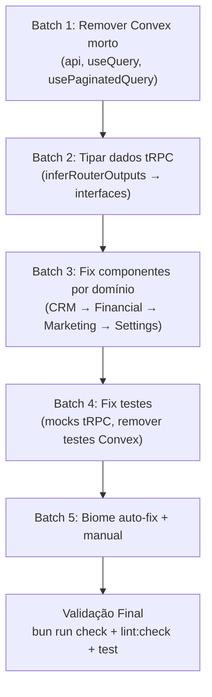

# PLAN: Fix All Remaining TypeScript, Biome, and Vitest Errors

**Complexity:** L6 (Multi-file systematic fixes) | **Estimativa:** 4-6 horas | **Parallel-Safe:** Parcialmente

> [!IMPORTANT]
> Este plano cobre tudo que resta dos AT-311 (Phase 4), AT-501 (Phase 6), e os fixes de testes.
> **Estado atual:** TS=~560 erros, Biome=31 erros, Vitest=10 falhas em 4 arquivos.

---

## Diagnóstico Atual

### TypeScript (560 erros em ~90 arquivos)

| Código | Qtd | Causa Raiz | Estratégia |
|--------|-----|------------|-----------|
| TS2339 | 207 | Propriedade não existe (`.split`, `.map` em `unknown`) | Tipar dados com `inferRouterOutputs` |
| TS2322 | 80 | `unknown` → `ReactNode`/`string`/`Key` | Cast ou tipar variáveis |
| TS2304 | 68 | Variável não declarada (`api`, `usePaginatedQuery`) | Remover refs Convex mortas |
| TS2345 | 34 | Argumento incompatível | Ajustar chamadas tRPC |
| TS7006 | 26 | Parâmetro implicitamente `any` | Adicionar tipos explícitos |
| TS2349 | 26 | `useMutation` não é callable | Usar `.mutate()`/`.mutateAsync()` |
| TS2352 | 24 | Cast string→number | Usar `Number()` |
| TS18047 | 23 | Possivelmente null | Optional chaining `?.` |
| TS6133 | 17 | Importação/variável não usada | Remover |
| TS2538 | 12 | `unknown` como índice | Tipar como `string`/`number` |

### Biome (31 erros)

| Regra | Qtd | Fix |
|-------|-----|-----|
| `noExplicitAny` | 11 | Substituir por tipos específicos ou `biome-ignore` |
| `noUndeclaredVariables` | 8 | Remover `api`, `usePaginatedQuery` refs Convex |
| `useTopLevelRegex` | 5 | Mover regex para constante top-level |
| `noUnusedFunctionParameters` | 4 | Prefixar com `_` ou remover |
| `useFilenamingConvention` | 2 | Ignorar (nomes deliberados) |
| `useAwait` | 1 | Remover `async` ou adicionar `await` |

### Vitest (10 falhas em 4 arquivos)

| Arquivo | Falhas | Causa |
|---------|--------|-------|
| `lead-form.test.tsx` | 4 | Mock tRPC incompleto (falta mock `trpc.leads.create`) |
| `pipeline-kanban.test.tsx` | 3 | `lead-card.tsx` usa `api` (Convex) em `LeadTags` |
| `convex/settings-org.test.ts` | 1 | Teste Convex legado que deve ser removido/adaptado |
| `use-students-view-model.test.ts` | 2 | Já reescrito, pode precisar de ajuste de mock data |

---

## Estratégia de Execução

### Princípio: Fix em Camadas (Dependencies First)



---

## Batch 1: Eliminar Código Convex Morto ⚡ PARALLEL-SAFE

**Objetivo:** Remover todas referências a `api`, `useQuery(api.*)`, `useMutation(api.*)`, `usePaginatedQuery`, `useConvex`, `useConvexAuth` que sobreviveram à migração.

**Tempo estimado:** 30 min

### Step 1.1: Buscar e listar todos os resíduos Convex

```bash
grep -rn "from 'convex/react'" src/ --include="*.tsx" --include="*.ts" | grep -v "node_modules" | grep -v ".test."
grep -rn "from '.*convex/_generated" src/ --include="*.tsx" --include="*.ts"
grep -rn "apiAny\|useQueryUnsafe\|useMutationUnsafe\|usePaginatedQuery" src/ --include="*.tsx" --include="*.ts"
```

**Validação:** grep retorna 0 resultados

### Step 1.2: Para cada arquivo encontrado

Para cada arquivo com resíduos Convex:
1. Remover imports de `convex/react` e `convex/_generated`
2. Substituir `apiAny`/`useQueryUnsafe`/`useMutationUnsafe` por `trpc.{router}.{method}.useQuery()`/`.useMutation()`
3. Se o router tRPC não existir → criar stub com `TODO` e dados mock

**Arquivos conhecidos com resíduos:**

| Arquivo | Padrão | Fix |
|---------|--------|-----|
| [lead-card.tsx](file:///home/mauricio/gpus/src/components/crm/lead-card.tsx) | `api` em `LeadTags` | `trpc.tags.getLeadTags.useQuery()` + import `trpc` |
| [referral-section.tsx](file:///home/mauricio/gpus/src/components/crm/referral-section.tsx) | `useQueryUnsafe` stub | Verificar se já foi corrigido |
| [settings/team.tsx](file:///home/mauricio/gpus/src/routes/_authenticated/settings/team.tsx) | `api`, `usePaginatedQuery` | `trpc.users.list.useQuery()` |
| [settings/tags.tsx](file:///home/mauricio/gpus/src/routes/_authenticated/settings/tags.tsx) | `api` refs | `trpc.tags.*` |

**Rollback:** `git stash`

---

## Batch 2: Tipar Dados tRPC ⚡ PARALLEL-SAFE

**Objetivo:** Substituir `Record<string, unknown>` e casts `as unknown as` por tipos derivados do `AppRouter`.

**Tempo estimado:** 45 min

### Step 2.1: Expandir `src/types/api.ts`

O arquivo já existe com `inferRouterOutputs<AppRouter>`. Precisa adicionar tipos para **todos** os routers usados no frontend:

```typescript
// src/types/api.ts
import type { inferRouterOutputs } from '@trpc/server';
import type { AppRouter } from '../../server/routers';

type RouterOutputs = inferRouterOutputs<AppRouter>;

// Leads
export type Lead = RouterOutputs['leads']['get'];
export type LeadListItem = RouterOutputs['leads']['list']['data'][number];
export type LeadStats = RouterOutputs['leads']['stats'];

// Students
export type Student = RouterOutputs['students']['get'];
export type StudentListItem = RouterOutputs['students']['list']['data'][number];

// Activities
export type Activity = RouterOutputs['activities']['list'][number];

// Tasks
export type Task = RouterOutputs['tasks']['list'][number];

// Tags
export type Tag = RouterOutputs['tags']['list'][number];

// Users
export type SystemUser = RouterOutputs['users']['listSystemUsers'][number];

// Financial
export type Invoice = RouterOutputs['financial']['invoices']['list'][number];
export type FinancialMetrics = RouterOutputs['financial']['metrics'];

// Marketing
export type EmailCampaign = RouterOutputs['emailCampaigns']['list'][number];
export type EmailTemplate = RouterOutputs['emailTemplates']['list'][number];
export type EmailContact = RouterOutputs['emailContacts']['list'][number];
export type EmailList = RouterOutputs['emailLists']['list'][number];

// Messages
export type Conversation = RouterOutputs['conversations']['list'][number];
export type Message = RouterOutputs['messages']['list'][number];

// Settings
export type MessageTemplate = RouterOutputs['templates']['list'][number];
export type CustomField = RouterOutputs['customFields']['list'][number];
export type Notification = RouterOutputs['notifications']['list'][number];
```

**Validação:** `bunx tsc --noEmit src/types/api.ts` sem erros

### Step 2.2: Atualizar imports nos componentes

Substituir `Record<string, unknown>` e interfaces locais duplicadas pelos tipos do `src/types/api.ts` em todos os arquivos afetados.

---

## Batch 3: Fix Componentes por Domínio

Organizado por área funcional, cada subgrupo é parallel-safe.

### 3A: CRM (12 arquivos, ~80 erros) — 60 min

| # | Arquivo | Erros | Fix Principal |
|---|---------|-------|---------------|
| 1 | [lead-card.tsx](file:///home/mauricio/gpus/src/components/crm/lead-card.tsx) | 4 | Importar `trpc`, tipar `Tag` |
| 2 | [custom-field-renderer.tsx](file:///home/mauricio/gpus/src/components/crm/custom-field-renderer.tsx) | 12 | Tipar `CustomField` com api.ts |
| 3 | [tag-selector.tsx](file:///home/mauricio/gpus/src/components/crm/tag-selector.tsx) | 10 | `trpc.tags.*` queries |
| 4 | [tag-autocomplete.tsx](file:///home/mauricio/gpus/src/components/crm/tag-autocomplete.tsx) | 6 | `trpc.tags.*` queries |
| 5 | [tag-section.tsx](file:///home/mauricio/gpus/src/components/crm/tag-section.tsx) | 5 | `trpc.tags.*` queries |
| 6 | [objections-list.tsx](file:///home/mauricio/gpus/src/components/crm/objections-list.tsx) | 7 | Tipar `Objection` |
| 7 | [objection-form.tsx](file:///home/mauricio/gpus/src/components/crm/objection-form.tsx) | 4 | Tipar mutation args |
| 8 | [task-form.tsx](file:///home/mauricio/gpus/src/components/crm/task-form.tsx) | 7 | `trpc.tasks.*` |
| 9 | [referral-section.tsx](file:///home/mauricio/gpus/src/components/crm/referral-section.tsx) | 5 | Verificar stub |
| 10 | [referral-autocomplete.tsx](file:///home/mauricio/gpus/src/components/crm/referral-autocomplete.tsx) | 5 | `trpc.leads.list` search |
| 11 | [lead-filters.tsx](file:///home/mauricio/gpus/src/components/crm/lead-filters.tsx) | 6 | Tipar props do filtro |
| 12 | Outros CRM (`lead-owner-select`, `lead-detail`, `lead-edit-dialog`, etc.) | ~15 | Tipagem + imports |

**Validação por arquivo:** `bunx tsc --noEmit src/components/crm/{file}`

### 3B: Financial + ASAAS (8 arquivos, ~90 erros) — 45 min

| # | Arquivo | Erros | Fix Principal |
|---|---------|-------|---------------|
| 1 | [admin-sync-history.tsx](file:///home/mauricio/gpus/src/components/admin/asaas/sync-history/admin-sync-history.tsx) | 32 | Tipar `SyncLog`, remover `Record<string, unknown>` |
| 2 | [admin-sync-controls.tsx](file:///home/mauricio/gpus/src/components/admin/asaas/sync-controls/admin-sync-controls.tsx) | 14 | Tipar responses |
| 3 | [invoice-list.tsx](file:///home/mauricio/gpus/src/components/financial/invoice-list.tsx) | 17 | `trpc.financial.*` |
| 4 | [monthly-overview-card.tsx](file:///home/mauricio/gpus/src/components/financial/monthly-overview-card.tsx) | 17 | Tipar `FinancialMetrics` |
| 5 | [payment-calendar.tsx](file:///home/mauricio/gpus/src/components/financial/payment-calendar.tsx) | 13 | Tipar `Payment` |
| 6 | [sync-history.tsx](file:///home/mauricio/gpus/src/components/asaas/sync-history.tsx) | 13 | Tipar `SyncLog` |
| 7 | [revenue-chart.tsx](file:///home/mauricio/gpus/src/components/financial/revenue-chart.tsx) | 4 | Tipar chart data |
| 8 | Rotas financial (`reports.tsx`, `payments.tsx`, `index.tsx`) | ~23 | Tipar queries |

### 3C: Marketing (8 arquivos, ~70 erros) — 45 min

| # | Arquivo | Erros | Fix Principal |
|---|---------|-------|---------------|
| 1 | [listas/$listId.tsx](file:///home/mauricio/gpus/src/routes/_authenticated/marketing/listas/$listId.tsx) | 20 | Tipar `EmailList`, `EmailContact` |
| 2 | [nova.tsx](file:///home/mauricio/gpus/src/routes/_authenticated/marketing/nova.tsx) | 17 | Tipar form, mutation |
| 3 | [$campaignId.tsx](file:///home/mauricio/gpus/src/routes/_authenticated/marketing/$campaignId.tsx) | 13 | Tipar `Campaign` |
| 4 | [listas.tsx](file:///home/mauricio/gpus/src/routes/_authenticated/marketing/listas.tsx) | 12 | Tipar `EmailList[]` |
| 5 | [templates/$templateId.tsx](file:///home/mauricio/gpus/src/routes/_authenticated/marketing/templates/$templateId.tsx) | 9 | Tipar `Template` |
| 6 | [$campaignId/edit.tsx](file:///home/mauricio/gpus/src/routes/_authenticated/marketing/$campaignId/edit.tsx) | 8 | Tipar form |
| 7 | Outros marketing (`campanhas.tsx`, `contatos.tsx`, `leads.tsx`, `templates.tsx`) | ~10 | Tipar queries |
| 8 | Marketing components (`campaign-table`, `campaign-card`, `create-list-dialog`) | ~9 | Tipar props |

### 3D: Settings (6 arquivos, ~45 erros) — 30 min

| # | Arquivo | Erros | Fix Principal |
|---|---------|-------|---------------|
| 1 | [templates.tsx](file:///home/mauricio/gpus/src/routes/_authenticated/settings/templates.tsx) | 12 | Fix `useMutation` callable, tipar template |
| 2 | [tags.tsx](file:///home/mauricio/gpus/src/routes/_authenticated/settings/tags.tsx) | 10 | Remover `api` refs, `trpc.tags.*` |
| 3 | [team.tsx](file:///home/mauricio/gpus/src/routes/_authenticated/settings/team.tsx) | 8 | Remover `api`, `usePaginatedQuery` → `trpc.users.list` |
| 4 | [user-table.tsx](file:///home/mauricio/gpus/src/routes/_authenticated/settings/team/-components/user-table.tsx) | 7 | Tipar `User` props |
| 5 | [user-details.tsx](file:///home/mauricio/gpus/src/routes/_authenticated/settings/team/-components/user-details.tsx) | 7 | Tipar `User` props |
| 6 | Dialogs (`edit-role-dialog.tsx`, `remove-dialog.tsx`, `invite-dialog.tsx`) | ~3 | Fix mutation callable |

### 3E: Students (7 arquivos, ~50 erros) — 30 min

| # | Arquivo | Erros | Fix Principal |
|---|---------|-------|---------------|
| 1 | [student-payments-tab.tsx](file:///home/mauricio/gpus/src/components/students/tabs/student-payments-tab.tsx) | 24 | Tipar `Payment`, `Subscription` |
| 2 | [student-conversations-tab.tsx](file:///home/mauricio/gpus/src/components/students/tabs/student-conversations-tab.tsx) | 8 | Tipar `Conversation` |
| 3 | [student-import-dialog.tsx](file:///home/mauricio/gpus/src/components/students/student-import-dialog.tsx) | 9 | Tipar import result |
| 4 | [student-detail.tsx](file:///home/mauricio/gpus/src/components/students/student-detail.tsx) | 9 | Tipar `Student` |
| 5 | [student-form.tsx](file:///home/mauricio/gpus/src/components/students/student-form.tsx) | 7 | Tipar form/mutation |
| 6 | [student-table.tsx](file:///home/mauricio/gpus/src/components/students/student-table.tsx) | 5 | Tipar `StudentListItem` |
| 7 | Outros (`enrollment-card`, `student-card`, `create-payment-dialog`, `asaas-import-button`) | ~11 | Tipar props |

### 3F: Dashboard + Reports + Chat (8 arquivos, ~35 erros) — 20 min

| # | Arquivo | Erros | Fix Principal |
|---|---------|-------|---------------|
| 1 | [dashboard.tsx](file:///home/mauricio/gpus/src/routes/_authenticated/dashboard.tsx) | 9 | Tipar stats queries |
| 2 | [reports/sales.tsx](file:///home/mauricio/gpus/src/routes/_authenticated/reports/sales.tsx) | 20 | Tipar sales data |
| 3 | [reports/index.tsx](file:///home/mauricio/gpus/src/routes/_authenticated/reports.tsx) | 18 | Tipar reports data |
| 4 | [reports/team.tsx](file:///home/mauricio/gpus/src/routes/_authenticated/reports/team.tsx) | 2 | Minor fixes |
| 5 | Chat files (`conversation-list`, `chat-window`, `chat-input`, `message-bubble`, `$department/$id`) | ~13 | Tipar messages/conversations |

---

## Batch 4: Fix Testes — 30 min

### Step 4.1: Fix `lead-card.tsx` → Desbloqueia `pipeline-kanban.test.tsx`

- Importar `trpc` em `lead-card.tsx`
- Remover interface `Tag` não usada (usar tipo inferido do tRPC)
- Adicionar mock `trpc.tags.getLeadTags` no teste

### Step 4.2: Fix `lead-form.test.tsx`

Os 4 testes falham porque `LeadForm` agora usa `trpc.leads.create.useMutation()`. O mock precisa retornar `{ mutateAsync, isPending }`. Verificar se o rewrite anterior cobriu isso ou precisa ajuste.

### Step 4.3: Fix `pipeline-kanban.test.tsx`

Depende do fix do `lead-card.tsx` (Step 4.1). Adicionar mock para `trpc.tags.getLeadTags.useQuery`.

### Step 4.4: Remover/adaptar `convex/settings-org.test.ts`

Teste Convex legado — ou adaptar para testar o router tRPC correspondente, ou mover para testes deprecated.

### Step 4.5: Fix `use-students-view-model.test.ts`

Já reescrito com tRPC mocks. Verificar se passa e ajustar mock data se necessário.

**Validação:** `bun run test --run` — 0 falhas

---

## Batch 5: Biome Cleanup — 15 min ⚡ PARALLEL-SAFE

### Step 5.1: Auto-fix

```bash
bun run lint
```

### Step 5.2: Manual fixes restantes

| Regra | Arquivos | Fix |
|-------|----------|-----|
| `noUndeclaredVariables` | 8 ocorrências em settings | Batch 1 resolve (remover refs Convex) |
| `noExplicitAny` | 11 ocorrências | Adicionar tipos ou `biome-ignore` com justificativa |
| `useTopLevelRegex` | 5 ocorrências | Extrair regex para `const` top-level |
| `noUnusedFunctionParameters` | 4 ocorrências | Prefixar com `_` |
| `useAwait` | 1 em `invite-dialog.tsx` | Remover `async` ou usar `await` |

**Validação:** `bun run lint:check` — 0 erros

---

## Batch 6: Cleanup Scripts — 10 min ⚡ PARALLEL-SAFE

### Step 6.1: Remover scripts de migração obsoletos

```bash
# Estes scripts tinham erros TS e não são mais necessários:
rm scripts/migrate-convex-to-trpc.ts
rm scripts/fix-types.ts
rm scripts/fix-trpc-query-destructure.ts
rm scripts/fix-trpc-imports.ts
```

---

## Validação Final

### Automated (Quality Gates)

```bash
bun run check      # TypeScript → 0 errors
bun run lint:check  # Biome → 0 errors, 0 warnings
bun run test --run  # Vitest → all pass
```

### Manual Checklist

- [ ] `bun run dev` inicia sem erros de compilação
- [ ] Navegação por todas as rotas autenticadas funciona
- [ ] CRM: criar/editar/listar leads
- [ ] Students: listar/filtrar/detalhar
- [ ] 0 referências a `convex/react` ou `convex/_generated` em `src/`

---

## Ordem de Execução Recomendada

```
1. Batch 6 (Cleanup scripts)     — 10 min  ⚡
2. Batch 1 (Convex morto)        — 30 min  
3. Batch 2 (Tipos tRPC)          — 45 min  
4. Batch 3A (CRM)                — 60 min  
5. Batch 3B (Financial/ASAAS)    — 45 min  
6. Batch 3C (Marketing)          — 45 min  
7. Batch 3D (Settings)           — 30 min  
8. Batch 3E (Students)           — 30 min  
9. Batch 3F (Dashboard/Reports)  — 20 min  
10. Batch 4 (Testes)             — 30 min  
11. Batch 5 (Biome)              — 15 min  
12. Validação Final              — 15 min  
                                   ────────
                        Total:   ~6 horas
```

> [!TIP]
> Batches 3A-3F seguem o mesmo padrão mecânico: importar tipo de `@/types/api` → substituir `Record<string, unknown>` → tipar props → fix `.mutate()` callable. Um script semi-automático pode acelerar significativamente.
