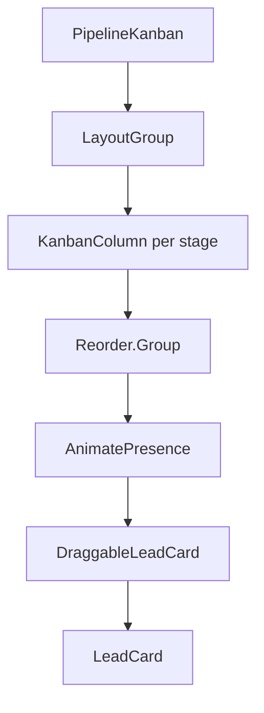

# CRM Drag and Drop Implementation

> **Migration**: @dnd-kit → Framer Motion (completed 2024)

## Overview

The CRM kanban pipeline uses **Framer Motion's Reorder API** for drag-and-drop functionality. This provides smooth spring physics animations, automatic layout transitions, and better visual feedback compared to the previous @dnd-kit implementation.

## Architecture



## Key Components

### PipelineKanban
Main container with `LayoutGroup` for coordinated cross-column animations.

```tsx
<LayoutGroup>
  <div className="flex gap-4...">
    {stages.map(stage => <KanbanColumn ... />)}
  </div>
</LayoutGroup>
```

### KanbanColumn
Each column uses `Reorder.Group` for vertical reordering:

```tsx
<Reorder.Group
  axis="y"
  values={leads}
  onReorder={(newOrder) => onReorder(stage.id, newOrder)}
  layoutScroll
>
  <AnimatePresence mode="popLayout">
    {leads.map(lead => <DraggableLeadCard ... />)}
  </AnimatePresence>
</Reorder.Group>
```

### DraggableLeadCard
Uses `Reorder.Item` with custom drag handling for cross-column moves:

```tsx
<Reorder.Item
  value={lead}
  layoutId={lead._id}
  layout="position"
  drag
  dragElastic={0.1}
  whileDrag={{ scale: 1.05, boxShadow: '...' }}
  onDragEnd={handleDragEnd}
>
  ...
</Reorder.Item>
```

## Animation Configuration

All animations use configurations from `src/lib/motion-config.ts`:

| Config | Usage |
|--------|-------|
| `SPRING_SMOOTH` | General UI transitions |
| `SPRING_BOUNCY` | Playful interactions |
| `layoutTransition` | Card reordering |
| `dragTransition` | During drag |
| `cardVariants` | Entry/exit animations |
| `hotIconVariants` | Pulsating fire icon |

## Cross-Column Drag Logic

Since Framer Motion's `Reorder` only works within a single group, cross-column dragging uses custom hit detection:

1. Column refs are tracked in a `Map<stageId, HTMLDivElement>`
2. On `dragEnd`, cursor position is checked against all column bounds
3. If dropped on different column, `onDragEnd(leadId, newStage)` is called

## Customization

### Adjust Spring Physics
```ts
// src/lib/motion-config.ts
export const SPRING_SMOOTH: Transition = {
  type: 'spring',
  stiffness: 300,  // ↑ faster, ↓ slower
  damping: 30,      // ↑ less bouncy, ↓ more bouncy
};
```

### Add New Card Animation
```tsx
<motion.div
  initial={{ opacity: 0, y: -20 }}
  animate={{ opacity: 1, y: 0 }}
  exit={{ opacity: 0, scale: 0.8 }}
>
  ...
</motion.div>
```

## Troubleshooting

| Issue | Solution |
|-------|----------|
| **Janky animations** | Add `will-change-transform` class |
| **Cards not reordering** | Ensure `values` contains objects with same reference |
| **Mobile scroll conflict** | `dragElastic={0.1}` reduces conflicts |
| **Layout thrashing** | Use `layout="position"` not `layout={true}` |

## Performance Tips

1. Use `layout="position"` (only animates position, not size)
2. Add `will-change-transform` for GPU acceleration
3. `AnimatePresence mode="popLayout"` prevents layout jump
4. `layoutId` enables shared element transitions across columns
