# Core Flows: CRM Enhancement Features

# Core User Flows

This document defines the user flows for all 8 CRM enhancement features, focusing on user interactions, entry points, and navigation patterns.

---

## 1. Sistema de Tags

### Flow 1.1: Visualizar Tags de um Lead

**Entry Point**: Vendedor abre o lead detail (clica em um lead no Kanban)

**Steps**:
1. Lead detail abre em side sheet (painel direito)
2. Aba "Visão Geral" é exibida por padrão
3. Seção "Tags" aparece após as seções existentes (Dados Profissionais, Interesse)
4. Tags do lead são exibidas como badges coloridas
5. Se não houver tags, mostra mensagem "Nenhuma tag adicionada"

**UI Feedback**: Tags são visualmente distintas com cores e ícone de remoção (X)

```wireframe
<!DOCTYPE html>
<html>
<head>
<style>
body { font-family: system-ui; padding: 20px; background: #f5f5f5; }
.lead-detail { background: white; border-radius: 8px; padding: 24px; max-width: 600px; }
.section { margin-bottom: 24px; }
.section-title { font-size: 12px; text-transform: uppercase; color: #666; margin-bottom: 12px; font-weight: 600; }
.tags-container { display: flex; flex-wrap: wrap; gap: 8px; }
.tag { background: #e3f2fd; color: #1976d2; padding: 6px 12px; border-radius: 16px; font-size: 13px; display: inline-flex; align-items: center; gap: 6px; }
.tag-remove { cursor: pointer; font-weight: bold; }
.add-tag-btn { background: #f0f0f0; color: #666; padding: 6px 12px; border-radius: 16px; font-size: 13px; border: 1px dashed #ccc; cursor: pointer; }
</style>
</head>
<body>
<div class="lead-detail">
  <div class="section">
    <div class="section-title">📌 Tags</div>
    <div class="tags-container">
      <span class="tag" data-element-id="tag-1">Urgente <span class="tag-remove">×</span></span>
      <span class="tag" data-element-id="tag-2">VIP <span class="tag-remove">×</span></span>
      <span class="tag" data-element-id="tag-3">Follow-up Semanal <span class="tag-remove">×</span></span>
      <button class="add-tag-btn" data-element-id="add-tag-button">+ Adicionar Tag</button>
    </div>
  </div>
</div>
</body>
</html>
```

### Flow 1.2: Adicionar Tag a um Lead

**Entry Point**: Vendedor clica no botão "+ Adicionar Tag" na seção Tags

**Steps**:
1. Input de autocomplete aparece inline
2. Vendedor digita para buscar tags existentes
3. Dropdown mostra tags que correspondem à busca
4. Se tag não existe, opção "Criar nova tag: [nome]" aparece no dropdown
5. Vendedor seleciona tag existente OU cria nova
6. Tag é adicionada imediatamente ao lead
7. Tag aparece como badge na seção Tags
8. Input de autocomplete fecha

**UI Feedback**: 
- Loading spinner durante salvamento
- Tag aparece com animação de entrada
- Mensagem de sucesso sutil (toast)

```wireframe
<!DOCTYPE html>
<html>
<head>
<style>
body { font-family: system-ui; padding: 20px; background: #f5f5f5; }
.autocomplete-container { position: relative; max-width: 400px; }
.autocomplete-input { width: 100%; padding: 10px; border: 2px solid #1976d2; border-radius: 8px; font-size: 14px; }
.autocomplete-dropdown { position: absolute; top: 100%; left: 0; right: 0; background: white; border: 1px solid #ddd; border-radius: 8px; margin-top: 4px; box-shadow: 0 4px 12px rgba(0,0,0,0.1); max-height: 200px; overflow-y: auto; }
.autocomplete-option { padding: 10px 12px; cursor: pointer; font-size: 14px; border-bottom: 1px solid #f0f0f0; }
.autocomplete-option:hover { background: #f5f5f5; }
.autocomplete-option.create-new { color: #1976d2; font-weight: 500; }
.tag-preview { display: inline-block; background: #e3f2fd; color: #1976d2; padding: 4px 8px; border-radius: 12px; font-size: 12px; margin-left: 8px; }
</style>
</head>
<body>
<div class="autocomplete-container">
  <input type="text" class="autocomplete-input" placeholder="Buscar ou criar tag..." value="urgen" data-element-id="tag-search-input">
  <div class="autocomplete-dropdown" data-element-id="tag-dropdown">
    <div class="autocomplete-option" data-element-id="tag-option-1">
      Urgente <span class="tag-preview">Tag existente</span>
    </div>
    <div class="autocomplete-option create-new" data-element-id="create-tag-option">
      ✨ Criar nova tag: "urgen"
    </div>
  </div>
</div>
</body>
</html>
```

### Flow 1.3: Filtrar Leads por Tags

**Entry Point**: Vendedor clica no botão "Filtros" na página CRM

**Steps**:
1. Popover de filtros abre
2. Nova seção "Tags" aparece após as seções existentes
3. Lista de todas as tags disponíveis é exibida com checkboxes
4. Vendedor seleciona uma ou mais tags
5. Contador de filtros ativos atualiza
6. Popover fecha (ou permanece aberto)
7. Kanban atualiza mostrando apenas leads com as tags selecionadas
8. Badge de filtro ativo mostra número de tags selecionadas

**UI Feedback**: 
- Kanban recarrega com loading state
- Contador de leads por coluna atualiza
- Badge no botão "Filtros" mostra total de filtros ativos

```wireframe
<!DOCTYPE html>
<html>
<head>
<style>
body { font-family: system-ui; padding: 20px; background: #f5f5f5; }
.filter-popover { background: white; border-radius: 8px; padding: 16px; width: 320px; box-shadow: 0 4px 12px rgba(0,0,0,0.15); }
.filter-header { display: flex; justify-content: space-between; align-items: center; margin-bottom: 16px; }
.filter-title { font-weight: 600; font-size: 14px; }
.clear-btn { color: #666; font-size: 12px; cursor: pointer; }
.filter-section { margin-bottom: 16px; padding-bottom: 16px; border-bottom: 1px solid #f0f0f0; }
.filter-section-title { font-size: 12px; color: #666; font-weight: 600; margin-bottom: 8px; }
.checkbox-grid { display: grid; grid-template-columns: 1fr 1fr; gap: 8px; }
.checkbox-item { display: flex; align-items: center; gap: 8px; font-size: 13px; }
.checkbox { width: 16px; height: 16px; }
</style>
</head>
<body>
<div class="filter-popover" data-element-id="filter-popover">
  <div class="filter-header">
    <span class="filter-title">Filtros</span>
    <span class="clear-btn" data-element-id="clear-filters">Limpar</span>
  </div>
  
  <div class="filter-section">
    <div class="filter-section-title">Tags</div>
    <div class="checkbox-grid">
      <label class="checkbox-item">
        <input type="checkbox" class="checkbox" checked data-element-id="tag-filter-urgente">
        <span>Urgente</span>
      </label>
      <label class="checkbox-item">
        <input type="checkbox" class="checkbox" data-element-id="tag-filter-vip">
        <span>VIP</span>
      </label>
      <label class="checkbox-item">
        <input type="checkbox" class="checkbox" checked data-element-id="tag-filter-followup">
        <span>Follow-up</span>
      </label>
      <label class="checkbox-item">
        <input type="checkbox" class="checkbox" data-element-id="tag-filter-retorno">
        <span>Retorno</span>
      </label>
    </div>
  </div>
</div>
</body>
</html>
```

---

## 2. Sistema de Objeções

### Flow 2.1: Registrar Objeção de um Lead

**Entry Point**: Vendedor abre lead detail e clica na aba "Objeções"

**Steps**:
1. Aba "Objeções" é exibida (nova aba após "Timeline")
2. Lista de objeções registradas aparece (vazia inicialmente)
3. Botão "+ Adicionar Objeção" no topo da lista
4. Vendedor clica no botão
5. Campo de texto aparece para digitar a objeção
6. Vendedor digita a objeção (ex: "Preço muito alto")
7. Vendedor pressiona Enter ou clica em "Salvar"
8. Objeção é adicionada à lista com timestamp
9. Campo de texto limpa para nova entrada

**UI Feedback**:
- Objeção aparece imediatamente na lista
- Timestamp mostra "Agora mesmo"
- Campo de texto tem foco automático após salvar

```wireframe
<!DOCTYPE html>
<html>
<head>
<style>
body { font-family: system-ui; padding: 20px; background: #f5f5f5; }
.objections-tab { background: white; border-radius: 8px; padding: 24px; max-width: 600px; }
.tab-header { display: flex; justify-content: space-between; align-items: center; margin-bottom: 20px; }
.tab-title { font-size: 16px; font-weight: 600; }
.add-btn { background: #1976d2; color: white; padding: 8px 16px; border-radius: 6px; border: none; cursor: pointer; font-size: 14px; }
.objection-input { width: 100%; padding: 12px; border: 2px solid #1976d2; border-radius: 8px; font-size: 14px; margin-bottom: 16px; }
.objections-list { display: flex; flex-direction: column; gap: 12px; }
.objection-item { padding: 12px; background: #f9f9f9; border-radius: 8px; border-left: 3px solid #ff9800; }
.objection-text { font-size: 14px; margin-bottom: 4px; }
.objection-meta { font-size: 12px; color: #666; }
.empty-state { text-align: center; padding: 40px; color: #999; }
</style>
</head>
<body>
<div class="objections-tab">
  <div class="tab-header">
    <span class="tab-title">Objeções</span>
    <button class="add-btn" data-element-id="add-objection-btn">+ Adicionar Objeção</button>
  </div>
  
  <input type="text" class="objection-input" placeholder="Digite a objeção do lead..." data-element-id="objection-input">
  
  <div class="objections-list">
    <div class="objection-item" data-element-id="objection-1">
      <div class="objection-text">Preço muito alto para o momento atual</div>
      <div class="objection-meta">Registrado há 2 horas por João Silva</div>
    </div>
    <div class="objection-item" data-element-id="objection-2">
      <div class="objection-text">Precisa consultar o sócio antes de decidir</div>
      <div class="objection-meta">Registrado há 1 dia por João Silva</div>
    </div>
  </div>
</div>
</body>
</html>
```

### Flow 2.2: Visualizar Histórico de Objeções

**Entry Point**: Vendedor abre aba "Objeções" no lead detail

**Steps**:
1. Lista de objeções é exibida em ordem cronológica (mais recente primeiro)
2. Cada objeção mostra: texto, data/hora, vendedor que registrou
3. Vendedor pode rolar a lista se houver muitas objeções
4. Vendedor pode remover objeção (ícone de lixeira)
5. Confirmação antes de remover

**UI Feedback**:
- Objeções removidas desaparecem com animação
- Se lista ficar vazia, mostra estado vazio

---

## 3. Dashboard Individual por Vendedor

### Flow 3.1: Vendedor Visualiza Seu Dashboard

**Entry Point**: Vendedor com role "vendedor" acessa a página Dashboard

**Steps**:
1. Dashboard carrega automaticamente filtrado para o vendedor logado
2. Todas as métricas mostram apenas dados do vendedor
3. Título mostra "Meu Dashboard" ou "Dashboard - [Nome do Vendedor]"
4. Seletor de período funciona normalmente (7d, 30d, 90d, ano)
5. Gráficos e KPIs refletem apenas leads/conversões do vendedor
6. Vendedor NÃO vê seletor de "Vendedor" (não pode ver dados de outros)

**UI Feedback**:
- Badge ou indicador mostra "Visualização Individual"
- Métricas carregam com loading state

### Flow 3.2: Gestor Visualiza Dashboard de Vendedor Específico

**Entry Point**: Gestor com role "admin" ou "manager" acessa a página Dashboard

**Steps**:
1. Dashboard carrega com visão global (todos os vendedores) por padrão
2. Seletor de "Vendedor" aparece ao lado do seletor de período
3. Dropdown mostra opções: "Todos os Vendedores" + lista de vendedores
4. Gestor seleciona um vendedor específico
5. Dashboard recarrega com dados filtrados para aquele vendedor
6. Título atualiza para "Dashboard - [Nome do Vendedor]"
7. Todas as métricas e gráficos atualizam
8. Gestor pode voltar para "Todos os Vendedores" a qualquer momento

**UI Feedback**:
- Loading state durante troca de vendedor
- Badge mostra vendedor selecionado
- Métricas animam durante atualização

```wireframe
<!DOCTYPE html>
<html>
<head>
<style>
body { font-family: system-ui; padding: 20px; background: #f5f5f5; }
.dashboard-header { display: flex; justify-content: space-between; align-items: center; margin-bottom: 24px; }
.dashboard-title { font-size: 32px; font-weight: 700; }
.dashboard-subtitle { font-size: 14px; color: #666; margin-top: 4px; }
.filters-container { display: flex; gap: 12px; }
.select-box { padding: 10px 16px; border: 1px solid #ddd; border-radius: 8px; background: white; font-size: 14px; min-width: 180px; cursor: pointer; }
.badge { background: #e3f2fd; color: #1976d2; padding: 4px 12px; border-radius: 12px; font-size: 12px; margin-left: 8px; }
</style>
</head>
<body>
<div class="dashboard-header">
  <div>
    <div class="dashboard-title">
      Dashboard
      <span class="badge" data-element-id="vendor-badge">João Silva</span>
    </div>
    <div class="dashboard-subtitle">Visão geral de performance individual</div>
  </div>
  <div class="filters-container">
    <select class="select-box" data-element-id="vendor-selector">
      <option>Todos os Vendedores</option>
      <option selected>João Silva</option>
      <option>Maria Santos</option>
      <option>Pedro Costa</option>
    </select>
    <select class="select-box" data-element-id="period-selector">
      <option>Últimos 7 dias</option>
      <option selected>Últimos 30 dias</option>
      <option>Últimos 90 dias</option>
      <option>Este ano</option>
    </select>
  </div>
</div>
</body>
</html>
```

---

## 4. Pipeline por Produto

### Flow 4.1: Visualizar Pipeline de um Produto Específico

**Entry Point**: Vendedor acessa a página CRM

**Steps**:
1. Tabs aparecem no topo da página, acima do Kanban
2. Tabs disponíveis: "Todos" | "OTB 2025" | "NEON" | "TRINTAE3"
3. Tab "Todos" é selecionada por padrão (comportamento atual)
4. Vendedor clica em uma tab de produto (ex: "OTB 2025")
5. Kanban recarrega mostrando apenas leads daquele produto
6. Filtros continuam funcionando dentro do produto selecionado
7. Contador de leads por coluna atualiza
8. Tab ativa é visualmente destacada

**UI Feedback**:
- Loading state durante troca de tab
- Animação suave de transição
- URL atualiza para refletir produto selecionado (ex: /crm?product=otb)

```wireframe
<!DOCTYPE html>
<html>
<head>
<style>
body { font-family: system-ui; padding: 20px; background: #f5f5f5; margin: 0; }
.crm-page { max-width: 1400px; margin: 0 auto; }
.page-header { margin-bottom: 20px; }
.page-title { font-size: 32px; font-weight: 700; margin-bottom: 16px; }
.product-tabs { display: flex; gap: 4px; border-bottom: 2px solid #e0e0e0; margin-bottom: 20px; }
.tab { padding: 12px 24px; background: transparent; border: none; font-size: 14px; font-weight: 500; color: #666; cursor: pointer; border-bottom: 3px solid transparent; transition: all 0.2s; }
.tab.active { color: #1976d2; border-bottom-color: #1976d2; }
.tab:hover { background: #f5f5f5; }
.tab-badge { background: #e0e0e0; color: #666; padding: 2px 8px; border-radius: 10px; font-size: 11px; margin-left: 6px; }
.tab.active .tab-badge { background: #e3f2fd; color: #1976d2; }
</style>
</head>
<body>
<div class="crm-page">
  <div class="page-header">
    <div class="page-title">Pipeline de Vendas</div>
  </div>
  
  <div class="product-tabs" data-element-id="product-tabs">
    <button class="tab" data-element-id="tab-all">
      Todos <span class="tab-badge">47</span>
    </button>
    <button class="tab active" data-element-id="tab-otb">
      OTB 2025 <span class="tab-badge">23</span>
    </button>
    <button class="tab" data-element-id="tab-neon">
      NEON <span class="tab-badge">15</span>
    </button>
    <button class="tab" data-element-id="tab-trintae3">
      TRINTAE3 <span class="tab-badge">9</span>
    </button>
  </div>
  
  <div style="padding: 20px; background: white; border-radius: 8px; text-align: center; color: #999;">
    [Kanban do produto OTB 2025 seria renderizado aqui]
  </div>
</div>
</body>
</html>
```

### Flow 4.2: Alternar Entre Produtos

**Entry Point**: Vendedor está visualizando pipeline de um produto

**Steps**:
1. Vendedor clica em outra tab de produto
2. Kanban mostra loading state
3. Leads do novo produto são carregados
4. Kanban atualiza com nova lista de leads
5. Filtros são mantidos (se aplicáveis ao novo produto)
6. Tab anterior é desmarcada, nova tab é marcada como ativa

**UI Feedback**:
- Skeleton loading durante carregamento
- Contadores de leads atualizam
- Transição suave entre produtos

---

## 5. Sistema de Indicações e Cashback

### Flow 5.1: Registrar Lead Indicado

**Entry Point**: Vendedor cria novo lead (clica em "+ Novo Lead" no Kanban)

**Steps**:
1. Formulário de criação de lead abre
2. Campos padrão são exibidos (nome, telefone, email, etc.)
3. Novo campo "Indicado por" aparece no formulário
4. Campo é opcional (pode ficar vazio)
5. Vendedor clica no campo "Indicado por"
6. Autocomplete busca leads/alunos existentes
7. Vendedor seleciona o indicador da lista
8. Nome do indicador aparece no campo
9. Vendedor preenche resto do formulário e salva
10. Lead é criado com referência ao indicador

**UI Feedback**:
- Autocomplete mostra nome + telefone para identificação
- Ícone de "indicação" aparece ao lado do campo preenchido

```wireframe
<!DOCTYPE html>
<html>
<head>
<style>
body { font-family: system-ui; padding: 20px; background: #f5f5f5; }
.lead-form { background: white; border-radius: 8px; padding: 24px; max-width: 500px; }
.form-title { font-size: 18px; font-weight: 600; margin-bottom: 20px; }
.form-group { margin-bottom: 16px; }
.form-label { display: block; font-size: 13px; font-weight: 500; margin-bottom: 6px; color: #333; }
.form-input { width: 100%; padding: 10px; border: 1px solid #ddd; border-radius: 6px; font-size: 14px; }
.form-input:focus { border-color: #1976d2; outline: none; }
.optional-badge { font-size: 11px; color: #999; font-weight: 400; margin-left: 6px; }
.referral-icon { color: #4caf50; margin-left: 8px; }
</style>
</head>
<body>
<div class="lead-form">
  <div class="form-title">Novo Lead</div>
  
  <div class="form-group">
    <label class="form-label">Nome Completo</label>
    <input type="text" class="form-input" placeholder="Digite o nome" data-element-id="name-input">
  </div>
  
  <div class="form-group">
    <label class="form-label">Telefone</label>
    <input type="text" class="form-input" placeholder="(00) 00000-0000" data-element-id="phone-input">
  </div>
  
  <div class="form-group">
    <label class="form-label">
      Indicado por <span class="optional-badge">(opcional)</span>
    </label>
    <input type="text" class="form-input" placeholder="Buscar cliente que indicou..." value="Maria Santos (11) 98765-4321" data-element-id="referral-input">
    <span class="referral-icon">🤝</span>
  </div>
  
  <div class="form-group">
    <label class="form-label">Produto de Interesse</label>
    <select class="form-input" data-element-id="product-select">
      <option>Selecione...</option>
      <option>OTB 2025</option>
      <option>NEON</option>
      <option>TRINTAE3</option>
    </select>
  </div>
</div>
</body>
</html>
```

### Flow 5.2: Visualizar Cashback de Indicação

**Entry Point**: Vendedor abre lead detail de um lead que ele indicou

**Steps**:
1. Lead detail abre normalmente
2. Na aba "Visão Geral", seção "Indicação" aparece
3. Seção mostra: "Você indicou este lead"
4. Se lead está em estágio "fechado_ganho":
   - Mostra: "✅ Cashback ganho: R$ 500,00"
   - Badge verde com valor
5. Se lead ainda não fechou:
   - Mostra: "⏳ Aguardando fechamento para cashback"
   - Estimativa de cashback potencial
6. Link "Ver todas minhas indicações" leva para lista completa

**UI Feedback**:
- Seção de indicação é destacada visualmente
- Valor de cashback em destaque
- Animação de confete quando cashback é creditado (primeira visualização)

```wireframe
<!DOCTYPE html>
<html>
<head>
<style>
body { font-family: system-ui; padding: 20px; background: #f5f5f5; }
.referral-section { background: linear-gradient(135deg, #e8f5e9 0%, #c8e6c9 100%); border-radius: 8px; padding: 20px; margin: 16px 0; border: 2px solid #4caf50; }
.referral-header { display: flex; align-items: center; gap: 8px; margin-bottom: 12px; }
.referral-icon { font-size: 24px; }
.referral-title { font-size: 14px; font-weight: 600; color: #2e7d32; }
.cashback-amount { font-size: 28px; font-weight: 700; color: #1b5e20; margin: 8px 0; }
.cashback-label { font-size: 12px; color: #558b2f; margin-bottom: 4px; }
.cashback-status { display: inline-block; background: #4caf50; color: white; padding: 6px 12px; border-radius: 16px; font-size: 12px; font-weight: 500; }
.referral-link { color: #1976d2; font-size: 13px; text-decoration: none; margin-top: 12px; display: inline-block; }
</style>
</head>
<body>
<div class="referral-section" data-element-id="referral-section">
  <div class="referral-header">
    <span class="referral-icon">🤝</span>
    <span class="referral-title">Você indicou este lead</span>
  </div>
  
  <div class="cashback-label">Cashback ganho</div>
  <div class="cashback-amount">R$ 500,00</div>
  <span class="cashback-status">✅ Creditado</span>
  
  <div style="margin-top: 16px;">
    <a href="#" class="referral-link" data-element-id="view-all-referrals">Ver todas minhas indicações →</a>
  </div>
</div>
</body>
</html>
```

---

## 6. Comunicação WhatsApp Ativa

### Flow 6.1: Enviar Mensagem WhatsApp via Sistema

**Entry Point**: Vendedor abre lead detail

**Steps**:
1. Header do lead detail mostra botões de ação
2. Botão "WhatsApp" existente permanece (abre WhatsApp Web)
3. Novo botão "Enviar Mensagem" aparece ao lado
4. Vendedor clica em "Enviar Mensagem"
5. Dialog modal abre no centro da tela
6. Dialog mostra: campo de texto para mensagem, botões de template (opcional)
7. Vendedor digita mensagem OU seleciona template
8. Vendedor clica em "Enviar"
9. Loading state no botão
10. Mensagem é enviada via Evolution API
11. Confirmação de envio aparece
12. Dialog fecha
13. Atividade é registrada na timeline do lead

**UI Feedback**:
- Dialog com foco no campo de texto
- Contador de caracteres
- Preview do número de destino
- Toast de sucesso após envio
- Erro claro se falhar (com opção de tentar novamente)

```wireframe
<!DOCTYPE html>
<html>
<head>
<style>
body { font-family: system-ui; padding: 20px; background: rgba(0,0,0,0.5); display: flex; align-items: center; justify-content: center; min-height: 100vh; }
.dialog { background: white; border-radius: 12px; padding: 24px; max-width: 500px; width: 100%; box-shadow: 0 8px 32px rgba(0,0,0,0.2); }
.dialog-header { display: flex; justify-content: space-between; align-items: center; margin-bottom: 20px; }
.dialog-title { font-size: 18px; font-weight: 600; }
.close-btn { background: none; border: none; font-size: 24px; cursor: pointer; color: #999; }
.recipient-info { background: #f5f5f5; padding: 12px; border-radius: 6px; margin-bottom: 16px; font-size: 13px; color: #666; }
.message-textarea { width: 100%; min-height: 120px; padding: 12px; border: 1px solid #ddd; border-radius: 8px; font-size: 14px; font-family: system-ui; resize: vertical; }
.char-counter { text-align: right; font-size: 12px; color: #999; margin-top: 4px; }
.templates-section { margin: 16px 0; }
.templates-label { font-size: 13px; font-weight: 500; margin-bottom: 8px; color: #666; }
.template-btn { background: #f0f0f0; border: 1px solid #ddd; padding: 8px 12px; border-radius: 6px; font-size: 13px; cursor: pointer; margin-right: 8px; margin-bottom: 8px; }
.template-btn:hover { background: #e0e0e0; }
.dialog-actions { display: flex; gap: 12px; justify-content: flex-end; margin-top: 20px; }
.btn { padding: 10px 20px; border-radius: 6px; font-size: 14px; font-weight: 500; cursor: pointer; border: none; }
.btn-cancel { background: #f5f5f5; color: #666; }
.btn-send { background: #25D366; color: white; }
</style>
</head>
<body>
<div class="dialog" data-element-id="whatsapp-dialog">
  <div class="dialog-header">
    <span class="dialog-title">Enviar Mensagem WhatsApp</span>
    <button class="close-btn" data-element-id="close-dialog">×</button>
  </div>
  
  <div class="recipient-info">
    📱 Para: João Silva - (11) 98765-4321
  </div>
  
  <div class="templates-section">
    <div class="templates-label">Templates rápidos:</div>
    <button class="template-btn" data-element-id="template-1">Primeiro contato</button>
    <button class="template-btn" data-element-id="template-2">Follow-up</button>
    <button class="template-btn" data-element-id="template-3">Proposta enviada</button>
  </div>
  
  <textarea class="message-textarea" placeholder="Digite sua mensagem..." data-element-id="message-input">Olá João! Tudo bem? Estou entrando em contato para...</textarea>
  <div class="char-counter">67 caracteres</div>
  
  <div class="dialog-actions">
    <button class="btn btn-cancel" data-element-id="cancel-btn">Cancelar</button>
    <button class="btn btn-send" data-element-id="send-btn">Enviar Mensagem</button>
  </div>
</div>
</body>
</html>
```

### Flow 6.2: Usar Template de Mensagem

**Entry Point**: Vendedor está no dialog de envio de mensagem

**Steps**:
1. Vendedor clica em um botão de template (ex: "Primeiro contato")
2. Texto do template é inserido no campo de mensagem
3. Vendedor pode editar o texto se necessário
4. Vendedor clica em "Enviar"
5. Mensagem é enviada normalmente

**UI Feedback**:
- Template preenche campo com animação
- Cursor posiciona no final do texto para edição

---

## 7. Automação e Lembretes

### Flow 7.1: Criar Tarefa com Data de Vencimento

**Entry Point**: Vendedor abre lead detail e clica na aba "Tarefas"

**Steps**:
1. Nova aba "Tarefas" aparece após "Timeline"
2. Lista de tarefas pendentes é exibida
3. Botão "+ Nova Tarefa" no topo
4. Vendedor clica no botão
5. Formulário inline aparece com campos:
   - Descrição da tarefa
   - Data de vencimento (date picker)
   - Mencionar vendedores (autocomplete multi-select)
6. Vendedor preenche campos
7. Vendedor clica em "Criar Tarefa"
8. Tarefa aparece na lista
9. Se data de vencimento é hoje ou passada, tarefa aparece destacada

**UI Feedback**:
- Tarefas vencidas em vermelho
- Tarefas de hoje em amarelo
- Tarefas futuras em cinza
- Badge com número de tarefas pendentes na aba

```wireframe
<!DOCTYPE html>
<html>
<head>
<style>
body { font-family: system-ui; padding: 20px; background: #f5f5f5; }
.tasks-tab { background: white; border-radius: 8px; padding: 24px; max-width: 600px; }
.tab-header { display: flex; justify-content: space-between; align-items: center; margin-bottom: 20px; }
.tab-title { font-size: 16px; font-weight: 600; }
.add-task-btn { background: #1976d2; color: white; padding: 8px 16px; border-radius: 6px; border: none; cursor: pointer; font-size: 14px; }
.task-form { background: #f9f9f9; padding: 16px; border-radius: 8px; margin-bottom: 20px; border: 2px solid #1976d2; }
.form-row { margin-bottom: 12px; }
.form-label { display: block; font-size: 12px; font-weight: 500; margin-bottom: 4px; color: #666; }
.form-input { width: 100%; padding: 8px; border: 1px solid #ddd; border-radius: 4px; font-size: 14px; }
.form-actions { display: flex; gap: 8px; justify-content: flex-end; margin-top: 12px; }
.btn-save { background: #1976d2; color: white; padding: 8px 16px; border-radius: 4px; border: none; cursor: pointer; }
.btn-cancel { background: #f0f0f0; color: #666; padding: 8px 16px; border-radius: 4px; border: none; cursor: pointer; }
.tasks-list { display: flex; flex-direction: column; gap: 12px; }
.task-item { padding: 12px; background: #fff; border-radius: 8px; border-left: 4px solid #4caf50; box-shadow: 0 1px 3px rgba(0,0,0,0.1); }
.task-item.overdue { border-left-color: #f44336; background: #ffebee; }
.task-item.today { border-left-color: #ff9800; background: #fff3e0; }
.task-description { font-size: 14px; margin-bottom: 8px; font-weight: 500; }
.task-meta { font-size: 12px; color: #666; display: flex; gap: 16px; }
.task-mentions { display: flex; gap: 4px; margin-top: 8px; }
.mention-badge { background: #e3f2fd; color: #1976d2; padding: 4px 8px; border-radius: 12px; font-size: 11px; }
</style>
</head>
<body>
<div class="tasks-tab">
  <div class="tab-header">
    <span class="tab-title">Tarefas</span>
    <button class="add-task-btn" data-element-id="add-task-btn">+ Nova Tarefa</button>
  </div>
  
  <div class="task-form" data-element-id="task-form">
    <div class="form-row">
      <label class="form-label">Descrição</label>
      <input type="text" class="form-input" placeholder="Ex: Ligar para apresentar proposta" data-element-id="task-description">
    </div>
    <div class="form-row">
      <label class="form-label">Data de Vencimento</label>
      <input type="date" class="form-input" data-element-id="task-due-date">
    </div>
    <div class="form-row">
      <label class="form-label">Mencionar vendedores (opcional)</label>
      <input type="text" class="form-input" placeholder="Buscar vendedores..." data-element-id="task-mentions">
    </div>
    <div class="form-actions">
      <button class="btn-cancel" data-element-id="cancel-task">Cancelar</button>
      <button class="btn-save" data-element-id="save-task">Criar Tarefa</button>
    </div>
  </div>
  
  <div class="tasks-list">
    <div class="task-item overdue" data-element-id="task-1">
      <div class="task-description">Enviar proposta comercial detalhada</div>
      <div class="task-meta">
        <span>📅 Venceu há 2 dias</span>
        <span>👤 Criado por você</span>
      </div>
      <div class="task-mentions">
        <span class="mention-badge">@Maria Santos</span>
      </div>
    </div>
    
    <div class="task-item today" data-element-id="task-2">
      <div class="task-description">Ligar para follow-up da reunião</div>
      <div class="task-meta">
        <span>📅 Hoje</span>
        <span>👤 Criado por você</span>
      </div>
    </div>
    
    <div class="task-item" data-element-id="task-3">
      <div class="task-description">Agendar demonstração do produto</div>
      <div class="task-meta">
        <span>📅 Amanhã</span>
        <span>👤 Criado por João Silva</span>
      </div>
    </div>
  </div>
</div>
</body>
</html>
```

### Flow 7.2: Receber Notificação de Tarefa Vencendo

**Entry Point**: Sistema executa cron job diário verificando tarefas

**Steps**:
1. Cron job roda às 8h da manhã
2. Sistema busca tarefas com vencimento para hoje
3. Para cada tarefa, cria notificação para:
   - Vendedor responsável (criador da tarefa)
   - Vendedores mencionados
4. Notificação aparece no sino de notificações
5. Vendedor clica na notificação
6. É redirecionado para o lead detail, aba "Tarefas"
7. Tarefa vencendo é destacada

**UI Feedback**:
- Badge vermelho no sino de notificações
- Notificação mostra: descrição da tarefa, lead relacionado, data de vencimento
- Tarefa destacada quando acessada via notificação

---

## 8. Campos Customizáveis

### Flow 8.1: Admin Cria Campo Personalizado

**Entry Point**: Admin acessa "Configurações > Campos Personalizados"

**Steps**:
1. Página de configuração abre
2. Lista de campos customizados existentes (vazia inicialmente)
3. Botão "+ Novo Campo" no topo
4. Admin clica no botão
5. Formulário abre com campos:
   - Nome do campo
   - Tipo (Texto, Número, Data, Seleção)
   - Entidade (Lead, Aluno)
   - Obrigatório (sim/não)
   - Opções (se tipo for Seleção)
6. Admin preenche formulário
7. Admin clica em "Salvar"
8. Campo é criado e aparece na lista
9. Campo fica disponível imediatamente nos formulários

**UI Feedback**:
- Preview do campo enquanto configura
- Validação de nome duplicado
- Confirmação de criação

```wireframe
<!DOCTYPE html>
<html>
<head>
<style>
body { font-family: system-ui; padding: 20px; background: #f5f5f5; }
.config-page { max-width: 1000px; margin: 0 auto; }
.page-header { display: flex; justify-content: space-between; align-items: center; margin-bottom: 24px; }
.page-title { font-size: 24px; font-weight: 700; }
.add-field-btn { background: #1976d2; color: white; padding: 10px 20px; border-radius: 6px; border: none; cursor: pointer; }
.fields-table { background: white; border-radius: 8px; overflow: hidden; }
.table-header { background: #f5f5f5; padding: 12px 16px; font-weight: 600; font-size: 13px; display: grid; grid-template-columns: 2fr 1fr 1fr 1fr 100px; gap: 16px; }
.table-row { padding: 12px 16px; border-bottom: 1px solid #f0f0f0; display: grid; grid-template-columns: 2fr 1fr 1fr 1fr 100px; gap: 16px; align-items: center; }
.field-name { font-weight: 500; }
.field-type { background: #e3f2fd; color: #1976d2; padding: 4px 8px; border-radius: 4px; font-size: 12px; display: inline-block; }
.field-entity { color: #666; font-size: 13px; }
.field-required { color: #f44336; font-size: 12px; }
.actions { display: flex; gap: 8px; }
.action-btn { background: none; border: none; cursor: pointer; color: #666; font-size: 18px; }
</style>
</head>
<body>
<div class="config-page">
  <div class="page-header">
    <div class="page-title">Campos Personalizados</div>
    <button class="add-field-btn" data-element-id="add-field-btn">+ Novo Campo</button>
  </div>
  
  <div class="fields-table">
    <div class="table-header">
      <div>Nome do Campo</div>
      <div>Tipo</div>
      <div>Entidade</div>
      <div>Obrigatório</div>
      <div>Ações</div>
    </div>
    
    <div class="table-row" data-element-id="field-1">
      <div class="field-name">Número de Funcionários</div>
      <div><span class="field-type">Número</span></div>
      <div class="field-entity">Lead</div>
      <div class="field-required">Não</div>
      <div class="actions">
        <button class="action-btn" data-element-id="edit-field-1">✏️</button>
        <button class="action-btn" data-element-id="delete-field-1">🗑️</button>
      </div>
    </div>
    
    <div class="table-row" data-element-id="field-2">
      <div class="field-name">Especialidade Médica</div>
      <div><span class="field-type">Seleção</span></div>
      <div class="field-entity">Lead</div>
      <div class="field-required">Sim</div>
      <div class="actions">
        <button class="action-btn" data-element-id="edit-field-2">✏️</button>
        <button class="action-btn" data-element-id="delete-field-2">🗑️</button>
      </div>
    </div>
  </div>
</div>
</body>
</html>
```

### Flow 8.2: Vendedor Preenche Campo Customizado

**Entry Point**: Vendedor cria ou edita um lead

**Steps**:
1. Formulário de lead abre
2. Campos padrão são exibidos (nome, telefone, etc.)
3. Campos customizados aparecem integrados no formulário
4. Campos customizados são visualmente similares aos padrão
5. Campos obrigatórios têm asterisco (*)
6. Vendedor preenche campos customizados
7. Validação ocorre normalmente
8. Vendedor salva o lead
9. Valores dos campos customizados são salvos

**UI Feedback**:
- Campos customizados não se distinguem visualmente dos padrão
- Validação de campos obrigatórios
- Erro claro se campo obrigatório não preenchido

```wireframe
<!DOCTYPE html>
<html>
<head>
<style>
body { font-family: system-ui; padding: 20px; background: #f5f5f5; }
.lead-form { background: white; border-radius: 8px; padding: 24px; max-width: 500px; }
.form-title { font-size: 18px; font-weight: 600; margin-bottom: 20px; }
.form-section { margin-bottom: 24px; }
.section-title { font-size: 14px; font-weight: 600; color: #666; margin-bottom: 12px; padding-bottom: 8px; border-bottom: 1px solid #f0f0f0; }
.form-group { margin-bottom: 16px; }
.form-label { display: block; font-size: 13px; font-weight: 500; margin-bottom: 6px; color: #333; }
.required { color: #f44336; }
.form-input { width: 100%; padding: 10px; border: 1px solid #ddd; border-radius: 6px; font-size: 14px; }
.form-select { width: 100%; padding: 10px; border: 1px solid #ddd; border-radius: 6px; font-size: 14px; }
.custom-field-indicator { background: #fff3e0; color: #f57c00; padding: 2px 6px; border-radius: 4px; font-size: 10px; margin-left: 6px; }
</style>
</head>
<body>
<div class="lead-form">
  <div class="form-title">Novo Lead</div>
  
  <div class="form-section">
    <div class="section-title">Informações Básicas</div>
    
    <div class="form-group">
      <label class="form-label">Nome Completo <span class="required">*</span></label>
      <input type="text" class="form-input" placeholder="Digite o nome" data-element-id="name-input">
    </div>
    
    <div class="form-group">
      <label class="form-label">Telefone <span class="required">*</span></label>
      <input type="text" class="form-input" placeholder="(00) 00000-0000" data-element-id="phone-input">
    </div>
    
    <div class="form-group">
      <label class="form-label">Profissão</label>
      <input type="text" class="form-input" placeholder="Ex: Dermatologista" data-element-id="profession-input">
    </div>
  </div>
  
  <div class="form-section">
    <div class="section-title">Informações Adicionais</div>
    
    <div class="form-group">
      <label class="form-label">
        Número de Funcionários
        <span class="custom-field-indicator">CUSTOMIZADO</span>
      </label>
      <input type="number" class="form-input" placeholder="Ex: 5" data-element-id="custom-employees">
    </div>
    
    <div class="form-group">
      <label class="form-label">
        Especialidade Médica <span class="required">*</span>
        <span class="custom-field-indicator">CUSTOMIZADO</span>
      </label>
      <select class="form-select" data-element-id="custom-specialty">
        <option>Selecione...</option>
        <option>Dermatologia</option>
        <option>Estética</option>
        <option>Cirurgia Plástica</option>
        <option>Odontologia</option>
      </select>
    </div>
  </div>
</div>
</body>
</html>
```

---

## Flow Interactions & Dependencies

```mermaid
graph TD
    A[Vendedor acessa CRM] --> B[Seleciona Produto via Tabs]
    B --> C[Visualiza Pipeline Filtrado]
    C --> D[Aplica Filtros incluindo Tags]
    D --> E[Clica em Lead]
    E --> F[Lead Detail Abre]
    F --> G{Qual aba?}
    G -->|Visão Geral| H[Vê Tags, Indicação, Campos Custom]
    G -->|Objeções| I[Registra Objeções]
    G -->|Tarefas| J[Cria Tarefas com Due Date]
    G -->|Timeline| K[Vê Histórico]
    F --> L[Ações de Comunicação]
    L --> M[Envia WhatsApp via Dialog]
    
    N[Gestor acessa Dashboard] --> O[Seleciona Vendedor]
    O --> P[Visualiza Métricas Individuais]
    
    Q[Admin acessa Configurações] --> R[Cria Campos Customizados]
    R --> S[Campos aparecem em Formulários]
    
    T[Sistema Cron Job] --> U[Verifica Tarefas Vencendo]
    U --> V[Cria Notificações]
    V --> W[Vendedor recebe Alerta]
    
    X[Lead Indicado Fecha] --> Y[Sistema Calcula Cashback]
    Y --> Z[Atualiza Lead do Indicador]
```



---

## Summary

These flows define the complete user journey for all 8 features, focusing on:

- **Entry points**: Where users start each flow
- **Step-by-step actions**: What users do and see
- **UI feedback**: How the system responds
- **Navigation**: How flows connect to existing features
- **Information hierarchy**: What's primary vs. secondary

All flows integrate seamlessly with existing UI patterns (sheets, popovers, tabs, dialogs) and maintain consistency with the current design system.