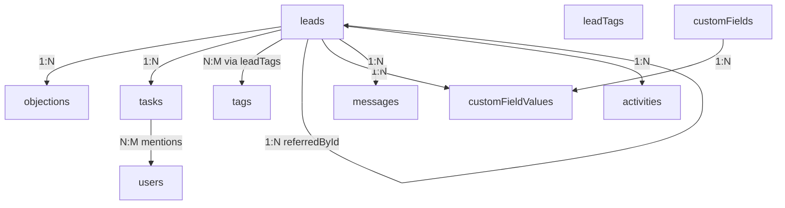
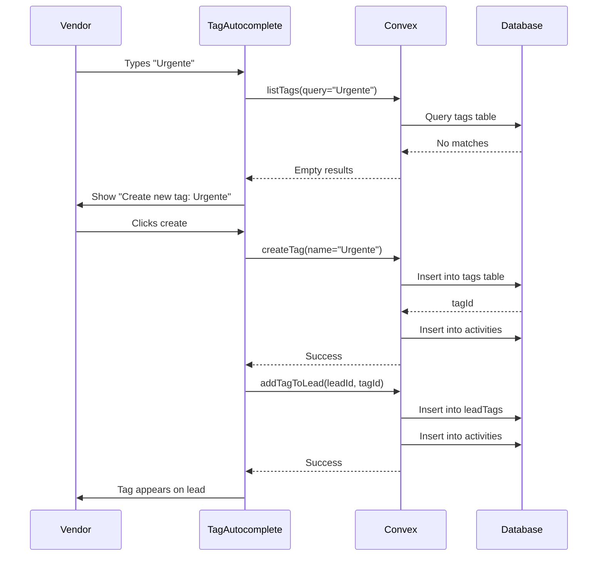
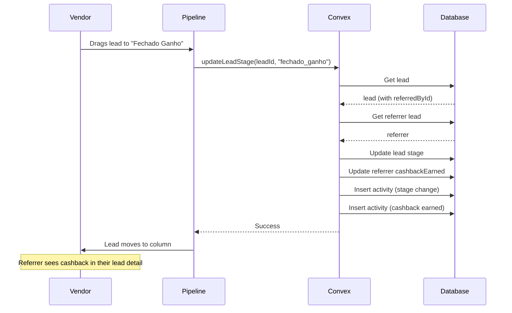
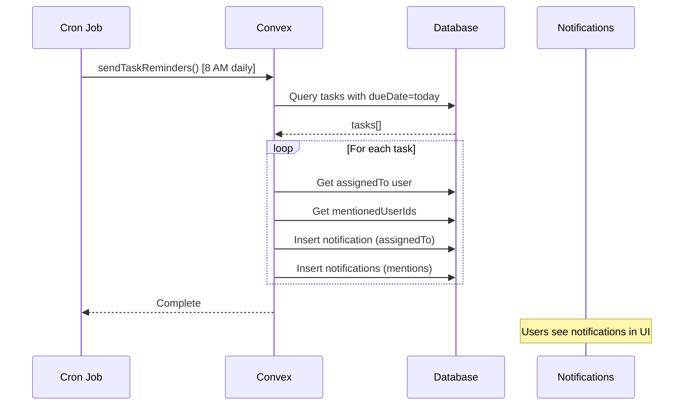

# Tech Plan: CRM Enhancement Architecture

# Technical Architecture Plan

This document defines the high-level technical approach for implementing all 8 CRM enhancement features, focusing on critical architectural decisions, data model design, and component integration.

---

## 1. Architectural Approach

### Core Architectural Decisions

**1.1 Database Strategy: Normalized Schema with Explicit Indexes**

**Decision**: Use separate tables for complex entities (tags, objections, tasks, custom fields) rather than embedding arrays or JSON blobs.

**Rationale**:
- **Analytics-friendly**: Separate tables enable complex queries, aggregations, and reporting without scanning entire lead documents
- **Performance**: Convex indexes work best with normalized data; junction tables allow efficient many-to-many queries
- **Scalability**: With 15+ vendors and growing lead volume, normalized schema prevents document bloat and enables targeted queries
- **Flexibility**: Easier to add metadata (timestamps, user attribution) to individual records

**Trade-offs**:
- More tables to manage (8 new tables vs. 3-4 with embedded approach)
- Slightly more complex queries (joins via multiple queries)
- Acceptable because Convex's reactive queries handle this efficiently

**Constraints**:
- Convex doesn't support SQL-style joins; must use multiple queries and client-side joining
- All queries must use indexes (no full table scans)
- Maximum 8192 items per array (not a concern with separate tables)

---

**1.2 Multi-Tenant Isolation: Organization-Scoped Data**

**Decision**: All new tables include `organizationId` field with indexed queries.

**Rationale**:
- Maintains existing multi-tenant pattern from `file:convex/schema.ts`
- Ensures data isolation between organizations
- Enables efficient queries via `by_organization` indexes

**Implementation Pattern**:
```typescript
// Every table follows this pattern
defineTable({
  // ... fields
  organizationId: v.string(),
}).index('by_organization', ['organizationId'])
```

---

**1.3 Role-Based Access Control: Flexible Permission Model**

**Decision**: Single query/mutation with role-based logic inside handler, not separate functions per role.

**Rationale**:
- **Flexibility**: Easier to adjust permissions without duplicating code
- **Maintainability**: Single source of truth for business logic
- **DRY**: Avoids code duplication between admin/manager/vendor functions

**Pattern**:
```typescript
export const getDashboard = query({
  args: { userId: v.optional(v.id('users')) },
  handler: async (ctx, args) => {
    const identity = await requireAuth(ctx);
    const userRole = identity.org_role;
    
    // Vendors can only see their own data
    if (userRole === 'member' || userRole === 'sdr') {
      const effectiveUserId = identity.subject;
      // Filter by effectiveUserId
    }
    
    // Managers/admins can see any user or all users
    const effectiveUserId = args.userId || null;
    // Filter by effectiveUserId if provided
  }
});
```

---

**1.4 Audit Trail: Activities Table as Universal Log**

**Decision**: Continue using existing `activities` table for all user actions, supplemented by dedicated tables for structured data.

**Rationale**:
- **Compliance**: LGPD requires audit trail of all data modifications
- **Debugging**: Centralized log simplifies troubleshooting
- **User transparency**: Timeline view shows complete history

**Pattern**:
- Activities table: Human-readable descriptions, timestamps, user attribution
- Dedicated tables: Structured data for queries and business logic
- Example: WhatsApp messages stored in both `messages` (structured) and `activities` (audit)

---

**1.5 External Integration: Action-Based API Calls**

**Decision**: Use Convex actions (not mutations) for Evolution API integration.

**Rationale**:
- **Non-deterministic**: External API calls can fail, timeout, or return different results
- **Long-running**: WhatsApp message sending may take seconds
- **Retry logic**: Actions can be retried without side effects on database

**Pattern**:
```typescript
export const sendWhatsAppMessage = action({
  args: { leadId: v.id('leads'), message: v.string() },
  handler: async (ctx, args) => {
    // 1. Fetch Evolution API credentials
    const config = await ctx.runQuery(internal.integrations.getEvolutionConfig);
    
    // 2. Call external API
    const response = await fetch(config.apiUrl, { ... });
    
    // 3. Store result via mutation
    await ctx.runMutation(internal.messages.createMessage, { ... });
  }
});
```

---

**1.6 Automation: Cron Jobs for Scheduled Tasks**

**Decision**: Add new cron jobs to existing `file:convex/crons.ts` for lead reactivation and task reminders.

**Rationale**:
- **Reliability**: Convex cron jobs run reliably without external schedulers
- **Simplicity**: No need for external services (AWS Lambda, etc.)
- **Consistency**: Follows existing pattern for Asaas sync jobs

**Constraints**:
- Cron jobs run at fixed intervals (minimum 1 minute)
- Must be idempotent (safe to run multiple times)
- Should batch process to avoid timeouts

---

**1.7 Dynamic Fields: Metadata-Driven Rendering**

**Decision**: Store custom field definitions in `customFields` table, values in `customFieldValues` table with polymorphic entity references.

**Rationale**:
- **Flexibility**: Admins can add fields without code changes
- **Type safety**: Field definitions include type and validation rules
- **Scalability**: Separate values table prevents lead document bloat

**Validation Strategy**:
- **Frontend**: Immediate UX feedback (required fields, type validation)
- **Backend**: Security enforcement (prevent invalid data, SQL injection, XSS)
- **Double validation**: Acceptable overhead for data integrity

---

### Technology Stack Alignment

| Layer | Technology | Justification |
|-------|------------|---------------|
| **Database** | Convex | Existing, real-time, serverless |
| **Backend** | Convex Queries/Mutations/Actions | Type-safe, reactive, integrated |
| **Auth** | Clerk | Existing, role-based, multi-tenant |
| **Frontend** | React 19 + TanStack Router | Existing, modern, type-safe |
| **UI Components** | shadcn/ui | Existing, accessible, customizable |
| **External API** | Evolution API (WhatsApp) | Existing integration point |
| **Scheduling** | Convex Cron Jobs | Built-in, reliable, simple |

---

## 2. Data Model

### 2.1 New Tables

#### Tags System

**tags** - Organization-wide tag definitions
```typescript
defineTable({
  name: v.string(),                    // Tag name (e.g., "Urgente", "VIP")
  color: v.optional(v.string()),       // Hex color for UI (e.g., "#FF5733")
  organizationId: v.string(),
  createdBy: v.string(),               // Clerk user ID
  createdAt: v.number(),
})
  .index('by_organization', ['organizationId'])
  .index('by_organization_name', ['organizationId', 'name']) // Unique constraint
```

**leadTags** - Many-to-many junction table
```typescript
defineTable({
  leadId: v.id('leads'),
  tagId: v.id('tags'),
  organizationId: v.string(),
  addedBy: v.string(),                 // Clerk user ID
  addedAt: v.number(),
})
  .index('by_lead', ['leadId'])
  .index('by_tag', ['tagId'])
  .index('by_organization', ['organizationId'])
```

**Design Notes**:
- Tags are global per organization (not per user)
- Any vendor can create tags (mutation validates auth only)
- Duplicate tag names prevented via `by_organization_name` index query
- Junction table tracks who added tag and when (audit trail)

---

#### Objections System

**objections** - Structured objection records
```typescript
defineTable({
  leadId: v.id('leads'),
  objectionText: v.string(),           // The objection description
  organizationId: v.string(),
  recordedBy: v.string(),              // Clerk user ID
  recordedAt: v.number(),
  resolved: v.optional(v.boolean()),   // Future: track resolution
  resolution: v.optional(v.string()),  // Future: how it was resolved
})
  .index('by_lead', ['leadId'])
  .index('by_organization', ['organizationId'])
  .index('by_lead_recorded', ['leadId', 'recordedAt']) // Chronological order
```

**Design Notes**:
- Separate table enables analytics (most common objections, resolution rates)
- Each objection is a discrete record with timestamp and attribution
- Future-proof with `resolved` and `resolution` fields for tracking outcomes

---

#### Tasks System

**tasks** - Actionable tasks with due dates and mentions
```typescript
defineTable({
  description: v.string(),
  leadId: v.optional(v.id('leads')),   // Tasks can be lead-specific or general
  studentId: v.optional(v.id('students')),
  dueDate: v.optional(v.number()),     // Unix timestamp
  completed: v.boolean(),
  completedAt: v.optional(v.number()),
  mentionedUserIds: v.optional(v.array(v.id('users'))), // @mentions
  organizationId: v.string(),
  createdBy: v.string(),               // Clerk user ID
  assignedTo: v.optional(v.string()),  // Clerk user ID (task owner)
  createdAt: v.number(),
  updatedAt: v.number(),
})
  .index('by_lead', ['leadId'])
  .index('by_organization', ['organizationId'])
  .index('by_assigned_to', ['assignedTo'])
  .index('by_due_date', ['dueDate'])   // For cron job queries
  .index('by_mentioned_user', ['mentionedUserIds']) // For notifications
```

**Design Notes**:
- Separate from activities table for clean separation of concerns
- Tasks are actionable items; activities are historical events
- Supports mentions for collaboration (multiple users can be notified)
- Due date index enables efficient cron job queries

---

#### Custom Fields System

**customFields** - Field definitions (metadata)
```typescript
defineTable({
  name: v.string(),                    // Field name (e.g., "Número de Funcionários")
  fieldType: v.union(
    v.literal('text'),
    v.literal('number'),
    v.literal('date'),
    v.literal('select'),
    v.literal('multiselect'),
    v.literal('boolean')
  ),
  entityType: v.union(
    v.literal('lead'),
    v.literal('student')
  ),
  required: v.boolean(),
  options: v.optional(v.array(v.string())), // For select/multiselect types
  organizationId: v.string(),
  createdBy: v.string(),
  createdAt: v.number(),
  active: v.boolean(),                 // Soft delete
})
  .index('by_organization_entity', ['organizationId', 'entityType'])
  .index('by_organization', ['organizationId'])
```

**customFieldValues** - Field values (data)
```typescript
defineTable({
  customFieldId: v.id('customFields'),
  entityId: v.string(),                // Lead ID or Student ID (polymorphic)
  entityType: v.union(v.literal('lead'), v.literal('student')),
  value: v.any(),                      // Flexible value storage
  organizationId: v.string(),
  updatedBy: v.string(),
  updatedAt: v.number(),
})
  .index('by_entity', ['entityId', 'entityType'])
  .index('by_custom_field', ['customFieldId'])
  .index('by_organization', ['organizationId'])
```

**Design Notes**:
- EAV (Entity-Attribute-Value) pattern for maximum flexibility
- Field definitions are metadata; values are data
- Polymorphic `entityId` allows same system for leads and students
- `v.any()` for value allows different types (validated in backend)

---

### 2.2 Schema Modifications to Existing Tables

#### leads table - Add referral tracking and dashboard filtering
```typescript
// Add these fields to existing leads table
{
  referredById: v.optional(v.id('leads')),  // Who referred this lead
  cashbackEarned: v.optional(v.number()),   // Cashback amount (calculated)
  cashbackPaidAt: v.optional(v.number()),   // When cashback was paid
}

// Add indexes for referral queries and dashboard filtering
.index('by_referred_by', ['referredById'])
.index('by_organization_assigned_to', ['organizationId', 'assignedTo'])  // For vendor dashboard
```

**Design Notes**:
- `referredById` points to another lead (the referrer)
- Cashback calculated automatically when lead closes
- Separate `cashbackPaidAt` tracks payment status (future: payment integration)

---

#### integrations table - Add Evolution API config
```typescript
// Existing table already supports key-value config
// Add new integration type for Evolution API
{
  type: 'evolution_api',
  config: {
    apiUrl: string,
    apiKey: string,
    instanceName: string,
  },
  organizationId: null,  // Global credentials (shared instance)
}
```

**Design Notes**:
- Reuses existing `integrations` table structure
- `organizationId: null` indicates global configuration
- Only admins can read/write Evolution API credentials
- Rate limiting queue per organization to prevent shared rate limit exhaustion

---

#### settings table - Add cashback configuration
```typescript
// Add to existing settings table or create new organizationSettings
{
  organizationId: v.string(),
  cashbackAmount: v.number(),              // Default: 500 (R$ 500)
  cashbackType: v.union(
    v.literal('fixed'),                    // Fixed amount
    v.literal('percentage')                // Percentage of deal value
  ),
  updatedAt: v.number(),
}

.index('by_organization', ['organizationId'])
```

**Design Notes**:
- Makes cashback amount configurable per organization
- Supports both fixed and percentage-based cashback
- Defaults to R$ 500 fixed if not configured

---

### 2.3 Data Relationships



---

## 3. Component Architecture

### 3.1 Backend Components (Convex Functions)

#### Tags System

**Queries**:
- `listTags(organizationId)` - Get all tags for organization
- `getLeadTags(leadId)` - Get tags for specific lead
- `searchTags(organizationId, query)` - Autocomplete search

**Mutations**:
- `createTag(name, color)` - Create new tag (any vendor)
- `addTagToLead(leadId, tagId)` - Associate tag with lead
- `removeTagFromLead(leadId, tagId)` - Remove tag from lead
- `deleteTag(tagId)` - Admin only, removes all associations

**Integration Points**:
- Filters: `listLeads` query extended with `tags` parameter
- Activities: Log tag additions/removals

---

#### Objections System

**Queries**:
- `listObjections(leadId)` - Get all objections for lead (chronological)
- `getObjectionStats(organizationId, period)` - Analytics query

**Mutations**:
- `addObjection(leadId, objectionText)` - Record new objection
- `updateObjection(objectionId, updates)` - Edit objection
- `deleteObjection(objectionId)` - Remove objection
- `markObjectionResolved(objectionId, resolution)` - Future feature

**Integration Points**:
- Activities: Log objection additions
- Dashboard: Aggregate objection stats

---

#### Dashboard System

**Queries**:
- `getDashboard(period, userId?)` - Modified existing query
  - If `userId` provided and user is manager/admin: filter by that user
  - If `userId` not provided and user is vendor: auto-filter by their ID
  - If `userId` not provided and user is manager/admin: show all data

**Logic Flow**:
```typescript
const identity = await requireAuth(ctx);
const userRole = identity.org_role;

let effectiveUserId: string | null = null;

if (userRole === 'member' || userRole === 'sdr') {
  // Vendors always see only their data
  effectiveUserId = identity.subject;
} else if (args.userId) {
  // Managers/admins can filter by specific user
  effectiveUserId = args.userId;
}

// Apply effectiveUserId filter to all metrics queries
const leads = effectiveUserId
  ? await ctx.db.query('leads')
      .withIndex('by_assigned_to', q => q.eq('assignedTo', effectiveUserId))
  : await ctx.db.query('leads').withIndex('by_organization', ...);
```

**Integration Points**:
- Existing metrics calculations
- Team performance query

---

#### Referral & Cashback System

**Queries**:
- `getReferralStats(leadId)` - Get referral info for a lead
- `getMyReferrals(userId)` - List all leads referred by user

**Mutations**:
- `updateLeadStage` - Modified to trigger cashback calculation
  - When stage changes to 'fechado_ganho'
  - Check if `referredById` exists
  - Calculate cashback (business logic: fixed amount or percentage)
  - Update referrer's `cashbackEarned` field
  - Log activity on both leads

**Cashback Calculation Logic**:
```typescript
// Inside updateLeadStage mutation
if (args.newStage === 'fechado_ganho' && lead.referredById) {
  const referrer = await ctx.db.get(lead.referredById);
  if (referrer) {
    const cashbackAmount = 500; // Business rule: R$ 500 per referral
    await ctx.db.patch(referrer._id, {
      cashbackEarned: (referrer.cashbackEarned || 0) + cashbackAmount,
    });
    
    // Log activity on referrer's lead
    await ctx.db.insert('activities', {
      type: 'cashback_earned',
      description: `Cashback de R$ ${cashbackAmount} por indicação`,
      leadId: referrer._id,
      // ...
    });
  }
}
```

**Integration Points**:
- Lead creation form (referredById field)
- Lead detail view (referral section)
- Dashboard (cashback metrics)

---

#### WhatsApp Integration

**Actions**:
- `sendWhatsAppMessage(leadId, message)` - Send message via Evolution API
  1. Fetch Evolution API credentials from integrations table
  2. Get lead phone number
  3. Call Evolution API
  4. Handle response/errors
  5. Store message in messages table
  6. Log activity

**Mutations** (called by action):
- `createMessage(leadId, content, direction, status)` - Store message record

**Integration Points**:
- Messages table (existing)
- Activities table (audit log)
- Conversations table (link to conversation if exists)

**Error Handling**:
- Retry logic for transient failures
- Store failed messages with error details
- UI shows delivery status

---

#### Tasks & Automation

**Queries**:
- `listTasks(leadId?, assignedTo?, dueDate?)` - Flexible task listing
- `getTasksDueToday()` - For cron job
- `getMyTasks(userId)` - User's assigned tasks

**Mutations**:
- `createTask(description, leadId?, dueDate?, mentionedUserIds?)` - Create task
- `updateTask(taskId, updates)` - Edit task
- `completeTask(taskId)` - Mark as done
- `deleteTask(taskId)` - Remove task

**Cron Jobs** (new):
- `reactivateIdleLeads` - Daily at 8 AM
  - Query leads in 'primeiro_contato' or 'qualificado' stages
  - Filter by `updatedAt` > 7 days ago
  - Update stage to 'novo'
  - Log activity

- `sendTaskReminders` - Daily at 8 AM
  - Query tasks with `dueDate` = today
  - Create notifications for `assignedTo` and `mentionedUserIds`
  - Mark tasks as "reminded"

**Integration Points**:
- Notifications table (existing)
- Activities table (log task creation/completion)

---

#### Custom Fields System

**Queries**:
- `listCustomFields(entityType)` - Get field definitions for entity
- `getCustomFieldValues(entityId, entityType)` - Get values for entity

**Mutations**:
- `createCustomField(name, fieldType, entityType, required, options?)` - Admin only
- `updateCustomField(fieldId, updates)` - Admin only
- `deleteCustomField(fieldId)` - Admin only (soft delete)
- `setCustomFieldValue(entityId, entityType, customFieldId, value)` - Set value
- `validateCustomFieldValue(customFieldId, value)` - Backend validation

**Validation Logic**:
```typescript
export const validateCustomFieldValue = internalMutation({
  args: { customFieldId: v.id('customFields'), value: v.any() },
  handler: async (ctx, args) => {
    const field = await ctx.db.get(args.customFieldId);
    
    // Type validation
    if (field.fieldType === 'number' && typeof args.value !== 'number') {
      throw new Error('Invalid type: expected number');
    }
    
    // Required validation
    if (field.required && !args.value) {
      throw new Error('Field is required');
    }
    
    // Options validation (for select types)
    if (field.fieldType === 'select' && !field.options?.includes(args.value)) {
      throw new Error('Invalid option');
    }
    
    return true;
  }
});
```

**Integration Points**:
- Lead/Student forms (dynamic rendering)
- Lead/Student detail views (display values)

---

### 3.2 Frontend Components

**New Components** (high-level, no implementation details):

| Component | Purpose | Integration |
|-----------|---------|-------------|
| `TagAutocomplete` | Search and create tags | Uses `listTags`, `createTag` queries |
| `TagBadge` | Display tag with remove action | Uses `removeTagFromLead` mutation |
| `ObjectionsList` | Display and manage objections | Uses `listObjections`, `addObjection` |
| `TaskForm` | Create/edit tasks | Uses `createTask`, `updateTask` mutations |
| `TaskList` | Display tasks with filters | Uses `listTasks` query |
| `CustomFieldRenderer` | Dynamic field rendering | Uses `listCustomFields`, `getCustomFieldValues` |
| `CustomFieldForm` | Admin field management | Uses `createCustomField`, `updateCustomField` |
| `WhatsAppDialog` | Send message interface | Uses `sendWhatsAppMessage` action |
| `ReferralSection` | Display referral info | Uses `getReferralStats` query |
| `VendorDashboard` | Vendor-specific metrics | Uses `getDashboard` with auto-filter |

**Component Patterns**:
- All components use Convex React hooks (`useQuery`, `useMutation`, `useAction`)
- Optimistic updates for mutations (Convex handles automatically)
- Loading states and error boundaries
- shadcn/ui components for consistency

---

### 3.3 Integration Flow Examples

#### Flow 1: Vendor Creates Tag and Adds to Lead



#### Flow 2: Lead Closes and Triggers Cashback



#### Flow 3: Cron Job Sends Task Reminders



---

## 4. Critical Technical Considerations

### 4.1 Performance Optimization

**Index Strategy**:
- Every query must use an index (Convex requirement)
- Composite indexes for common filter combinations
- Example: `by_organization_stage` for filtered pipeline views

**Query Batching**:
- Use `Promise.all()` for parallel queries
- Example: Dashboard loads multiple metrics simultaneously

**Pagination**:
- All list queries support pagination
- Use `paginationOptsValidator` from Convex

---

### 4.2 Security Considerations

**Authentication**:
- All queries/mutations require `requireAuth(ctx)`
- Role checks via `identity.org_role`

**Data Isolation**:
- All queries filter by `organizationId`
- Prevent cross-organization data leaks

**Input Validation**:
- Backend validates all inputs (type, required, options)
- Frontend provides UX feedback
- Custom fields validated against field definitions

**API Credentials**:
- Evolution API credentials stored encrypted
- Only admins can read/write credentials
- Use environment variables for sensitive config

---

### 4.3 Error Handling & Resilience

**External API Failures**:
- WhatsApp action retries on transient errors
- Store failed messages with error details
- UI shows delivery status and retry option

**Cron Job Failures**:
- Idempotent operations (safe to run multiple times)
- Batch processing with error isolation
- Log failures to activities table

**Data Consistency**:
- Mutations are atomic (Convex transactions)
- Referential integrity via ID types
- Soft deletes for custom fields (preserve historical data)

---

### 4.4 Migration Strategy

**Schema Changes**:
1. Add new tables to `file:convex/schema.ts`
2. Deploy schema changes (Convex handles migrations)
3. Backfill data if needed (via internal mutations)

**Backward Compatibility**:
- New fields are optional (`v.optional()`)
- Existing queries continue to work
- Gradual rollout of new features

**Data Migration**:
- No migration needed for new tables (start empty)
- Referral fields on leads start as `undefined` (optional)
- Custom fields system starts with no fields defined

---

## 5. Architecture Validation Results

### Validation Process

The architecture was stress-tested against 6 dimensions: Simplicity, Flexibility, Robustness, Scaling, Codebase Fit, and Requirements Consistency. 10 issues were identified and resolved through collaborative clarification.

### Critical Issues Resolved

**1. Dashboard Filtering Index**
- **Issue**: Missing index for `assignedTo` field filtering
- **Solution**: Added composite index `by_organization_assigned_to` to leads table
- **Impact**: Enables efficient vendor-specific dashboard queries

**2. Cashback Calculation Robustness**
- **Issue**: Potential null reference, race conditions, inflexibility
- **Solution**: Comprehensive improvements:
  - Null checks with error logging for deleted referrers
  - Atomic operations to prevent race conditions
  - Separate `calculateCashback` internal mutation for retry logic
  - Configurable amount in organization settings table
- **Impact**: Prevents data corruption and enables business rule flexibility

**3. Custom Fields Validation**
- **Issue**: `v.any()` loses type safety, unclear validation strategy
- **Solution**: Distributed validation in lead/student update mutations
  - Each mutation validates custom field values before storing
  - Type checking based on field definitions
  - XSS/injection prevention via sanitization
- **Impact**: Ensures data integrity while maintaining flexibility

### Significant Issues Resolved

**4. Evolution API Resilience**
- **Issue**: Single point of failure, shared rate limits
- **Solution**: Rate limiting queue per organization
  - Track API calls per org in separate table
  - Queue messages when rate limit approached
  - Retry failed messages with exponential backoff
- **Impact**: Prevents one org from exhausting shared API limits

**5. Array Index Behavior**
- **Issue**: Uncertainty about Convex array index behavior
- **Solution**: Keep array with index (confirmed acceptable)
  - Convex creates index entry per array element (expected)
  - Query returns tasks where user is mentioned (works correctly)
  - Performance acceptable for typical mention counts (1-5 users)
- **Impact**: Simpler implementation, consistent with Convex patterns

**6. WhatsApp Storage Consistency**
- **Issue**: Dual writes could fail partially
- **Solution**: Single atomic mutation writes both tables
  - `createMessageWithActivity` internal mutation
  - Writes to messages and activities in same transaction
  - Action calls this mutation after API success
- **Impact**: Guarantees consistency between audit log and message history

**7. Custom Fields Performance**
- **Issue**: Potential N+1 query problem with EAV pattern
- **Solution**: Batch fetch values for current page
  - Fetch custom field values for all leads on current page
  - Use `Promise.all()` for parallel queries
  - Cache results in React Query
- **Impact**: Better UX with acceptable query overhead

### Moderate Issues Resolved

**8. Cashback Configuration**
- **Solution**: Added `cashbackAmount` to organization settings table
- **Impact**: Business can adjust without code changes

**9. Tag Duplicate Prevention**
- **Solution**: Check-then-create with error handling
  - Normalize tag names (lowercase, trim)
  - Handle duplicate errors gracefully
  - Admin merge tool for cleanup
- **Impact**: Reduces duplicates, provides recovery mechanism

**10. Evolution API Future-Proofing**
- **Solution**: Keep global for MVP (YAGNI principle)
- **Impact**: Simpler implementation now, refactor if needed later

### Updated Architecture Summary

**Tables**: 8 new + 2 modified + 1 settings extension = 11 total changes

**New Convex Functions**: ~35 queries/mutations/actions across all features

**New Cron Jobs**: 2 (lead reactivation, task reminders)

**Key Improvements from Validation**:
- ✅ Added missing indexes for performance
- ✅ Strengthened cashback calculation with error handling
- ✅ Clarified validation strategy for custom fields
- ✅ Added rate limiting for API resilience
- ✅ Ensured atomic operations for data consistency
- ✅ Optimized query patterns for performance

---

## 6. Summary

This technical architecture provides:

✅ **Scalability**: Normalized schema handles growing data volume  
✅ **Flexibility**: Custom fields and role-based access adapt to changing needs  
✅ **Performance**: Indexed queries, batch fetching, and efficient data model  
✅ **Security**: Multi-tenant isolation, input validation, and rate limiting  
✅ **Maintainability**: Clear separation of concerns and consistent patterns  
✅ **Reliability**: Cron jobs, error handling, atomic operations, and audit trails  
✅ **Robustness**: Validated against failure modes, race conditions, and edge cases  

The architecture builds on existing Convex patterns while introducing 8 new tables and extending 3 existing tables (leads, integrations, settings), all following established conventions for multi-tenancy, authentication, and data modeling. All critical gaps identified during validation have been addressed with concrete solutions.
